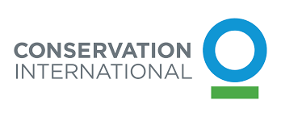

# Conservation International

{style="display: block; margin: 0 auto; border: 1px solid grey" }

Through the help of community leaders and policymakers, the mission of <a href="https://www.conservation.org/">Conservation International (CI)</a> is to combat climate
change and preserve carbon stores. CI and the Climate Positive Land Use Strategy (CPLUS) project need the ability to spatially analyse a given area to determine the
best land use in order to naturally combat climate change and the effects thereof on a global scale.
Further, reports need to be generated to communicate to stakeholders the importance of conserving
and maintaining certain areas and the need to restore lost climate-positive environments. Thus,
mitigating the negative effects of climate change produced by our daily activities. The aim is to ensure
a better future for everyone.

