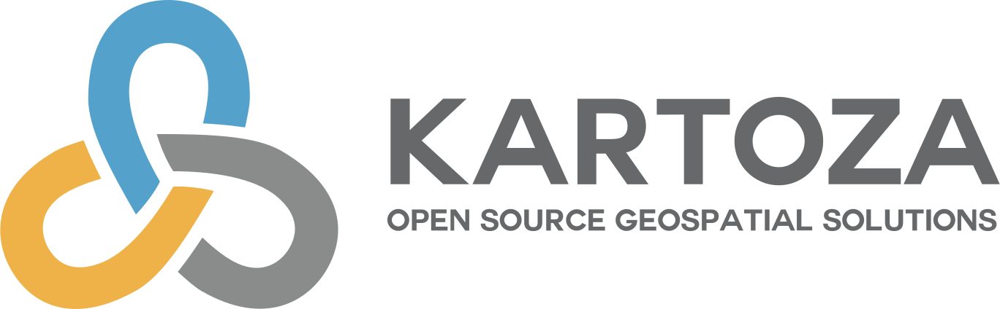

# Kartoza

{style="display: block; margin: 0 auto; border: 1px solid grey; width: 50%; height: 50%"}

<a href="https://kartoza.com/">Kartoza</a>
will make geospatial data and technology work for you by partnering with us for training,
development and maintenance of GIS systems.

Kartoza is a South Africa-based Free and Open Source GIS (FOSSGIS) service provider.
We use GIS software to solve complex location-related problems for individuals, businesses and
governments around the world.

Our team develops software using FOSSGIS to give you the freedom to share and modify your
GIS as your needs grow and change.