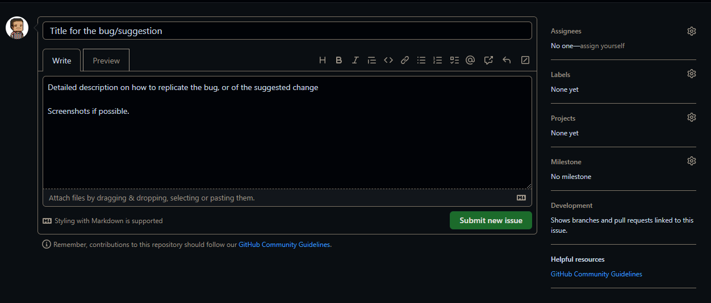

# GitHub

## Repository

The map viewer is stored in a GitHub repository. The code, branches, updates, issues, and
the task board will be kept up-to-date. Issues, tasks, or any other suggestions are welcome
and will be appreciated to improve the plugin and resolve issues as quick as possible.

- **Repository**: https://github.com/kartoza/cplus-plugin
- **Issues**: https://github.com/kartoza/cplus-plugin/issues
- **GitHub board**: https://github.com/orgs/kartoza/projects/26/views/1

## Submit an issue or task

This section relates to creating an issue for when a bug is found in the plugin, or
if the user has a suggested improvement for the plugin.

- Go to the repository
- Click on the **Issues** tab
- Click on **New Issue**
  - Title: Short, but detailed title
  - Description: Detailed description. If it's a bug, an explanation on how to replicate the bug will be best.
    Screenshots of the bug or suggestion will also be helpful

- 
