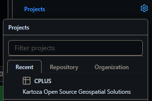
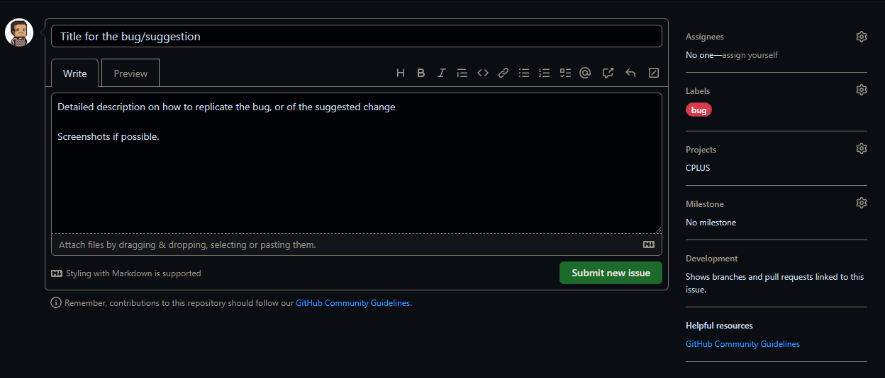

# Bugs and suggestions

This section relates to creating an issue for when a bug is found in the plugin, or
if the user has a suggested improvement for the plugin.

- Go to the [CPLUS repository](https://github.com/kartoza/cplus-plugin)
- Click on the **Issues** tab
- Click on **New Issue** (see **Figure 1**)
  - Title: Short, but descriptive
  - Description: Detailed description. If it's a bug, an explanation on how to replicate the bug will be best.
    Screenshots of the bug or suggestion will also be helpful

*Figure 1: An example of a new GitHub issue*

- Select a **Label** (e.g. bug, enhancement, etc.) as shown in **Figure 2**

*Figure 2: Selecting a label for an issue*

- Select the *CPLUS* **Project** (**Figure 3**). This will add the issue/task to the project board

*Figure 3: Selecting a Project for an issue*

- The end result should be similar to **Figure 4**.

*Figure 4: An example of a finalized issue*

- Click **Submit new issue**

The issue will now be submitted to the GitHub repository and be available to the developers.
