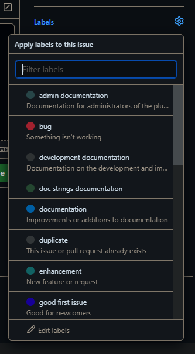
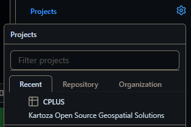
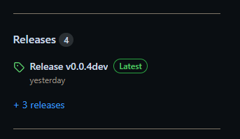
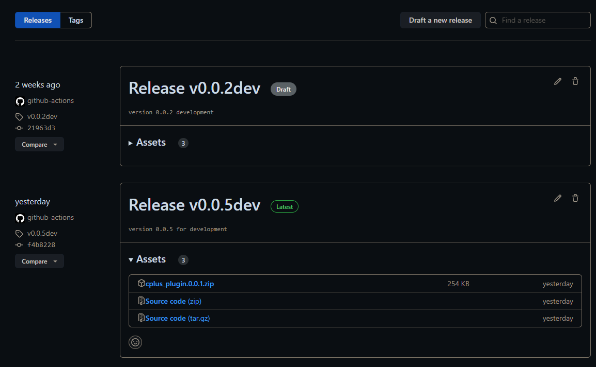

# Administrators guide

## Bugs and suggestions

This section relates to creating an issue for when a bug is found in the plugin, or
if the user has a suggested improvement for the plugin.

- Go to the [CPLUS repository](https://github.com/kartoza/cplus-plugin)
- Click on the **Issues** tab
- Click on **New Issue** (see **Figure 1**)
  - Title: Short, but descriptive
  - Description: Detailed description. If it's a bug, an explanation on how to replicate the bug will be best.
    Screenshots of the bug or suggestion will also be helpful

*Figure 1: An example of a new GitHub issue*

- Select a **Label** (e.g. bug, enhancement, etc.) as shown in **Figure 2**

*Figure 2: Selecting a label for an issue*

- Select the *CPLUS* **Project** (**Figure 3**). This will add the issue/task to the project board

*Figure 3: Selecting a Project for an issue*

- The end result should be similar to **Figure 4**.

*Figure 4: An example of a finalized issue*

- Click **Submit new issue**

The issue will now be submitted to the GitHub repository and be available to the developers.

## Staging version of the plugin

When a pull requested is performed, an automatic staging version is created. This will allow a developer to test their
changes to the plugin with other changes which has not been merged into the main branch. Another advantage of this
approach is to show the client to progress of the plugin.

### Get the staging version

- Go to the repository: https://github.com/kartoza/cplus-plugin
- To the right there is a section named **Releases**

- Click on **Latest** release
- Download the *cplus_plugin<version>.zip* file if you want to install the plugin in QGIS
- Developers will likely be interested in *Source code (zip)* and *Source code (tar.gz)* options

- See user/installation on how to install a QGIS plugin

If you want to have a look at past versions of the plugin:

- On the repository page, click on **Releases**
- A list of option will appear
- Choose the version you are interested in, and follow the steps discussed above

