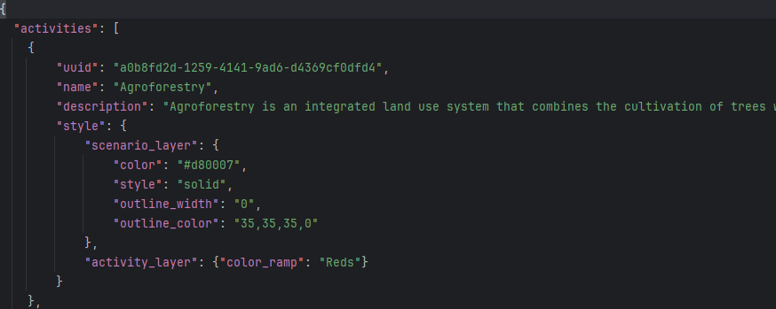

# Administrators guide

## Pilot area data

This section deals with making updates to the data of the pilot study area (Bushbuck Ridge). This needs
to be done in the GitHub repository, or locally on the repository clone, and then pushed into the repository. The change can be made as follows:

The following JSON files needs to be considered when doing this, all of which are stored in
"src/cplus_plugin/data/default"

- ```activities.json```
- ```ncs_pathways.json```
- ```priority_weighted_layers.json```

### Activities

In this file, existing activities can be edited (e.g. change name or description), be removed
or a new activity can be added. Here is a quick overview of an activity stored in the JSON file

- Each activity contains the following elements:
    - **uuid**: A universal unique identifier (UUID) for the activity
    - **name**: A unique name for the activity
    - **description**: Detailed description of the activity
    - **style**: The style which will be applied to the activity pixel value in the scenario layer
    - **activity_layer**: The name of a valid QGIS color ramp that will be applied to the output activity layer
- Editing these will have an effect on the activity in the plugin



When adding a new activity to the list (or a UUID needs to change), the user needs to provide a UUID. This can be done as follows:

- Open a [UUID generator](https://www.uuidgenerator.net/). Other UUID generators can also be used, but the provided link will suffice
- Best will be to make use of version 4
- Click **Generate a version 4 UUID**
- Copy and paste the newly generated UUID


To remove an activity from the list of activities, an administrator can simply remove the entry in the JSON file.
Remove this text to remove an activity:


To update the list of priority weighted layers for an activity, the ID needs to be retrieved:

- Open the ```priority_weighted_layers.json``` file
- Each available PWL will be listed under "layers"
- Save the file


A section on PWL editing will soon follow.

### NCS pathways

An administrator can access/edit the NCS pathways as follows:

- Open the ```ncs_pathways.json``` file
- Here is a description of each element:
    - **uuid**: A unique identifier for the pathway
    - **name**: Unique title for the pathway
    - **description**: Detailed description of the pathway
    - **path**: Directory with file name for the pathway data
    - **layer_type**: Numerical value zero - 0 - for rasters
- Editing these elements will make changes to the pilot area data in the plugin


When adding a new pathway to the list (or a UUID needs to change), the user needs to provide a UUID. This can be done as follows:

- Open a [UUID generator](https://www.uuidgenerator.net/). Other UUID generators can also be used, but the provided link will suffice
- Best will be to make use of version 4
- Click **Generate a version 4 UUID**
- Copy and paste the newly generated UUID


To remove a pathway from the list of layers, an administrator can simply remove the entry in the JSON file.
Remove this text to remove an NCS pathway:


### Priority weighted layers

Do the following to change/add/remove priority weighted layers for the pilot study area

- Open the ```priority_weighted_layers.json``` file
- Here is a description of each element:
    - **uuid**: A unique ID for the PWL
    - **name**: Unique name for the PWL
    - **description**: A detailed description of the PWL
    - **selected**: Whether the PWL should be selected on default
    - **path**: A directory with file name for the PWL data. This should be a raster
- Changing the above values will have an impact on the data in the plugin for the pilot study area


When adding a new PWL to the list (or a UUID needs to change), the user needs to provide a UUID. This can be done as follows:

- Open a [UUID generator](https://www.uuidgenerator.net/). Other UUID generators can also be used, but the provided link will suffice
- Best will be to make use of version 4
- Click **Generate a version 4 UUID**
- Copy and paste the newly generated UUID

To remove a PWL from the list of layers, an administrator can simply remove the entry in the JSON file.
Remove this text to remove a PWL:


## Default Global Priority Weighted Layers (PWLs)

This section relates to the set of default global datasets within the plugin. There are Default Global PWLs so that users can use high-quality baseline data without needing to manually upload their own layers. Administrative users can manage (add, delete, edit, or download) Global Priority Weighted Layers (PWLs) in the plugin settings.

To access the Default Global PWLs, administrative users can click on the `dropdown arrow` on the plugin icon.


Then they can click on `Settings`.


In the window that pops up, administrative users should scroll down to the `Global priority weighted layers (PWLs)` Section where there is a list of Default Global Priority Weighted Layers (PWLs).


There are buttons that allow users to:
- `Download` a Global PWL 
- `Add` a new Global PWL 
- `Edit` a Global PWL 
- `Delete` a Global PWL 

### Adding or Editing a Priority Weighted Layer (PWL)

If an administrative user clicks on the `Add` or `Edit` buttons, a window appears that allows them to add/edit the information related to the PWL. Administrative users need to provide a `Name`, provide a `Description`, choose the `Map layer` from a local file, choose the `Privacy type`, provide `License` information, and provide a `Version` for the PWL. Once everything is filled in, administrative users can click on the `OK` button. If at any point, the administrative user wants to leave the window without saving their current state, they can click on `Cancel`.


Once an administrative user clicks on `OK`, the plugin begins the process of uploading the layer.


> Note: If any of the provided information is not correct, when the user clicks on `OK` an error message will appear in the window (it will provide information on where the issue occurred in the form). E.g. no layer name has been provided:


If the administrative user clicks on the `Delete` button, a window pops up asking them to confirm their decision.


Once an administrative user is done managing the Default Global PWLs, the can click on the `OK` button to close the Settings window. If they do not want to keep their changes, they can click on the `Cancel` button.


## Bugs and suggestions

This section relates to creating an issue for when a bug is found in the plugin, or
if the user has a suggested improvement for the plugin.

- Go to the [CPLUS repository](https://github.com/ConservationInternational/cplus-plugin)
- Click on the **Issues** tab
- Click on **New Issue**. An issue entry from is as shown in **Figure 1**
    - Title: Short, but descriptive
    - Description: Detailed description. If it's a bug, an explanation on how to replicate the bug will be best.
Screenshots of the bug or suggestion will also be helpful


*Figure 1: An example of a new GitHub issue*

- Select a **Label** (e.g. bug, enhancement, etc.) as shown in **Figure 2**


*Figure 2: Selecting a label for an issue*

- Select the *CPLUS* **Project** (**Figure 3**). This will add the issue/task to the project board


*Figure 3: Selecting a Project for an issue*

- The end result should be similar to **Figure 4**.


*Figure 4: An example of a finalized issue*

- Click **Submit new issue**

The issue will now be submitted to the GitHub repository and be available to the developers.

## Staging version of the plugin

When a pull requested is performed, an automatic staging version is created. This will allow a developer to test their
changes to the plugin with other changes which has not been merged into the main branch. Another advantage of this
approach is to have the latest features tested by an external group including the CI team.

### Get the staging version

- Go to the repository: [https://github.com/ConservationInternational/cplus-plugin](https://github.com/ConservationInternational/cplus-plugin)
- To the right there is a section named **Releases**


- Click on **Latest** release
- Download the *cplus_plugin<version>.zip* file if you want to install the plugin in QGIS
- Developers will likely be interested in *Source code (zip)* and *Source code (tar.gz)* options


- See the [Installation](../../user/guide/index.md#installation) section in the Quick Start guide on how to install the CPLUS plugin

If you want to have a look at past versions of the plugin:

- On the repository page, click on **Releases**
- A list of option will appear
- Choose the version you are interested in, and follow the steps discussed above


