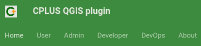
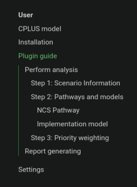
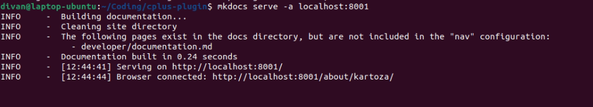
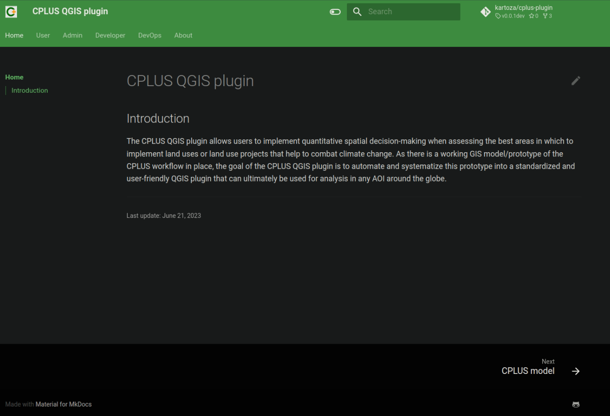

# Working with documentation

Documentation is written using <a href="https://mkdocs.org/">mkdocs</a>.
A detailed description on getting-started with mkdocs is available <a href="https://www.mkdocs.org/getting-started/">here</a>.

## Install mkdocs

- Open the terminal
- Run "pip install mkdocs"
- This should install mkdocs and all requirements

## Creating a new project

This should not be required as the mkdocs has been created already, but serves more of a guide for
a user whom are new to mkdocs.

- Open the terminal
- Run "mkdocs new ."
- This will generate the documents folder with the home page index markdown file

## Updating the mkdocs.yml file

Mostly, the only changes a user will need to make is to the **nav** section in the mkdocs.yml file (**Figure 1**).
Other options, such as the themes, plugins and extensions, should require no changes.

*Figure 1: Navigation example of mkdocs*

Here is an explanation on how the **nav** should be updated:

- It is important to keep to the structure of the mkdocs
- Each section focusses on a particular aspect, for example **User** will provide information on installing
  the plugin, a guide on how to use the plugin, etc.
- The order in which the **nav** is structured will determine the tabs order on the site, as shown in **Figure 2**

*Figure 2: Tabs in a generated site*

- Each tab, or group, will then be structured as in **Figure 3**

*Figure 3: Structure created by markdown headings*

- The additional titles (in the *Plugin guide* section in the above example) is based on the headings
  provided in the guide markdown file (*cplus_ui_guide.md* in this case)
- Headings for each section should be short, but descriptive
- The section itself can have a more detailed description
- Add screenshots where possible. This will make the guide(s) user-friendly

## mkdocstrings

This is an important aspect of documenting code. Using mkdocstrings is an easy and effective way of keeping
track of classes, functions, etc. Any changes to the code will automatically update here, but the developer
needs to make the changes in the code (comments) for this to happen.

The comments for mkdocstrings is three sections:

- Description: A description on what the function does. A destailed description are welcome
- Args: The list of parameters for the function.
- Returns:

## Serving the pages locally

This step is useful when making changes and the user wants to test and review their changes to the mkdocs
before creating a pull request.

- Open the terminal
- Run "mkdocs serve"
- **Figure 4** shows an example of the result

*Figure 4: Console example of serving mkdocs*

- On default, mkdocs is served to localhost:8000. But if the port is already in use, the user needs to provide a port number
- Run "mkdocs serve -a localhost:8001". The user can use a port number of their choosing
- Open the URL in a browser: localhost:8000
- The Home page should be similar to **Figure 5**

*Figure 5: Site example. This is the Home page*

### Errors

When performing the serve, mkdocs will automatically check for any errors. An example will be when
a file linked in the documentation cannot be found (**Figure 6**).

*Figure 6: Missing file example when serving mkdocs*

Be sure to check for such errors in the console prior to creating a pull request for your documentation changes.

## GitHub pages

This is only required if it has not been set up on GitHub for the repository, or if it has been disabled.
Only a user with admin rights to the repository will be able to do this.

- Go to the repository and click on **Settings**
- Click on **Pages**
- Set the branch to "gh-pages"
- Click **Save**
- Select the action
- Select **Deploy**
- Open the Run mkdocs gh-deploy section
- The URL should be https://kartoza.github.io/cplus-plugin/
