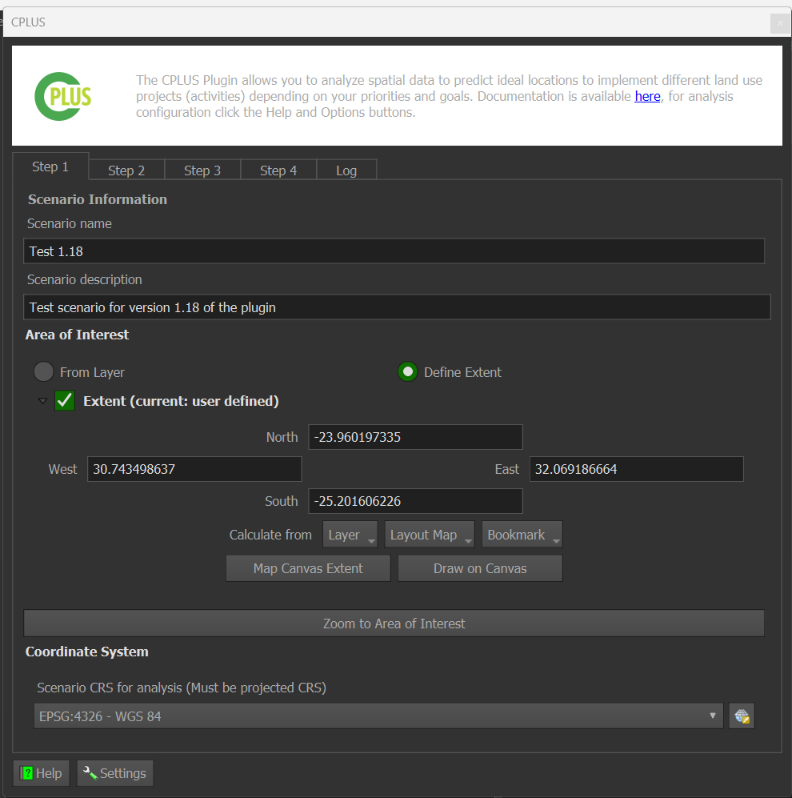
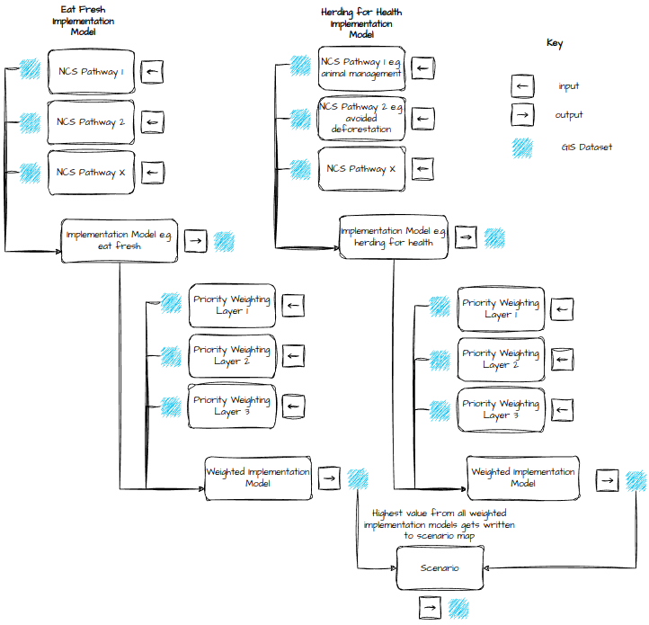

# CPLUS QGIS plugin

## Introduction

The challenge of mitigating climate change and achieving global and national climate targets requires innovative and
holistic approaches. In this pursuit, the Climate Positive Land Use Strategy (CPLUS) decision support tool has emerged
as a crucial resource. CPLUS is a spatially-explicit roadmap designed to guide land-use planning strategies, utilising
natural climate solutions to drive meaningful and sustainable change. The CPLUS decision support tool combines
open-source technology, localised data sets, and modelled products to empower policymakers, land managers,
and stakeholders in making informed decisions. By integrating spatial information, such as land cover, carbon stocks,
and potential for carbon sequestration, CPLUS enables the identification of key areas for intervention and investment.
By prioritising these nature-based interventions, CPLUS seeks to harness the power of ecosystems and optimise their
climate mitigation potential.

One of the distinguishing features of CPLUS is its ability to address both global and national climate targets.
While global climate targets provide a broad framework for action, national targets require context-specific strategies
tailored to the unique characteristics of each country. The CPLUS decision support tool considers these diverse factors
and assists in designing land-use planning strategies that align with national commitments while contributing to global
climate goals. Furthermore, CPLUS recognises that effective land-use planning involves collaboration and engagement
among various stakeholders. It fosters dialogue and cooperation between governments, local communities, indigenous
groups, conservation organisations, and private entities, facilitating the development of inclusive and equitable
solutions. By involving diverse perspectives and expertise, CPLUS ensures that the decision-making process is
participatory and informed by local knowledge.

Piloted in the Bushbuckridge Municipality in the Kruger to Canyons Biosphere of South Africa, the CPLUS framework was
tested with a diverse set of stakeholders to identify land use priorities and understand the carbon benefits and
biodiversity, ecosystem services co-benefits of different scenarios.

## CPLUS model

### Activities

**Figure 1** shows a flow diagram of the CPLUS analysis model.

*Figure 1: Simplified analysis model*

### Algorithms

Shown in **Figure 2** is the algorithms applied by the CPLUS model analysis model.

*Figure 2: CPLUS simplified analysis workflow with algorithms*

### References

- https://www.pnas.org/doi/10.1073/pnas.1710465114
- https://royalsocietypublishing.org/doi/10.1098/rstb.2019.0126

## Site contents

The aim of this is site is to provide details on the models and algorithms used by the CPLUS plugin,
help a user on using the plugin, guide administrators on testings and providing feedback for the plugin,
and provide guidance to developers who want to contribute to the plugin.

Here is a quick introduction on the sections on the site:

- **[Users](user/index.md)**: Help for users of the plugin
    * *[Quick Start](user/quickstart/index.md)*: Installation guide and how to get started with the plugin
    * *[Guide](user/guide/index.md)*: Detailed workflow on how to use the plugin
    * *[Manual](user/manual/index.md)*: Descriptions of each UI element
- **[Administrators](administrator/index.md)**: Help for an administrator of the plugin
    * *[Guide](administrator/guide/index.md)*: Detailed guide for administrative requirements
    * *[Repository](administrator/repository/index.md)*: Downloadable versions of the plugin
- **[Developers](developer/index.md)**: People who want to contribute towards improving the plugin
    * *[Setup](developer/setup/index.md)*: How to set up the developers environment for the plugin
    * *[Architecture](developer/architecture/index.md)*:
    * *[Documentation](developer/documentation/index.md)*: Help on adding towards the API documentation for a developer
    * *[API](developer/index.md)*: Application programming interface for the plugin
- **[About](about/ci.md)**: Information on CI and other contributors to the plugin
