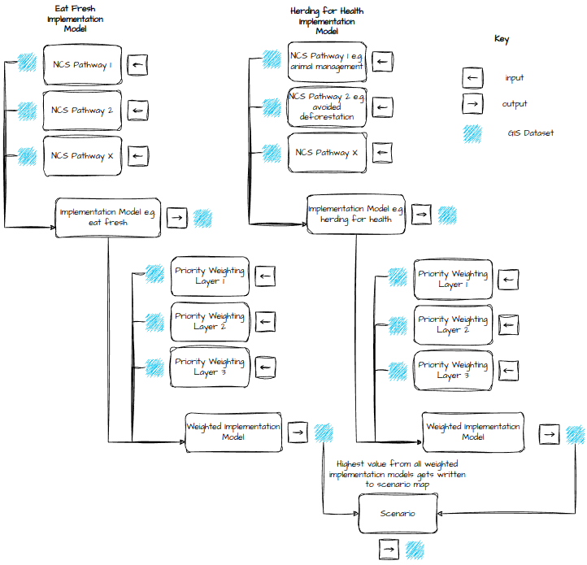
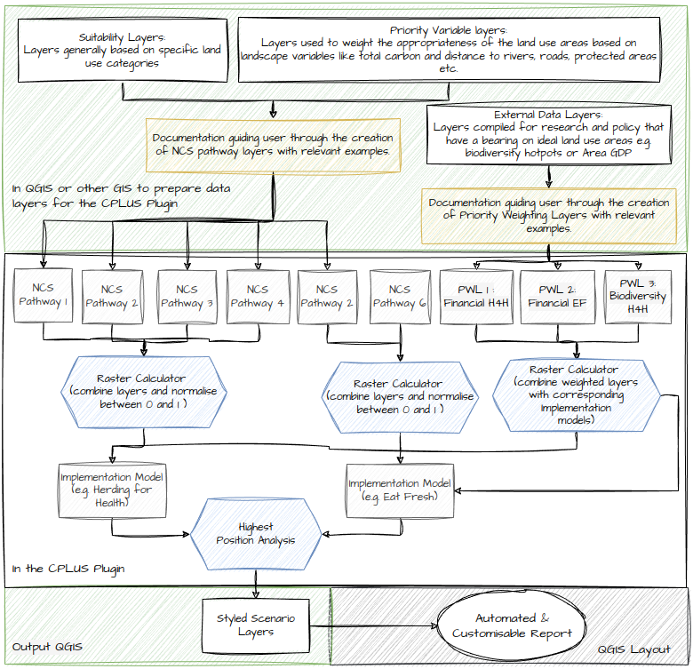
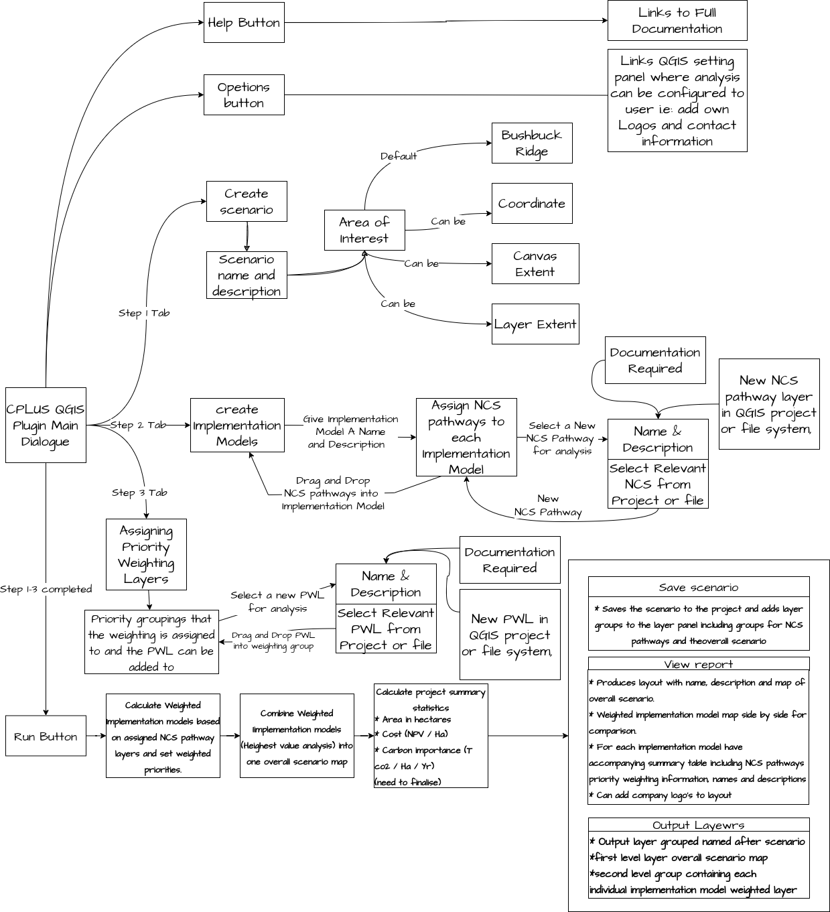
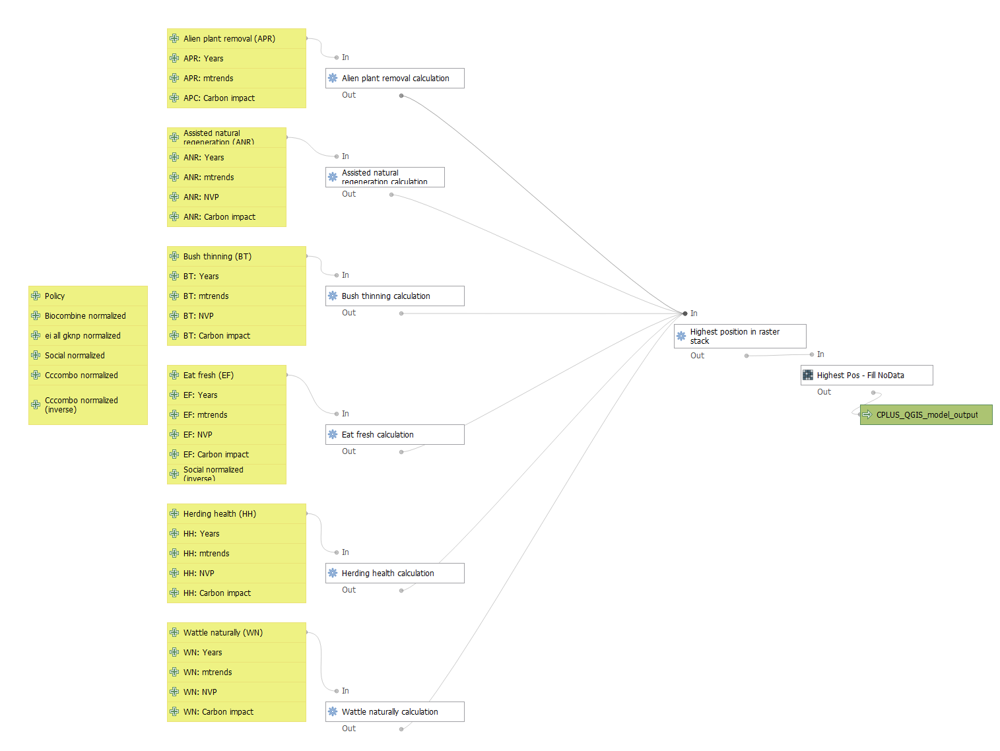

# CPLUS QGIS plugin

## Introduction

Through the help of community leaders and policymakers, the mission of Conservation International (CI) is to combat climate
change and preserve carbon stores. CI and the Climate Positive Land Use Strategy (CPLUS) project need the ability to spatially analyze a given area to determine the
best land use in order to naturally combat climate change and the effects thereof on a global scale.
Further, reports need to be generated to communicate to stakeholders the importance of conserving
and maintaining certain areas and the need to restore lost climate-positive environments. Thus,
mitigating the negative effects of climate change produced by our daily activities. The aim is to ensure
a better future for everyone.

The CPLUS QGIS plugin allows users to implement quantitative spatial decision-making when
assessing the best areas in which to implement land uses or land use projects that help to combat
climate change. As there is a working GIS model/prototype of the CPLUS workflow in place, the goal
of the CPLUS QGIS plugin is to automate and systematize this prototype into a standardized and
user-friendly QGIS plugin that can ultimately be used for analysis in any AOI around the globe

## CPLUS model

### Model

*Figure 1: Simplified analysis model*

*Figure 2: CPLUS simplified analysis workflow with algorithms*

### QGIS model

*Figure 3: CPLUS QGIS plugin workflow*

*Figure 4: Graphical model created in QGIS*
