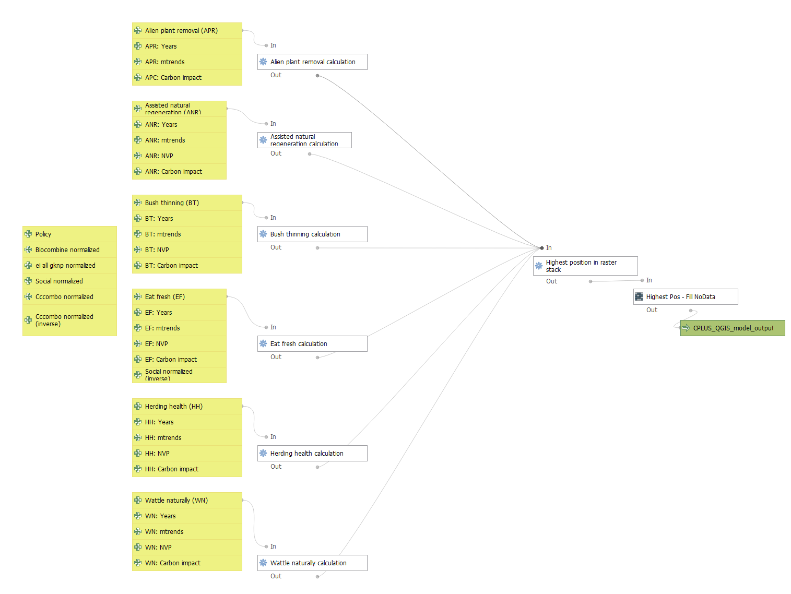

# CPLUS model

## Implementation models

*Figure 1: Simplified analysis model*

## Algorithms

*Figure 2: CPLUS simplified analysis workflow with algorithms*

## QGIS model

*Figure 3: Graphical model created in QGIS*