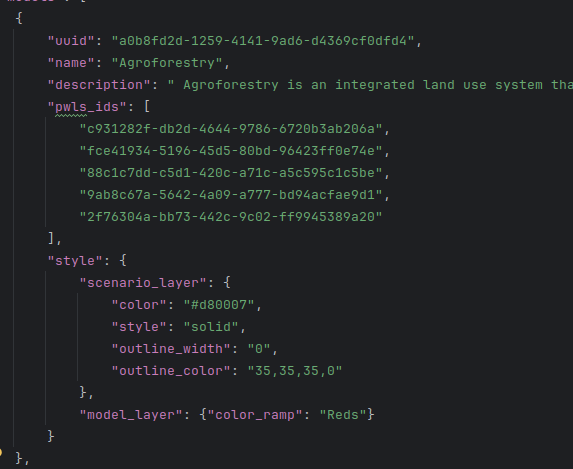
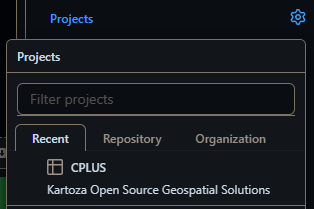
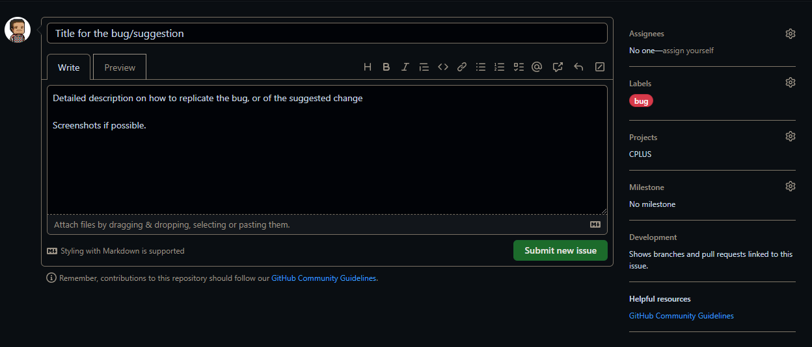
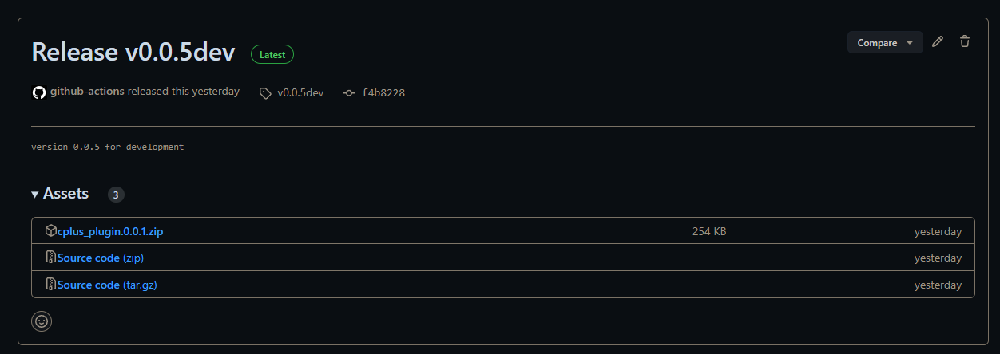
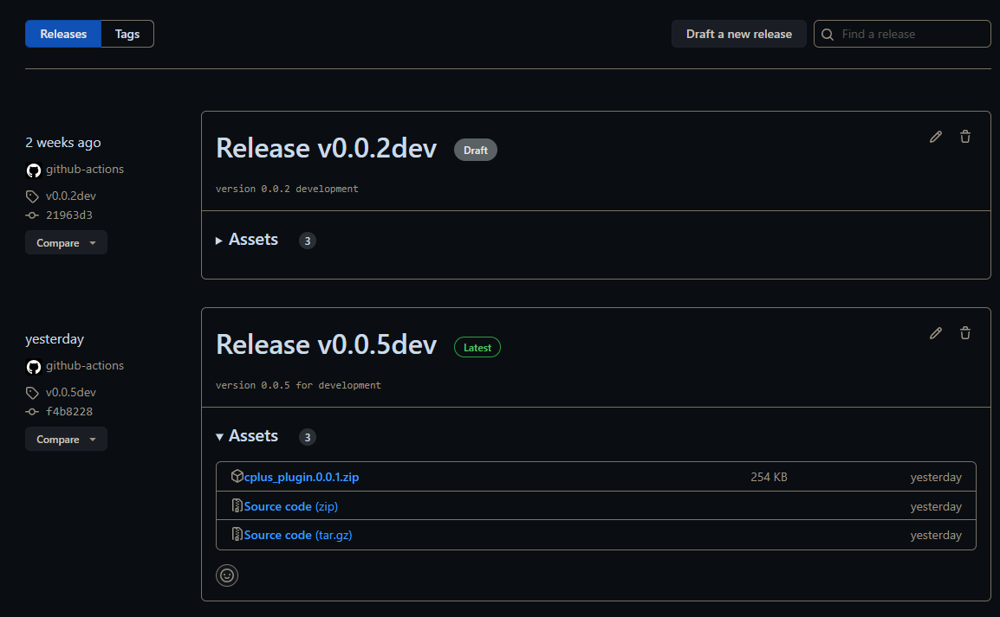

# Administrators guide

## Pilot area data

This section deals with making updates to the data of the pilot study area (Bushback Ridge). This needs
to be done in the GitHub repository, or locally on the repository clone, and then pushed into the repository. The change can be made as follows:

The following JSON files needs to be considered when doing this, all of which are stored in
"src/cplus_plugin/data/default"

- implementation_model.json
- ncs_pathways.json
- priority_weighted_layers.json

### Implementation models

In this file existing implementation models can be edited (e.g. change name or description), be removed
or a new model can be added. Here is a quick overview of a model stored in the JSON file

- Each model contains the following elements:
    - **uuid**: A Universally unique identifier (UUID) for the model
    - **name**: A unique name for the model
    - **description**: Detailed description of the model
    - **pwls_ids**: UUIDs of the priority weighted layers associated with the IM
    - **style**: The style which will be applied to the 
- Editing these will have an effect on the IM in the plugin

When adding a new IM to the list (or a UUID needs to change), the user needs to provide a UUID. This can be done as follows:

- Open a [UUID generator](https://www.uuidgenerator.net/). Other UUID generators can also be used, but the provided link will suffice
- Best will be to make use of version 4
- Click **Generate a version 4 UUID**
- Copy and paste the newly generated UUID

To remove an IM from the list of models, an administrator can simply remove the entry in the JSON file.
Remove this text to remove a model:

To update the list of priority weighted layers for a model, the ID needs to be retrieved:

- Open the priority_weighted_layers.json file
- Each available PWL will be listed under "layers"
- Cope and paste the UUID that needs to be added to the IM pwls_ids field
- Save the file

A section on PWL editing will soon follow.

### NCS pathways

An administrator can access/edit the NCS pathways as follows:

- Open the ncs_pathways.json file
- Here is a description of each element:
    - **uuid**: A unique identifier for the pathway
    - **name**: Unique title for the pathway
    - **description**: Detailed description of the pathway
    - **path**: Directory with file name for the pathway data
    - **layer_type**: Zero (0) for rasters, one (1) for vector layers
    - **carbon_paths**: A list of the carbon footprint rasters. This should be a directory with the raster name. Tif is the preferred format
- Editing these elements will make changes to the pilot area data in the plugin

When adding a new pathway to the list (or a UUID needs to change), the user needs to provide a UUID. This can be done as follows:

- Open a [UUID generator](https://www.uuidgenerator.net/). Other UUID generators can also be used, but the provided link will suffice
- Best will be to make use of version 4
- Click **Generate a version 4 UUID**
- Copy and paste the newly generated UUID

To remove a pathway from the list of layers, an administrator can simply remove the entry in the JSON file.
Remove this text to remove a model:

### Priority weighted layers

Do the following to change/add/remove priority weighted layers for the pilot study area

- Open the priority_weighted_layers.json file
- Here is a description of each element:
    - **uuid**: A unique ID for the PWL
    - **name**: Unique name for the PWL
    - **description**: A detailed description of the PWL
    - **selected**: Whether the PWL should be selected on default
    - **path**: A directory with file name for the PWL data. This should be a raster
- Changing the above values will have an impact on the data in the plugin for the pilot study area

When adding a new PWL to the list (or a UUID needs to change), the user needs to provide a UUID. This can be done as follows:

- Open a [UUID generator](https://www.uuidgenerator.net/). Other UUID generators can also be used, but the provided link will suffice
- Best will be to make use of version 4
- Click **Generate a version 4 UUID**
- Copy and paste the newly generated UUID

To remove a PWL from the list of layers, an administrator can simply remove the entry in the JSON file.
Remove this text to remove a model:

## Bugs and suggestions

This section relates to creating an issue for when a bug is found in the plugin, or
if the user has a suggested improvement for the plugin.

- Go to the [CPLUS repository](https://github.com/kartoza/cplus-plugin)
- Click on the **Issues** tab
- Click on **New Issue** (see **Figure 1**)
  - Title: Short, but descriptive
  - Description: Detailed description. If it's a bug, an explanation on how to replicate the bug will be best.
    Screenshots of the bug or suggestion will also be helpful

*Figure 1: An example of a new GitHub issue*

- Select a **Label** (e.g. bug, enhancement, etc.) as shown in **Figure 2**

*Figure 2: Selecting a label for an issue*

- Select the *CPLUS* **Project** (**Figure 3**). This will add the issue/task to the project board

*Figure 3: Selecting a Project for an issue*

- The end result should be similar to **Figure 4**.

*Figure 4: An example of a finalized issue*

- Click **Submit new issue**

The issue will now be submitted to the GitHub repository and be available to the developers.

## Staging version of the plugin

When a pull requested is performed, an automatic staging version is created. This will allow a developer to test their
changes to the plugin with other changes which has not been merged into the main branch. Another advantage of this
approach is to show the client to progress of the plugin.

### Get the staging version

- Go to the repository: https://github.com/kartoza/cplus-plugin
- To the right there is a section named **Releases**

- Click on **Latest** release
- Download the *cplus_plugin<version>.zip* file if you want to install the plugin in QGIS
- Developers will likely be interested in *Source code (zip)* and *Source code (tar.gz)* options

- See user/installation on how to install a QGIS plugin

If you want to have a look at past versions of the plugin:

- On the repository page, click on **Releases**
- A list of option will appear
- Choose the version you are interested in, and follow the steps discussed above

