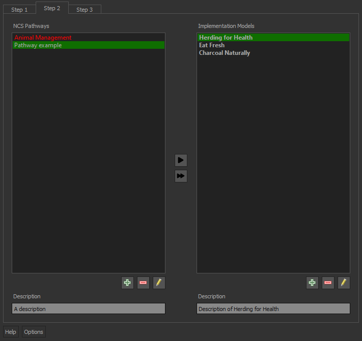
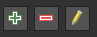
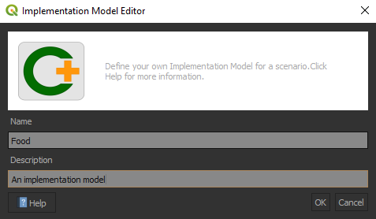
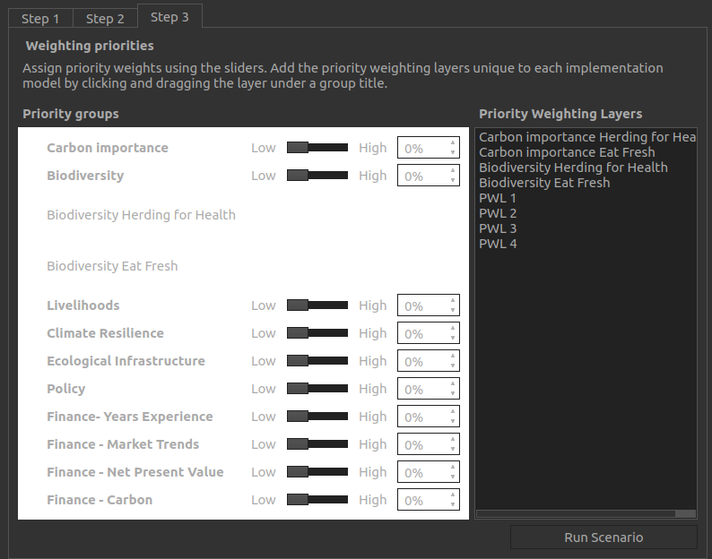

# Plugin guide

## Perform analysis

Open the CPLUS dockwidget by clicking on the CPLUS toolbar icon (**Figure 1**).


*Figure 1: CPLUS toolbar icon*

### Step 1: Scenario Information

The first step focuses on the **Scenario Information**. A *Scenario* refers to an overall analysis
done in an area of interest (AOI). Different criteria and priorities for spatial decision-making and
comparison will be considered for each scenario.

- **Scenario name**: A name for the analysis to be performed
- **Scenario description**: A detailed description of the analysis
- **Extent**: The area of interest for this analysis. This can be calculated from the current
  canvas view extent, a layer, or an extent drawn by the user
- **Figure 2** shows an example of Step 1
- Once the information has been provided, click **Step 2**


*Figure 2: Step 1 focusses on Scenario Information*

### Step 2: Pathways and models

This step deals with the **Natural Climate Solution (NCS) pathways** and the **Implementation models (IM)**.
A NCS pathway can be defined as a composite spatial layer on specific land use classes and other
factors that determine areas ideal for a specific use case (e.g. Animal mangement).
An IM is a combination of NCS pathways represented in an AOI spatial layer. **Figure 3** shows the UI.



*Figure 3: Step 2 allows the user to create and edit NCS pathways and Implementation Models*

Step 2 buttons (**Figure 4**):

- **Add**: Adds a new pathway or model
- **Editing**: Edit and existing pathway or model
- **Delete**: Delete a pathway or model



*Figure 4: Create, delete, and edit buttons*

#### NCS Pathway

- Click on the left green plus button to add a new pathway (**Figure 5**)
- Provide a **Name** and **Description** for the pathway
- Two approaches to select a layer: A layer from the **QGIS canvas**, or **Upload from a file**
- Click **OK**
- The new **NCS pathway** will be added

```
NOTE: If the NCS pathway is broken (e.g. layer or file cannot be found), the pathway text
will be highlighted in red. The user will need to rectify the issue before continuing to
step 3.
```


*Figure 5: NCS Pathway creator/editor*

#### Implementation model

- Click on the right green plus button to add an **Implementation model** (**Figure 6**)
- Provide a **Name** and **Description**
- Click **OK**
- The new **Implementation model** will be added



*Figure 6: Implementation Model creator/editor*

<blockquote>Before proceeding to Step 3, a user needs to define at least one NCS pathway layer for an implementation 
model else a warning message will be displayed as shown in Figure 7 below: </blockquote>

TODO: DV - Insert screenshot

### Step 3: Priority weighting

The final step deals with the **Weighting priorities** and **Priority groups**. These weights
will be applied when the user starts running the scenario. An example is shown in **Figure 7**.



*Figure 8: Step 3 allows the user to set the Weights of each Priority Group*

- Move the slider to adjust the weight of each group
- The user can also manually set the value
- Once the user is done selecting weights, click **Run Scenario**

## Report generating
