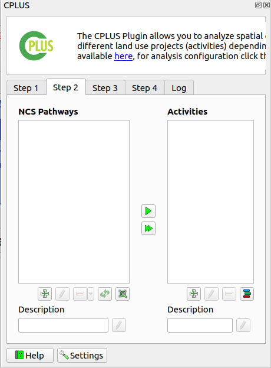

# Guide

## Perform analysis

**Figure 1** shows the toolbar button/menu for the plugin. Clicking on the icon will open the plugin.
When a user clicks on the drop-down button, they will be presented with four options:

- **CPLUS**: Close or open the plugin dock widget
- **Settings**: Open the settings for the plugin
- **Help**: Takes the user to the online guide for the plugin
- **About**: Will take the user to the About section on the GH pages


*Figure 1: CPLUS toolbar icon*

Open the CPLUS dockwidget by clicking on the CPLUS toolbar icon (**Figure 1**).

### Step 1: Scenario Information

The first step focuses on the **Scenario Information**. A *Scenario* refers to an overall analysis
done in an area of interest (AOI). Different criteria and priorities for spatial decision-making and
comparison will be considered for each scenario.

- **Scenario name**: A name for the analysis to be performed
- **Scenario description**: A detailed description of the analysis
- **Extent**: The area of interest for this analysis. This can be calculated from the current
  canvas view extent, a layer, or an extent drawn by the user
- **Figure 2** shows an example of Step 1
- Once the information has been provided, click **Step 2**


*Figure 2: Step 1 focusses on Scenario Information*

### Step 2: Pathways and models

This step deals with the **Natural Climate Solution (NCS) pathways** and the **Implementation models (IM)**.
A NCS pathway can be defined as a composite spatial layer on specific land use classes and other
factors that determine areas ideal for a specific use case (e.g. Animal mangement).
An IM is a combination of NCS pathways represented in an AOI spatial layer. **Figure 3** shows the UI.



*Figure 3: Step 2 allows the user to create and edit NCS pathways and Implementation Models*

Step 2 buttons (**Figure 4**):

- **Add**: Adds a new pathway or model
- **Editing**: Edit and existing pathway or model
- **Delete**: Delete a pathway or model


*Figure 4: Create, delete, and edit buttons*

#### NCS Pathway

- Click on the left green plus button to add a new pathway (**Figure 5**)
- Provide a **Name** and **Description** for the pathway
- Two approaches to select a layer: A layer from the **QGIS canvas**, or **Upload from a file**
- Click **OK**
- The new **NCS pathway** will be added

```
NOTE: If the NCS pathway is broken (e.g. layer or file cannot be found), the pathway text
will be highlighted in red. The user will need to rectify the issue before continuing to
step 3.
```


*Figure 5: NCS Pathway creator/editor*

#### Implementation model

Add pathways to an existing IM:

- Select the IM to which a pathway should be added
- Select the pathway you want to add to the IM
- Click the right arrow  to add a pathway to the selected IM
- Click the double right arrow  to add all pathways to the IM
- The user can also drag-and-drop a pathway onto the desired IM

How to add a new IM:

- Click on the right green plus button to add an **Implementation model** (**Figure 6**)
- Provide a **Name** and **Description**
- (optional) The user can provide an existing raster for the IM. Enable **Map layer** to do this
- Click **OK**
- The new **Implementation model** will be added


*Figure 6: Implementation Model creator/editor*

- The final step is to select each of the IMs a user want to include in the scenario run
- A user can exclude IMs if they don't want to include it, even if the IM has pathways


*Figure 7: Selected Implementation models*

<blockquote>Before proceeding to Step 3, a user needs to define at least one NCS pathway layer for an implementation 
model else a warning message will be displayed as shown in Figure 7 below: </blockquote>

### Step 3: Priority weighting

The final step deals with the **Weighting priorities** and **Priority groups**. These weights
will be applied when the user starts running the scenario. An example is shown in **Figure 9**.


*Figure 8: Step 3 allows the user to set the Weights of each Priority Group*

The priority weighting layers can be selected and added and removed into each priority group by using the 
arrow buttons. 

#### Add priority layers

Select the target layer from the priority weighting layers list and the destination group from
the priority groups and use the left arrow button  
to add the layer into the group.


#### Remove priority layers

Select the target layer from the priority weighting layers list from its priority group and 
use the right arrow button  to remove the layer into the group.

#### Setting groups values 
Move the slider to adjust the weight of each group, values can also be set manually, by using the left input spin box. 
Once done selecting weights, click **Run Scenario** button to run the analysis.

### Steps 1 to 3 example

The following recording (**Figure 9**) shows an example on how to do Step 1, 2 and 3.


*Figure 9: Shows how to implement Step 1, 2 and 3 in QGIS*

## Processing

- Once the user has provided all desired parameters, click **Run Scenario**
- The processing dialog will open (**Figure 10**)
- The processing will take a while, depending on the number of IMs and pathways provided for each IM
- Click the Cancel button to stop the processing


*Figure 10: Processing dialog while the algorithm is running*

- **Figure 11** will be the result if the processing succceeded
- The user should take note that the **View Report** button is now available


*Figure 11: Processing dialog if successfull*

### Processing results

The following groups and layers will be added to the QGIS canvas once the processing finishes (see **Figure 12**):
- A group containing the results
- **Implementation Model Maps**: Non-weighted IMs created by the user in Step 2
- **Weighted Implementation Model Maps**: Weighted IMs based on the IMs added in Step 2 and weighing set in Step 3
- **NCS Pathways Maps**: Pathways used for each IM in Step 2. If a layer were provided as the IM in Step 2, this will contain no pathways


*Figure 12: Groups and layers added to the QGIS canvas*

An example of output results in QGIS is detailed by **Figure 13**


*Figure 13: A recording example of an example scenario*

## Report generating

- Click the **View Report** button
- The user will have the following options:
  - **Layout designer**: 
  - **Open PDF**: 
  - **Help**: Open the help documentation related to the reports


*Figure 14: Report options*

- **Figure 14** shows an example of a report opened in the layout designer

 

*Figure 14: Report opened in the QGIS layout designer*

- **Figure 15** shows an report in PDF format


*Figure 15: PDF version of a report*

### Generated report example

Here is an example on how to open a report in the QGIS layout designer, or as a PDF (**Figure 16**).


*Figure 16: Example of a generated report in PDF and layout designer formats*

## Settings

### Open CPLUS settings

The user can follow two approaches to open the CPLUS settings.

QGIS options (**Figure 17**):

- Click on **Settings** -> **Options**


*Figure 17: QGIS settings*

- Select the CPLUS tab to the left
- This will open the CPLUS settings dialog. See **Figure 18** for an example


*Figure 18: CPLUS section as loaded in the QGIS settings dialog*

CPLUS toolbar (**Figure 19**):
- Click on the CPLUS toolbar drop-down
- Select **Settings**
- This will take you directly to the CPLUS settings dialog in the QGIS options


*Figure 19: CPLUS toolbar button*

### CPLUS settings

A short description of each available setting a user can change. Most are optional.

**Configure Analysis**:

- Settings will be added as the plugin development continues

**Reports**:

- Information which will be included when a report is generated. These settings are optional,
  and will be excluded from the report if not provided
- *Organization*: The organization(s) to be included in the report
- *Contact Email*: Contact email for the author
- *Website*: A website link to the project or company
- *Custom logo*: Enable and provide a custom logo of your choosing. If disabled, the CI logo will be used in the report
- *Footer*: Footer section for the report
- *Disclaimer*: A disclaimer to be added to the report
- *License*: A license to be added to the report

**Advanced**:

- *Base data directory* (required): Data accessed and download by the plugin will be stored here
- *Coefficient for carbon layers*: Value applied during processing to the carbon-based layers. Default is 0

**Figure 20** shows an example of updating and applying CPLUS settings.


*Figure 20: CPLUS settings example*
