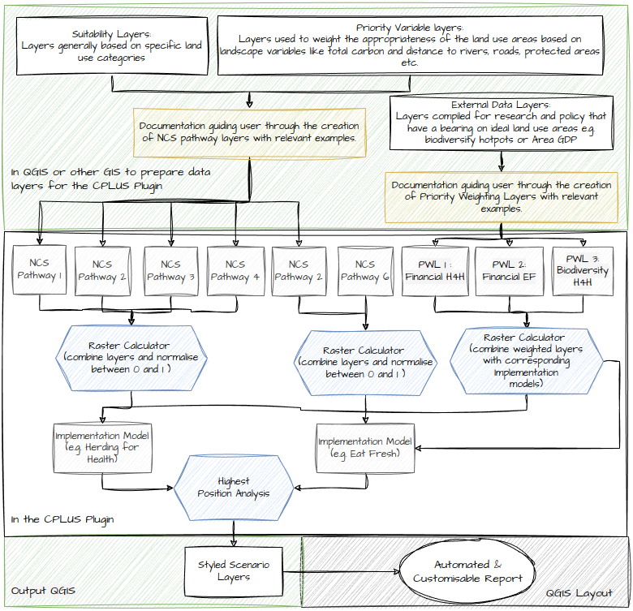

# Guide

## CPLUS model

### Implementation models

**Figure 1** shows a flow diagram of the CPLUS analysis model.

*Figure 1: Simplified analysis model*

### Algorithms

Shown in **Figure 2** is the algorithms applied by the CPLUS model analysis model.

*Figure 2: CPLUS simplified analysis workflow with algorithms*

### QGIS model

The model has been implemented in QGIS, which makes use of the Raster calculator tool to calculate
each of the model's algorithms. Once the algorithms finish, a Highest Position calculation is
done. This workflow is outlined in **Figure 3**.

*Figure 3: Graphical model created in QGIS*

### References

- https://www.pnas.org/doi/10.1073/pnas.1710465114
- https://royalsocietypublishing.org/doi/10.1098/rstb.2019.0126