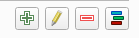
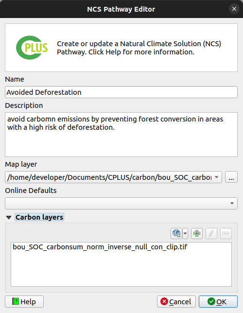
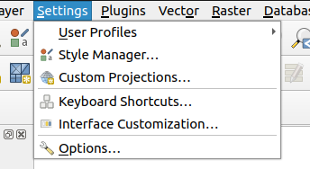

# Guide

## Preparing data

Data preparation is an important step prior to performing data analysis. This is especially true
for spatial data (rasters and vector layers), as there is a lot of factors which plays a role
in the end result. Here are some factors which needs to be considered:

- The data should cover the same spatial extent or overlap each other
- Coordinate systems are very important when it comes to the accuracy of your spatial analysis.
For most analysis a projected coordinate system (e.g. UTM, Albers Equal Area Conic, South African LO-system, etc) is preferred above a
geographic coordinate system (WGS84, Hartebeesthoek84, etc). This is because calculating distances and areas 
is much more accurate with projected coordinate systems
- Best practice will be to make use of the same coordinate system for each layer. Having a geographic coordinate
for some layers, and projected coordinate systems for other, can have negative impacts on your results
- When working with rasters, be sure that the nodata value is set correctly, otherwise the nodata value
will be unknown during analysis and will be considered as a normal pixel value
- The plugin can only work with raster layers. If you have data in vector format, consider converting it to a raster
- Any outlier values needs to be removed from the spatial data prior to performing analysis

Taking into account the above can greatly improve the analysis and the results produced from the analysis.
This section will further deal with how to prepare your data using tools available in QGIS.

- Click **Processing** -> **Toolbox** to open the QGIS toolbox
- The toolbox will be used for each section

### Coordinate systems

#### Fix layers with an undefined CRS

Sometimes a spatial dataset might not have its coordinate system defined. This can cause issues and needs
to be resolved prior to perform analysis. An unknown coordinate system can be identified as follows:

- Open the layer in QGIS
- QGIS will show a warning next to the layer
- This warning will explain that the coordinate system is not defined

*Figure 1: Unknown CRS for a layer in QGIS*

- Further investigation can be done by right-clicking on the layer and select **Properties**
- Click on the **Information** tab
- Scroll down to *Coordinate Reference System (CRS)*
- **Unknown** will be shown if the CRS is not set

*Figure 2: QGIS layer properties*

To define the CRS, do the following:

- Type "assign projection" in the toolbox search
- Open the Assign Projection tool in the *Raster Projections* section
    - If its a vector layer, open the Assign Projection tool in the *Vector general* section
- Set the parameters as follows:
    - **Input layer**: Layer which has an undefined CRS
    - **Desired CRS**: CRS which the layer coordinates is using
- Click **Run**
- Check if the layer is at its correct position in the QGIS canvas

*Figure 3: QGIS Assign projection tool*

<blockquote>Be sure you are using the correct coordinate system when defining an unknown coordinate
system to a layer. If the incorrect coordinate system is selected, the data will likely not be
at the correct position spatially. </blockquote>

#### Reprojecting (Warping)

- Best will be to convert each dataset in a geographic coordinate system to a projected coordinate system
- Type *warp* in the QGIS toolbox search
- Under **Raster projections**, select **Warp**

*Figure 4: QGIS Warp tool*

- Provide the following parameters:
    - **Input layer**: Layer thee user wants to reproject
    - **Source CRS**: Current CRS of the layer
    - **Target CRS**: The CRS to what the layer should be projected
    - **Resampling method to use**: Nearest Neighbour. Using other options will change pixel values, which we don't want
    - **Nodata value**: Leave empty, except if the user wants to change the nodata value
    - **Reprojected**: The output file

- Click **Run**
- Do this for all geographic coordinate system rasters
- As mentioned above, best will be for all layers to make use of the same coordinate system

### Nodata value

If a nodata value for a raster is not set correctly, it will be considered as a pixel value which is
part of the analysis. This can have a negative impact on the analysis results.

How to check if a raster's nodata is set correctly

- Right-click on the raster in QGIS
- Select **Properties**
- Select the **Information** tab
- Scroll down to the **Bands** section
- Under **No-data** there should be a value
- If there is no value, this means that the nodata is not set correctly and therefore needs to be fixed

*Figure 5: Layer properties to check for nodata value*

To fix a nodata issue, do the following:

- Type *Translate* in the toolbox search
- Open the *Translate* tool under *Raster Conversion*

*Figure 6: QGIS Translate tool*

- Provide the following parameters:
    - **Input layer**: Raster layer
    - **Assign a specific nodata value to output bands**: Provide a desired value here. -9999 will suffice for most cases
    - **Converted**: Output raster

This should solve a nodata issue with a raster. The *Translate* tool is to convert a raster to another format, but the user can still make use of the same format. This tool
is useful to correctly set nodata values when needed.

### Outlier pixels/values

A user must check if the raster data only include pixel values within the range it should be. If there
are any pixels values outside the range of accepted values, those pixels needs to be removed. This can be
accomplished using the *Reclassify by table* tool.

- Type *reclassify by table* in the QGIS toolbox search
- Select the *Reclassify by table* tool
- Set the parameters as follows:
    - **Raster layer**: Layer to be reclassed
    - **Band number**: Like the first band
    - **Reclassified raster**: Output raster
    - **Reclassification table**: Rules for the reclassification (explanation follows)

*Figure 7: QGIS Reclassify by Table tool*

- Open the *Reclassification table* so that the user can set the value reclassifcations. Atleast one
row needs to be provided
- Click **Add Row**
- Provide a *Minimum* and *Maximum* value. Consider the following:
    - Minimum must be less than maximum if providing a range
    - If only a single value needs to be reclassified, set the *Minimum* and *Maximum* to the same value
- Set the new *Value* for each row:
    - *Value* has to be numeric
    - If a user wants to remove a pixel/value from the analysis, the value needs to be set to the nodata value
    of the raster (e.g. -9999). See the above section on the **Nodata value** on how to find the nodata value of a raster

*Figure 8: Reclassify table*

- Click **Run**
- An example of the resulting raster compared to the original raster is shown in **Figure 8b**

*Figure 8b: Reclassified raster compared to the original raster*

### Vector to raster

As mentioned above, the plugin can only work with raster layers. But often a user might have some data in vector format. This can easily be resolved
by converting the vector layer to a raster, which can then be used as input to the plugin. Firstly, we want to convert the vector layer
to make use of the same projected coordinate system than other data. This can be done as follows:

- Type 'Reproject layer' in the QGIS toolbox search
- Select the 'Reproject layer' tool in the 'Vector general' section

*Figure 9: QGIS Reproject tool for vector layers*

- Set the parameters as follows:
    - **Input layer**: Vector layer which needs to be reprojected
    - **Target CRS**: Coordinate system to which the layer should be reprojected, preferrably a projected coordinate system
    - **Reprojected**: The output layer

- Click **Run**

Now that the vector layer is in the correct coordinate system, the user can convert the vector layer to a raster:

- Type 'rasterize' in the QGIS toolbox search
- Select 'Rasterize (vector to raster)'

*Figure 10: QGIS Rasterize tool*

- Set the parameters as follows:
    - **Input layer**: The vector layer to convert to a raster
    - **Field to use to burn**: Attribute field to use as the raster pixel values
    - **A fixed value to burn**: A default value for empty fields for a feature. Otherwise leave as is
    - **Output raster size units**: Georeferenced units
    - **Width** and **Height**: Spatial resolution in meters. If the vector layer is in geograpghic coordinates, this distance will be degrees not meters
    - **Output extent**: Leave as is, except if the user wants to limit the output to an extent
    - **Assign a specific nodata value to output bands**: -9999 will suffice for most cases
    - **Rasterized**: The output raster
- Click **Run**

The user's data should now be ready for analysis.

## Perform analysis

**Figure 1** shows the toolbar button/menu for the plugin. Clicking on the icon will open the plugin.
When a user clicks on the drop-down button, they will be presented with four options:

- **CPLUS**: Close or open the plugin dock widget
- **Settings**: Open the settings for the plugin
- **Help**: Takes the user to the online guide for the plugin
- **About**: Will take the user to the About section on the GH pages

*Figure 11: CPLUS toolbar icon*

Open the CPLUS dockwidget by clicking on the CPLUS toolbar icon (**Figure 11**).

### Step 1: Scenario Information

The first step focuses on the **Scenario Information**. A *Scenario* refers to an overall analysis
done in an area of interest (AOI). Different criteria and priorities for spatial decision-making and
comparison will be considered for each scenario.

- **Scenario name**: A name for the analysis to be performed
- **Scenario description**: A detailed description of the analysis
- **Extent**: The area of interest for this analysis. This can be calculated from the current
  canvas view extent, a layer, or an extent drawn by the user
- **Figure 12** shows an example of Step 1
- Once the information has been provided, click **Step 2**

*Figure 12: Step 1 focusses on Scenario Information*

### Step 2: Pathways and models

This step deals with the **Natural Climate Solution (NCS) pathways** and the **Implementation models (IM)**.
A NCS pathway can be defined as a composite spatial layer on specific land use classes and other
factors that determine areas ideal for a specific use case (e.g. Animal mangement).
An IM is a combination of NCS pathways represented in an AOI spatial layer. **Figure 13** shows the UI.

*Figure 13: Step 2 allows the user to create and edit NCS pathways and Implementation Models*

Step 2 buttons (**Figure 14**):

- **Add**: Adds a new pathway or model
- **Editing**: Edit and existing pathway or model
- **Delete**: Delete a pathway or model

*Figure 14: Create, delete, and edit buttons*

#### NCS Pathway

- Click on the left green plus button to add a new pathway (**Figure 15**)
- Provide a **Name** and **Description** for the pathway
- Two approaches to select a layer: A layer from the **QGIS canvas**, or **Upload from a file**
- Add **Carbon layers** as desired. Multiple carbon layers can be provided. These layers will be averaged
- Click **OK**
- The new **NCS pathway** will be added

<blockquote> If the NCS pathway is broken (e.g. layer or file cannot be found), the pathway text
will have an exclamation mark next to it. The user will need to rectify the issue before continuing to
step 3. </blockquote>

*Figure 15: NCS Pathway creator/editor*

<blockquote> Be sure each NCS pathway's Carbon layers is set up correctly before setting up
the Implementation models in the steps which follows. Changes to the Carbon layers afterward will
require the user to set up the Implementation model again. </blockquote>

#### Implementation model

Add pathways to an existing IM:

- Select the IM to which a pathway should be added
- Select the pathway you want to add to the IM
- Click the right arrow  to add a pathway to the selected IM
- Click the double right arrow  to add all pathways to the IM
- The user can also drag-and-drop a pathway onto the desired IM

How to add a new IM:

- Click on the right green plus button to add an **Implementation model** (**Figure 16**)
- Provide a **Name** and **Description**
- (optional) The user can provide an existing raster for the IM. Enable **Map layer** to do this
- Click **OK**
- The new **Implementation model** will be added

*Figure 16: Implementation Model creator/editor*

- The final step is to select each of the IMs a user want to include in the scenario run
- A user can exclude IMs if they don't want to include it, even if the IM has pathways

*Figure 17: Selected Implementation models*

<blockquote>Before proceeding to Step 3, a user needs to define at least one NCS pathway layer for an implementation 
model, otherwise a warning message will be displayed. </blockquote>

### Step 3: Priority weighting

The final step deals with the **Weighting priorities** and **Priority groups**. These weights
will be applied when the user starts running the scenario. An example is shown in **Figure 18**.

*Figure 18: Step 3 allows the user to set the Weights of each Priority Group*

The priority weighting layers can be selected and added and removed into each priority group by using the 
arrow buttons. 

#### Add priority layers

Select the target layer from the priority weighting layers list and the destination group from
the priority groups and use the left arrow button  
to add the layer into the group.

#### Remove priority layers

Select the target layer from the priority weighting layers list from its priority group and 
use the right arrow button  to remove the layer into the group.

#### Create custom priority layers

- Click on  to add a new custom priority layer, or  to edit an existing priority layer
- This will open the Priority Layer dialog (see **Figure 19**)
- The following parameters needs to be set:
    - **Priority layer**: The layer which represents the priority layer
    - **Priority layer name**: A unique identifier for the priority layer
    - **Priority layer description**: A detailed description of the priority layer
- Click the **Assign implementation models** button to select IMs to be associated with the priority layer (see **Figure 10**)

*Figure 19: Priority layer dialog*

- Select the IMs you want to be associated with the priority layer
- Click **OK**

*Figure 20: Implementation model selection for priority layers*

- : Remove the selected PWL

#### Setting groups values 
Move the slider to adjust the weight of each group, values can also be set manually, by using the left input spin box. 
Once done selecting weights, click **Run Scenario** button to run the analysis.

### Steps 1 to 3 example

The following recording (**Figure 21**) shows an example on how to do Step 1, 2 and 3.

*Figure 21: Shows how to implement Step 1, 2 and 3 in QGIS*

## Processing

- Once the user has provided all desired parameters, click **Run Scenario**
- The processing dialog will open (**Figure 22**)
- The processing will take a while, depending on the number of IMs and pathways provided for each IM
- Click the **Cancel** button to stop the processing

*Figure 22: Processing dialog while the algorithm is running*

- **Figure 23** will be the result if the processing succceeded
- The user should take note that the **View Report** button is now available

*Figure 23: Processing dialog if successfull*

### Processing results

The following groups and layers will be added to the QGIS canvas once the processing finishes (see **Figure 24**):
- A group containing the Scenario results
- **Implementation Model Maps**: Non-weighted IMs created by the user in Step 2
- **Weighted Implementation Model Maps**: Weighted IMs based on the IMs added in Step 2 and weighing set in Step 3
- **NCS Pathways Maps**: Pathways used for each IM in Step 2. If a IM layer were provided as the IM in Step 2, this will contain no pathways

*Figure 24: Groups and layers added to the QGIS canvas*

An example of output results in QGIS is detailed by **Figure 25**

*Figure 25: A recording example of an example scenario*

## Report generating

- Click the **View Report** button
- The user will have the following options:
    - **Layout designer**: Opens the report in the QGIS layout designer
    - **Open PDF**: Opens the report in PDF format
    - **Help**: Open the help documentation related to the reports

*Figure 26: Report options*

- **Figure 27** shows an example of a report opened in the layout designer

 

*Figure 27: Report opened in the QGIS layout designer*

- **Figure 28** shows a report in PDF format

*Figure 28: PDF version of a report*

### Generated report example

Here is an example on how to open a report in the QGIS layout designer, or as a PDF (**Figure 29**).

*Figure 29: Example of a generated report in PDF and layout designer formats*

## Settings

### Open CPLUS settings

The user can follow two approaches to open the CPLUS settings.

QGIS options (**Figure 30**):

- Click on **Settings** -> **Options**

*Figure 30: QGIS settings*

- Select the *CPLUS* tab to the left
- This will open the CPLUS settings dialog. See **Figure 31** for an example

*Figure 31: CPLUS section as loaded in the QGIS settings dialog*

CPLUS toolbar (**Figure 32**):
- Click on the CPLUS toolbar drop-down
- Select **Settings**
- This will take you directly to the CPLUS settings dialog in the QGIS options

*Figure 32: CPLUS toolbar button*

### CPLUS settings

A short description of each available setting a user can change. Most are optional.

**Configure Analysis**:

- Settings will be added as the plugin development continues

**Reports**:

- Information which will be included when a report is generated. These settings are optional,
  and will be excluded from the report if not provided
- **Organization**: The organization(s) to be included in the report
- **Contact Email**: Contact email for the author
- **Website**: A website link to the project or company
- **Custom logo**: Enable and provide a custom logo of your choosing. If disabled, the CI logo will be used in the report
- **Footer**: Footer section for the report
- **Disclaimer**: A disclaimer to be added to the report
- **License**: A license to be added to the report

**Advanced**:

- **Base data directory** (required): Data accessed and download by the plugin will be stored here
- **Coefficient for carbon layers**: Value applied during processing to the carbon-based layers. Default is 0

**Figure 33** shows an example of updating and applying CPLUS settings.

*Figure 33: CPLUS settings example*
