# Log

Welcome to the `Log Tab!` This section provides comprehensive insights into scenario history and processing logs. Here is a quick guide to navigating this feature.

Click on the 1️⃣ `Log` option to access the log tab.

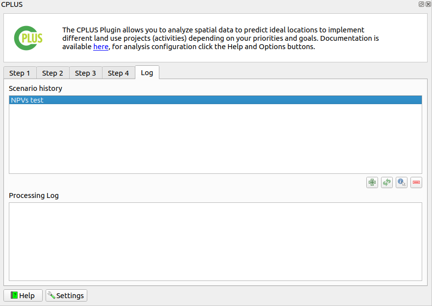

## Scenario History

This section displays a record of past scenarios executed within the system.

### Offline Scenarios

- In this scenario, reports are stored locally and can be accessed even when the system is offline.

- To view the offline report, the user has to select the report and then click on `refresh` button, this will load the scenario.

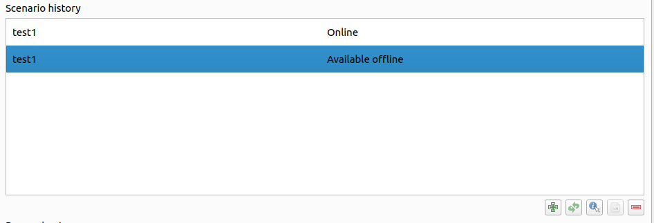

### Online Scenarios

- In this scenario, reports are generated and stored on the server.

- To view the online report, the user has to select the report and then click on the  `refresh` button, this will load the scenario.
  
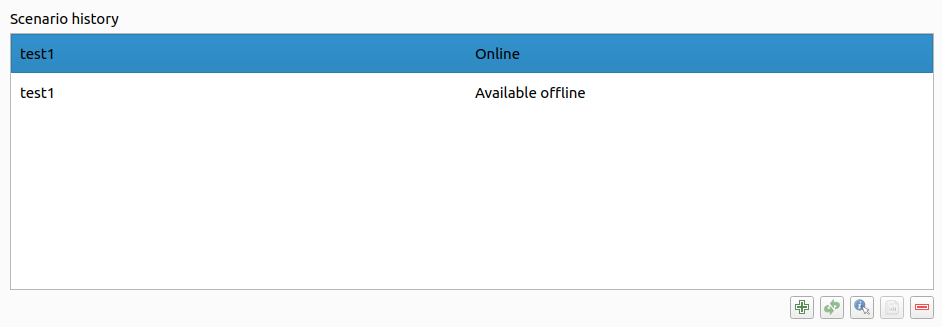

- After the successful completion of report generation via running the scenario online, the user will receive an email confirming the successful completion of the report.

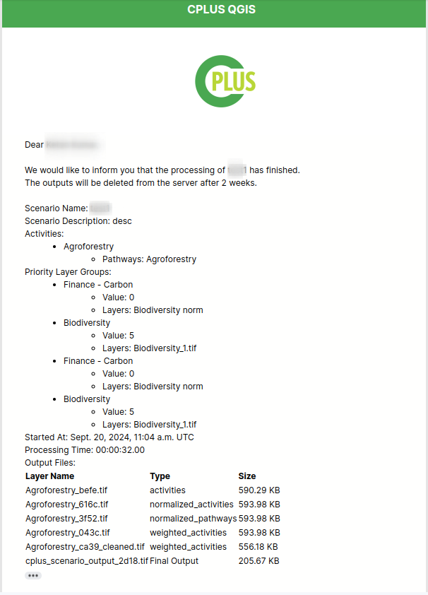

### Buttons Available

**Plus Icon:** Click this button to save the scenario to the history section for review and analysis.

**Refresh Button:** This button loads the selected scenario details into step 1.

**Information Icon:** Click here to access helpful information and tips related to the selected scenario.

**Scenario Comparison Report:** This button allows you to generate comparison report based on the selected scenarios.

**Minus Icon:** Remove specific scenarios from the history section to streamline displayed records.

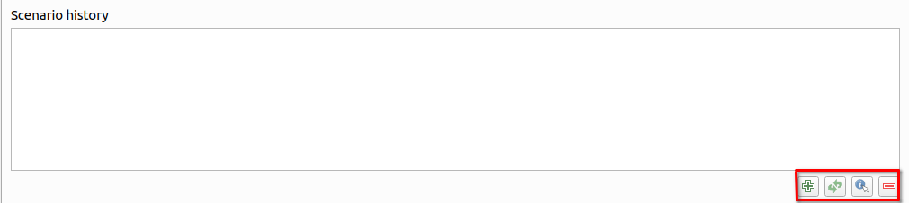

## Processing Log

Here, you can view detailed logs of the current processing scenario.
This log provides real-time insights into actions, events, and outcomes within the ongoing scenario.

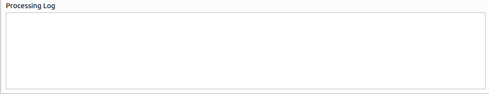

## Usage Tips

- Use the scenario history to review past activities and performance trends.

- Utilise the processing log to monitor the progress of current scenarios and diagnose any issues.

- Take advantage of the available buttons to manage and customise your log viewing experience.

- By leveraging the Log Tab effectively, you can gain valuable insights into system activities, optimise performance, and streamline workflow processes. If you have any questions or need assistance, don't hesitate to reach out to our support team.

## Where reports will be stored?

You can locate the report in the base directory folder. Within this folder, you will find all the scenario folders. Simply access the desired scenario folder to view the reports associated with that specific scenario. This organised structure allows for easy access to scenario-specific reports, facilitating efficient analysis and decision-making.

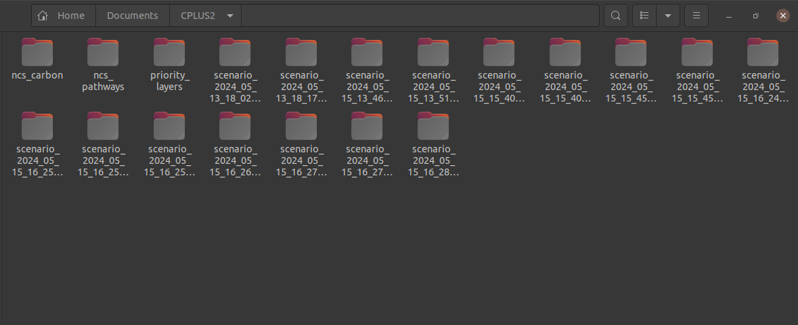
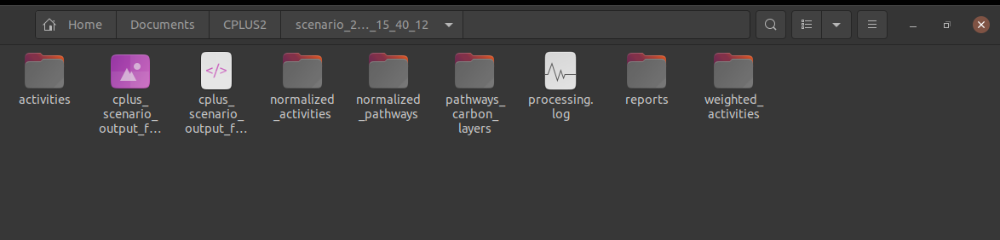

# How to Generate a Comparison Report

This feature allows users to compare different scenarios and generate comprehensive reports that are saved in the base data directory specified in the CPLUS plugin settings.

## Steps to Generate a Comparison Report

- **Step 1 Run the Scenario:** Ensure the scenario you want to save runs successfully. Only successful scenarios can be saved and used for comparison.

- **Step 2 Save Scenario History:** After the scenario runs successfully, click on the 1️⃣ `plus` icon to save the scenario history into the logs.

    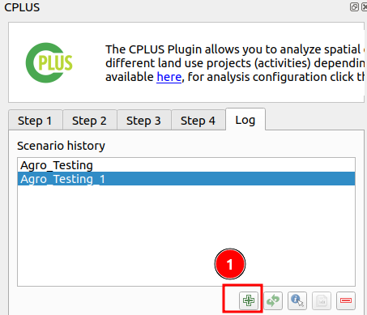

- **Step 3 Select Scenarios for Comparison:** Choose the scenarios you want to compare from the list of available logs. To select more than one scenario, hold down the `Ctrl` button while clicking on each scenario.

    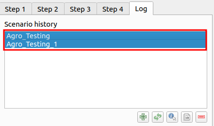

- **Step 4 Initiate Comparison:** Click on the 1️⃣ `Comparison` icon to start the comparison. Upon clicking the icon, the comparison report generation will commence. A popup will appear showing a progress bar indicating the status of the report generation process.

    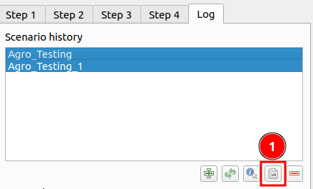

- **Step 5 Access the Comparison Report:** Once the comparison report is generated, it will be saved in the base data directory specified in the CPLUS plugin settings. Go to the base data directory to access your comparison report.

## Components of the Comparison Report

**The comparison report includes the following key components:**

- **Scenario Activity Area Comparison Table:** This table provides a detailed comparison of activity areas across the selected scenarios. It offers insights into how different activities perform in various areas, highlighting similarities and differences between scenarios.

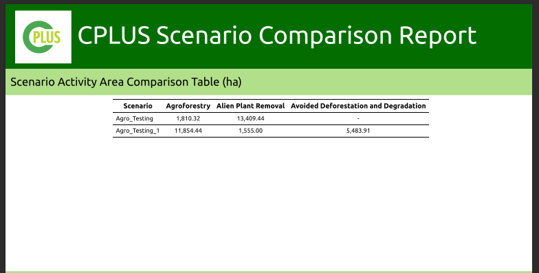

- **Scenario Maps:** These maps provide a side-by-side comparison of the different scenarios selected for the report. They represent the final output of the highest position analysis done for each scenario, indicating which activities are best suited to each area in the stated area of interest.

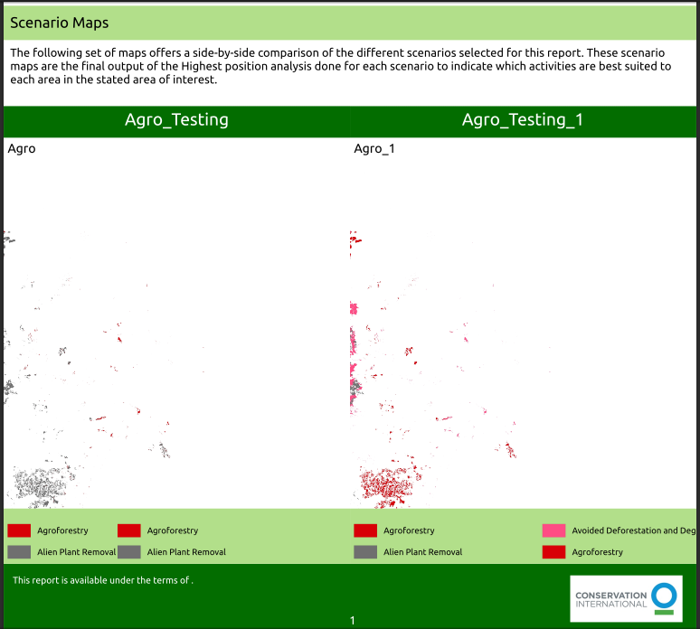

Following these steps will help you successfully generate a comparison report. Ensure your scenarios run successfully and are saved correctly to utilise the comparison functionality effectively.
