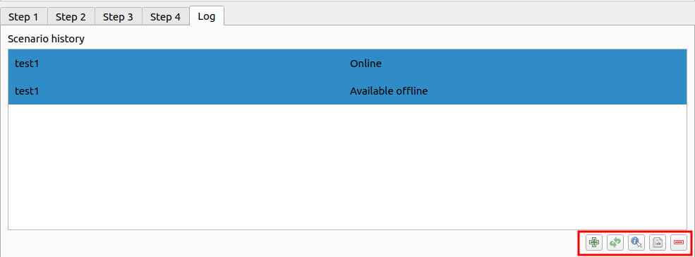

# Log

Welcome to the `Log Tab!` This section provides comprehensive insights into scenario history and processing logs. Here is a quick guide to navigating this feature.

Click on the 1️⃣ `Log` option to access the log tab.

## Scenario History

This section displays a record of past scenarios executed within the system.

### Buttons Available

**Plus Icon:** Click this button to save the scenario to the history section for review and analysis.

**Refresh Button:** This button loads the selected scenario details into step 1.

**Information Icon:** Click here to access helpful information and tips related to the selected scenario.

**Minus Icon:** Remove specific scenarios from the history section to streamline displayed records.

## Processing Log

Here, you can view detailed logs of the current processing scenario.
This log provides real-time insights into actions, events, and outcomes within the ongoing scenario.

## Usage Tips

- Use the scenario history to review past activities and performance trends.

- Utilise the processing log to monitor the progress of current scenarios and diagnose any issues.

- Take advantage of the available buttons to manage and customise your log viewing experience.

- By leveraging the Log Tab effectively, you can gain valuable insights into system activities, optimise performance, and streamline workflow processes. If you have any questions or need assistance, don't hesitate to reach out to our support team.

## Where reports are will stores?

You can locate the report in the base directory folder. Within this folder, you will find all the scenario folders. Simply access the desired scenario folder to view the reports associated with that specific scenario. This organised structure allows for easy access to scenario-specific reports, facilitating efficient analysis and decision-making.

