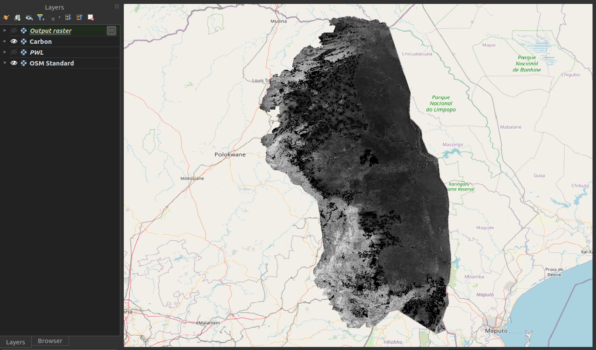
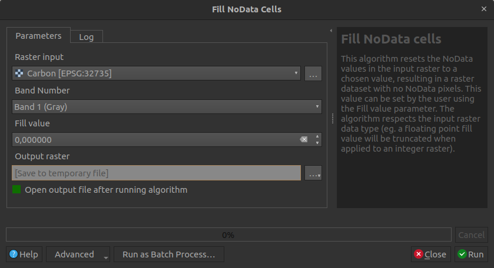

# Preparing data

Data preparation is an important step before performing data analysis. This is especially true for spatial data (rasters and vector layers), as many factors play a role in the result. Here are some factors that need to be considered:

- The data should cover the same spatial extent or overlap each other.

- Coordinate systems are very important when it comes to the accuracy of your spatial analysis.

For most analysis, a projected coordinate system (e.g. UTM, Albers Equal Area Conic, South African LO-system, etc) is preferred above a geographic coordinate system (WGS84, Hartebeesthoek84, etc). This is because calculating distances and areas is much more accurate with projected coordinate systems.

- The best practice will be to make use of the same coordinate system for each layer. Having a geographic coordinate
for some layers, and projected coordinate systems for others, can have negative impacts on your results.

- When working with rasters, be sure that the nodata value is set correctly, otherwise, the nodata value
will be unknown during analysis and will be considered as a normal pixel value.

- The plugin can only work with raster layers. If you have data in vector format, convert it to raster.

- Any outlier values need to be removed from the spatial data before performing analysis.

Taking into account the above can greatly improve the analysis and the results produced from the analysis. This section will further deal with how to prepare your data using tools available in QGIS.

- Click **Processing** -> **Toolbox** to open the QGIS toolbox.

- The toolbox will be used for each section.

## Carbon and Priority weighted layers

Both Carbon and Priority weighted layers (PWL) should not contain any nodata values. If the nodata pixels
are not removed from the rasters, the user's analysis will be less efficient and likely result in a reduction in
results (e.g. all nodata pixels will end up as nodata). **Figure 1** shows a Carbon raster with nodata pixels.

*Figure 1: Raster with nodata pixels*

Follow these easy steps to remove nodata pixels from a raster:

- In the toolbox search, type "fill nodata".

- Open the tool *Fill NoData cells*.

- Provide the parameters as follows:
    - **Raster input**: Raster layer with nodata pixels which should be removed
    - **Fill value**: Zero should suffice for most cases
    - **Output raster**: Directory to which the filled raster should be stored

*Figure 2: QGIS Fill nodata cells*

- Click **Run**

**Figure 3** shows a nodata filled raster.

*Figure 3: Raster with nodata pixels removed/filled*

### Coordinate systems

#### Fix layers with an undefined CRS

Sometimes a spatial dataset might not have its coordinate system defined. This can cause issues and needs
to be resolved before performing analysis. An unknown coordinate system can be identified as follows:

- Open the layer in QGIS.
- QGIS will show a warning next to the layer.
- This warning will explain that the coordinate system is not defined.

*Figure 4: Unknown CRS for a layer in QGIS*

- Further investigation can be done by right-clicking on the layer and selecting **Properties**
- Click on the **Information** tab
- Scroll down to *Coordinate Reference System (CRS)*
- **Unknown** will be shown if the CRS is not set

*Figure 5: QGIS layer properties*

To define the CRS, do the following:

- Type "assign projection" in the toolbox search.
- Open the Assign Projection tool in the *Raster Projections* section.
    - If it's a vector layer, open the Assign Projection tool in the *Vector general* section.

- Set the parameters as follows:
    - **Input layer**: Layer which has an undefined CRS.
    - **Desired CRS**: CRS which the layer coordinates are using.

- Click **Run**.
- Check if the layer is at its correct position in the QGIS canvas.

*Figure 6: QGIS Assign projection tool*

<blockquote>Be sure you are using the correct coordinate system when defining an unknown coordinate
system to a layer. If the incorrect coordinate system is selected, the data will likely not be
at the correct position spatially. </blockquote>

#### Reprojecting (Warping)

- The best will be to convert each dataset in a geographic coordinate system to a projected coordinate system.
- Type *warp* in the QGIS toolbox search.
- Under **Raster projections**, select **Warp**.

*Figure 7: QGIS Warp tool*

- Provide the following parameters:
    - **Input layer**: Layer the user wants to reproject.
    - **Source CRS**: Current CRS of the layer.
    - **Target CRS**: The CRS to what the layer should be projected.
    - **Resampling method to use**: Nearest Neighbour. Using other options will change pixel values, which we don't want.
    - **Nodata value**: Leave empty, except if the user wants to change the nodata value.
    - **Reprojected**: The output file.

- Click **Run**.
- Do this for all geographic coordinate system rasters.
- As mentioned above, the best will be for all layers to make use of the same coordinate system.

### Nodata value

If a nodata value for a raster is not set correctly, it will be considered as a pixel value which is part of the analysis. This can have a negative impact on the analysis results.

How to check if a raster's nodata is set correctly?

- Right-click on the raster in QGIS.
- Select **Properties**.
- Select the **Information** tab.
- Scroll down to the **Bands** section.
- Under **No-data** there should be a value.
- If there is no value, this means that the nodata is not set correctly and therefore needs to be fixed.

*Figure 8: Layer properties to check for nodata value*

To fix a nodata issue, do the following:

- Type *Translate* in the toolbox search.
- Open the *Translate* tool under *Raster Conversion*.

*Figure 9: QGIS Translate tool*

- Provide the following parameters:
    - **Input layer**: Raster layer.
    - **Assign a specific nodata value to output bands**: Provide a desired value here. -9999 will suffice for most cases.
    - **Converted**: Output raster.

This should solve a nodata issue with a raster. The *Translate* tool is to convert a raster to another format, but the user can still make use of the same format. This tool is useful to correctly set nodata values when needed.

### Outlier pixels/values

A user must check if the raster data only includes pixel values within the range it should be. If there
are any pixel values outside the range of accepted values, those pixels need to be removed. This can be
accomplished using the *Reclassify by table* tool.

- Type *reclassify by table* in the QGIS toolbox search.

- Select the *Reclassify by table* tool.

- Set the parameters as follows:
    - **Raster layer**: Layer to be reclassed.
    - **Band number**: Like the first band.
    - **Reclassified raster**: Output raster.
    - **Reclassification table**: Rules for the reclassification (explanation follows).

*Figure 10: QGIS Reclassify by Table tool*

- Open the *Reclassification table* so that the user can set the value reclassifications. At least one
row needs to be provided.

- Click **Add Row**.

- Provide a *Minimum* and *Maximum* value. Consider the following:
    - The minimum must be less than the maximum if providing a range.
    - If only a single value needs to be reclassified, set the *Minimum* and *Maximum* to the same value.

- Set the new *Value* for each row:
    - *Value* has to be numeric.
    - If a user wants to remove a pixel/value from the analysis, the value needs to be set to the nodata value of the raster (e.g. -9999). See the above section on the **Nodata value** on how to find the nodata value of a raster.

*Figure 11: Reclassify table*

- Click **Run**.
- An example of the resulting raster compared to the original raster is shown in **Figure 12**.

*Figure 12: Reclassified raster compared to the original raster*

### Vector to raster

As mentioned above, the plugin can only work with raster layers. But often a user might have some data in vector format. This can easily be resolved by converting the vector layer to a raster, which can then be used as input to the plugin. Firstly, we want to convert the vector layer to make use of the same projected coordinate system as other data. This can be done as follows:

- Type 'Reproject layer' in the QGIS toolbox search.
- Select the 'Reproject layer' tool in the 'Vector general' section.

*Figure 13: QGIS Reproject tool for vector layers*

- Set the parameters as follows:
    - **Input layer**: Vector layer that needs to be reprojected.
    - **Target CRS**: Coordinate system to which the layer should be reprojected, preferably a projected coordinate system.
    - **Reprojected**: The output layer.

- Click **Run**

Now that the vector layer is in the correct coordinate system, the user can convert the vector layer to a raster:

- Type 'rasterize' in the QGIS toolbox search.
- Select 'Rasterize (vector to raster)'.

*Figure 14: QGIS Rasterize tool*

- Set the parameters as follows:
    - **Input layer**: The vector layer to convert to a raster.
    - **Field to use to burn**: Attribute field to use as the raster pixel values.
    - **A fixed value to burn**: A default value for empty fields for a feature. Otherwise, leave as is.
    - **Output raster size units**: Georeferenced units.
    - **Width** and **Height**: Spatial resolution in meters. If the vector layer is in geographical coordinates, this distance will be degrees, not meters.
    - **Output extent**: Leave as is, except if the user wants to limit the output to an extent
    - **Assign a specific nodata value to output bands**: -9999 will suffice for most cases
    - **Rasterized**: The output raster.

- Click **Run**.

The user's data should now be ready for analysis.
