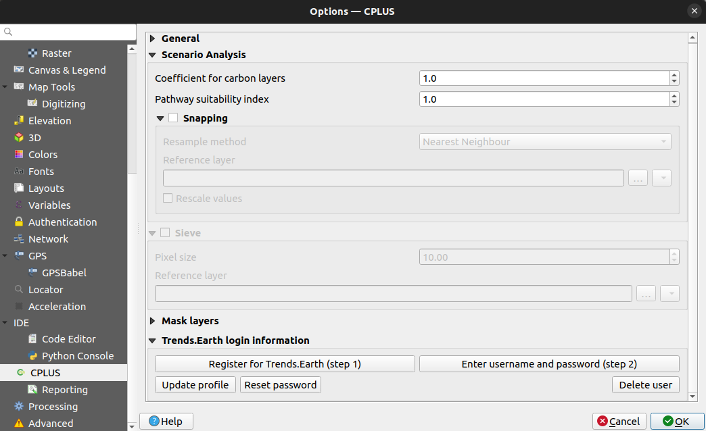
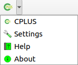
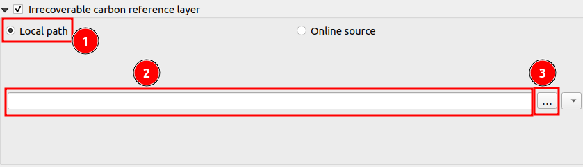
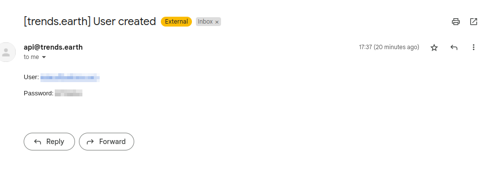
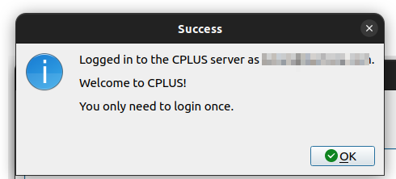
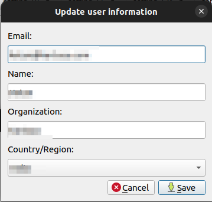
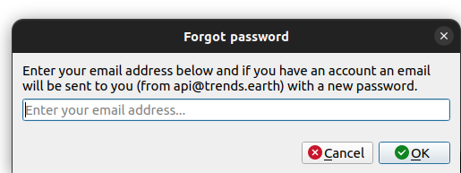

# How to apply CPLUS settings?

The CPLUS settings provide users with a customizable interface to configure various aspects of the platform according to their needs and preferences. Users can access the CPLUS settings through either the QGIS options or the CPLUS toolbar.

## Accessing CPLUS Settings

QGIS options (**Figure 1**):

- Click on **Settings** -> **Options**

*Figure 1: QGIS settings*

- Select the *CPLUS* tab to the left.
- This will open the CPLUS settings dialog. See **Figure 2** for an example.

*Figure 2: CPLUS section as loaded in the QGIS settings dialog*

CPLUS toolbar (**Figure 3**):

- Click on the CPLUS toolbar drop-down.
- Select **Settings**.
- This will take you directly to the CPLUS settings dialog in the QGIS options.

*Figure 3: CPLUS toolbar button*

A short description of each available setting a user can change. Most are optional, but the user needs to set the base directory as it's a requirement for the processing to work (e.g. outputs are stored in the base directory). Another important option to consider is snapping, as it will improve analysis results.

### Overview of Available Settings

**Configure Analysis:**

- Settings will be added as the plugin development continues.

#### Click on the CPLUS Tab to view the setting options

Once you click on the CPLUS Tab you will see the all available setting options. Click on the arrow to expand the setting options.

#### General

Click on the 1️⃣ `Three dots` to select a file from your system to set as the base directory.

#### Scenario Analysis

Enter the 1️⃣ `Coefficient for carbon layers` which will be applied to carbon layers during processing. Enter the 2️⃣ `Pathway suitability index` the index multiplied to the pathways. Lower values means the pathway is less important, and higher means it's more important.

##### Snapping

Snapping will set rasters to match the cell alignment of a reference layer.

Resampling performed on pixel values. You can choose the method of your choice from the dropdown. Click on the 3️⃣ `Resample method dropdown` to choose the method. The reference layer to which the cell alignment will be applied. You can select a file from the system, by clicking on the 4️⃣ `Three dots`. Rescale values according to cell size. You can check or uncheck the 5️⃣ `CheckBox`.

##### Naturebase CRS Snapping

The Naturebase dataset should be automatically reprojected so that it can be used properly in analysis within the plugin. This automatic reprojection happens as when the user activates the `Snapping` option. When a user attempts to run an analysis the plugin verifies CRS compatibility before allowing the analysis. If there is a non-compatibility issue the user receives a notification that the CRS needs to be adjusted in the Validation Inspector window that appears when a user starts an analysis.

#### Sieve Function

The `Sieve` function is a tool designed to filter raster data based on a specified pixel size. This function allows users to define a minimum area threshold, ensuring that any contiguous area in the raster dataset smaller than the specified size will be removed or filtered out. This feature is particularly useful for projects requiring a minimum spatial extent to be meaningful or practical.

##### Steps to Use the Sieve Function

- Navigate to the settings where the sieve function can be configured.
- Check the 1️⃣ checkbox available in front of the Sieve option to enable the sieve function.
- Enter the desired threshold value in the 2️⃣ `Threshold` field. This value represents the minimum number of connected pixels that should be preserved when sieving. Any contiguous area smaller than this threshold will be filtered out.
- Select the 3️⃣ `Reference Layer` from the system to which the sieve function will be applied.
- Click on the 4️⃣ `OK` button to apply the sieve function settings. This will filter the raster data based on the specified pixel size and reference layer.
- Click on the Cancel button to close the dialogue without applying any changes.

###### Practical Use Cases

The sieve function is particularly useful in scenarios where a minimum spatial extent is necessary for practical or meaningful activities. For example:

- **Land Management:** Ensuring that only parcels of land larger than a hectare are considered for agricultural projects.

- **Environmental Studies:** Filtering out small, insignificant areas from raster data to focus on larger, more relevant features.

By setting the desired pixel size, users can streamline their data analysis, ensuring that only relevant spatial entities are considered for further processing or analysis.

#### Mask Layer

Masking layers are used to specify areas that should be excluded from further analysis. You can use the available buttons to add, edit and remove the layers.

- Click on the `Plus` icon to add the layer.
- Click on the `Edit` icon to edit the layer.
- Click on the `Minus` icon to remove the layer.

#### Trends.Earth Account Information

>NOTE: User need to register and login with a Trends.Earth account to use the online API for processing with CPLUS.

##### Trends.Earth Registration

Click on the `Register for Trends.Earth (Step 1)` button to initiate the registration process for Trends.Earth. Upon clicking, a registration form will open. Enter the required details and click on the `OK` button to submit the form.

After clicking the `OK` button, a success message will pop up.

You will receive an email at the email address entered in the form. This email will contain the username and password needed to complete the setup.

###### Set Master Authentication Password

After successful registration, a pop-up will prompt you to set a new master authentication password.

- Always enable the Store/Update master password in your Wallet/KeyRing option to save the password securely in the Wallet/Keyring of your computer.

- Once set, the master password can be reset; however, the current master password will be needed prior to resetting.

- During the reset process, there is an option to generate a complete backup of the current database.

- **Important:** If the user forgets the master password, there is no way to retrieve or override it. There is also no means of retrieving encrypted information without knowing the master password.

- If a user inputs their existing password incorrectly three times, the dialog will offer to erase the database.

- **Reminder:** Do not forget your master password and store it securely for later use, as it is not retrievable.

- Enter the password in the `Required` field and again in the `Verify password` field for confirmation. Enable the Store/Update master password in your Wallet/KeyRing checkbox to save the password securely in your computer's Wallet/KeyRing. Click the `OK` button to submit and set the master password.

##### Trends.Earth Login

Click on the `Enter username and password (step 2)` button to log in to Trends.Earth account. Upon clicking on this button the Trends.Earth login form will open. To log in enter the email and password in the respective fields. Click on the `OK` button to log in to the Trends.Earth account.

After successful submission, the success message will pop up.

##### Update profile

Click on the `Update profile` button to update the profile. Upon clicking the update profile form will open.

You can update the fields you want to change by editing the respective fields. Click on the `Save` button to save the changes. After successful updating, a success message will pop up.

##### Reset password

Click on the `Reset Password` button to reset the password. Upon clicking the reset password form will open.

Enter the email address in the provided field. Click the `OK` button to submit the email address and request a password reset. Click the `Cancel` button to cancel the password reset request and exit the form.

Upon clicking the OK button, a confirmation popup will open with the following message:

Are you sure you want to reset your password for xyz@gmail.com? Your new password will be mailed to you. Click the `No` button to cancel the password reset and close the confirmation popup. Click the `Yes` button to confirm the password reset. An email with your new password will be sent to you.

*On successful submission, the success message popup will be shown to the user.*

*The user will receive an email with the new password.*

##### Delete user

Click on the `Delete user` button to delete the user. Upon clicking the delete user confirmation pop up will open.

Are you sure you want to delete the user xyz@gmail.com? All your tasks will be lost and you will no longer be able to process data online using Trends.Earth. Click the `No` button to cancel the deletion and close the form. Click the `Yes` button to confirm the deletion of the user. This will permanently delete your account and all associated tasks.

## Reports

Click on the `Reporting` option for reports-related settings. Under the Reporting settings, users can configure the information to be included in the generated reports. These settings include:

- *Organisation*: (optional) Organisation or institute name.

- *Contact email*: (optional) Contact email of the user.

- *Website*: (optional) Link to the website of your company or institute.

- *Custom logo*: (optional) If enabled, the user needs to provide a custom logo. Most formats should suffice (png, jpeg, etc.).

- *Logo preview*: Visual preview of the default CI logo, or the custom logo a user selected.

- *Footer*: (optional) Will be added to the report.

- *Disclaimer*: Change as desired, otherwise use the default disclaimer.

- *License*: Change as desired, otherwise use the default license description.

- *List of stakeholders and relationships*: Enter the stakeholder's name and a brief description of the relationship separated by a dash i.e.

    `Stakeholder's name - Relationship description`

    Each entry should be in a new line.

- *Cultural considerations*: Enter the cultural considerations and a brief description separated by a dash i.e.

    `Cultural considerations - description`

    Each entry should be in a new line.

- *Cultural Policies*: Enter the cultural policies and a brief description separated by a dash i.e.

    `Cultural policies - description`

    Each entry should be in a new line.

- To apply the settings user needs to click on the `OK` button.

- Click on `Cancel` will close the dialogue without applying any changes.

Overall, the CPLUS settings offer users the flexibility to tailor the platform to their specific requirements and optimise their workflow for conducting analyses and generating reports.
