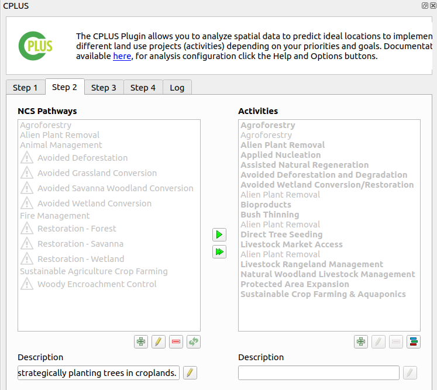
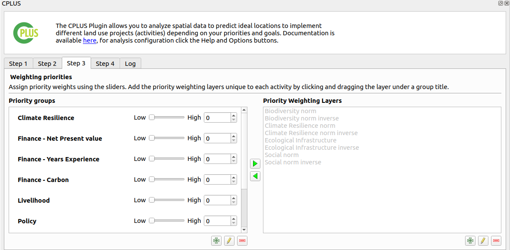

# Step 1: Scenario Information

The first step focuses on the **Scenario Information**. A *Scenario* refers to an overall analysis done in an area of interest (AOI). Different criteria and priorities for spatial decision-making and comparison will be considered for each scenario.

- **Scenario name**: A name for the analysis to be performed.
- **Scenario description**: A detailed description of the analysis.
- **Extent**: The area of interest for this analysis. This can be calculated from the current canvas view extent, a layer, or an extent drawn by the user.

**Figure 1** shows an example of Step 1

- Once the information has been provided, click **Step 2**.

<blockquote> If the QGIS canvas CRS is not set to WGS84 (EPSG: 4326), the zoom to the pilot area will not happen. </blockquote>

*Figure 1: Step 1 focuses on Scenario Information*

## Pilot area

The pilot study area covers `Bushbuck Ridge`, South Africa. When a user's study area is outside of this region, some of the activities and Priority-weighted layers will be disabled. This is because those datasets are specific to the `Bushbuck Ridge` study area and are of no use for other AOIs. It's important for a user to take this into account, as step 2 and step 3 will be affected by this.

If the selected extent is outside of this region, the Bushbuck Ridge activities will be disabled.

The same goes for the Priority Weighted layers.

If a user is outside the Bushbuck Ridge region, they will need to create custom activities and/or PWLs. An explanation of these follows in the other sections.

Click [here](step-2.md) to explore the step 2 section.

Click [here](step-3.md) to explore the step 3 section.

Click [here](step-4.md) to explore the step 4 section.

Click [here](logs.md) to explore the log section.
