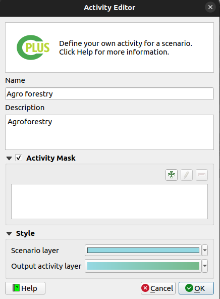

# Step 2: Pathways and activities

This step deals with the **Natural Climate Solution (NCS) pathways** and the **Activities**. An NCS pathway can be defined as a composite spatial layer on specific land use classes and other factors that determine areas ideal for a specific use case (e.g. Animal management). An activity is a combination of NCS pathways represented in an AOI spatial layer. **Figure 1** shows the UI.

*Figure 1: Step 2 allows the user to create and edit NCS pathways and Activities*

Step 2 buttons (**Figure 2**):

- **Add**: Adds a new pathway or activity.

- **Delete**: Delete a pathway or activity.

- **Editing**: Edit an existing pathway or activity.

- **Refresh view**: Checks the base directory for data.

*Figure 2: Create, delete, and edit buttons*

## NCS Pathway

- Click on the left green plus button to add a new pathway (**Figure 3**).

- Provide a **Name** and **Description** for the pathway.

- Two approaches to selecting a layer: A layer from the **QGIS canvas**, or **Upload from a file**.

- Add **Carbon layers** as desired. Multiple carbon layers can be provided. These layers will be averaged.

- Click **OK**.

- The new **NCS pathway** will be added.

<blockquote> If the NCS pathway is broken (e.g. layer or file cannot be found), the pathway text
will have an exclamation mark next to it. The user will need to rectify the issue before continuing to
step 3. </blockquote>

*Figure 3: NCS Pathway creator/editor*

<blockquote> Be sure each NCS pathway's Carbon layers are set up correctly before setting up the activities in the steps that follow. Changes to the Carbon layers afterward will require the user to set up the activities again. </blockquote>

## Activity

Add pathways to an existing activity:

- Select the activity to which a pathway should be added.

- Select the pathway you want to add to the activity.

- Click the right arrow  to add a pathway to the selected activity.

- Click the double right arrow  to add all pathways to the activity.

- The user can also drag and drop a pathway onto the desired activity.

### How to add a new activity?

- Click on the right green plus button to add an **activity** (**Figure 4**).

- Provide a **Name** and **Description**.

- (optional) The user can provide an existing raster for the activity. Enable the **Map layer** to do this.

- Click **OK**.

- The new **activity** will be added.

*Figure 4: Activity creator/editor*

- Open the Style pixel value editor by clicking on the  button.

- Select the activity which needs to be moved up or down in the stack.

- Drag-and-drop the activity where it needs to be in the stack.

- Click **OK** once done.

- The final step is to select each of the activities a user wants to include in the scenario run.
- A user can exclude activities if they don't want to include them, even if the activity has pathways.

*Figure 5: Selected activities*

<blockquote>Before proceeding to Step 3, a user needs to define at least one NCS pathway layer for an activity, otherwise a warning message will be displayed. </blockquote>

Click [here](step-3.md) to explore the step 3 section.

Click [here](step-4.md) to explore the step 4 section.

Click [here](logs.md) to explore the log section.
