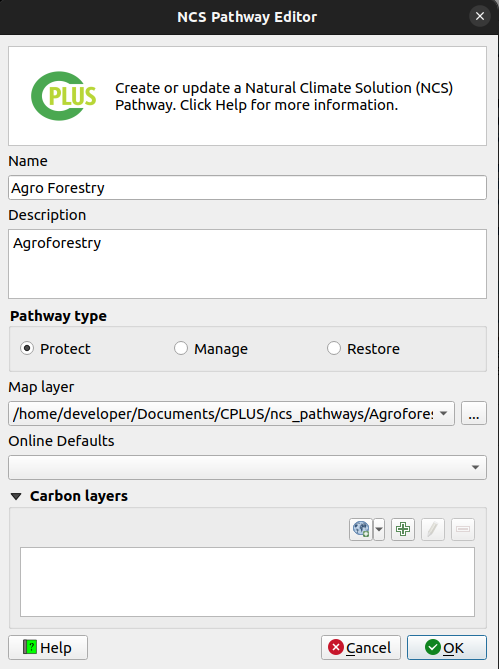

# Step 2: Pathways and activities

This step deals with the **Natural Climate Solution (NCS) pathways** and the **Activities**. An NCS pathway can be defined as a composite spatial layer on specific land use classes and other factors that determine areas ideal for a specific use case (e.g. Animal management). An activity is a combination of NCS pathways represented in an AOI spatial layer. **Figure 1** shows the UI.

*Figure 1: Step 2 allows the user to create and edit NCS pathways and Activities*

Activities buttons:

- **Add**: Adds a new activity.

- **Delete**: Delete an activity.

- **Editing**: Edit an existing activity.

- **Ordering pixel value:** Edit activity order.

NCS pathways buttons:

- **Add**: Adds a new pathway.

- **Delete**: Delete a pathway.

- **Editing**: Edit an existing pathway.

- **Refresh view**: Checks the base directory for data.

- **Validation inspector:** Checks the validations.

## How to add NCS pathway

Click on the left green plus button  to add a new pathway (**Figure 3**).

**You can use two methods to add the NCS pathway**

###  Method 1: Manually add NCS pathway

In this Method, you will create a new NCS pathway by providing a name, description, and selecting relevant map and carbon layers.

**Step 1 Enter NCS Pathway Details**

- In the `Name` field, enter name for your NCS pathway. This name will help you identify the pathway in the system.

- In the `Description` field, enter a brief description of the NCS pathway. This description will provide context and help others understand the purpose of the pathway.

**Step 2 Select Pathways Type**

* Pathway Type: Select the type of the NCS pathway.
    - **Protect:** Protect the world’s natural ecosystems from unsustainable practices and degradation.
    - **Manage:** Farming systems and working lands must shift from net carbon emitters to carbon sinks.
    - **Restore:** Restore ecosystem types and globally can reduce global greenhouse gas emissions and store additional carbon up to 3 gigatons annually.

**Step 3 Select Map Layer**

- In the `Map Layer` dropdown menu, select the map layer that is relevant to your NCS pathway. You can choose from the list of available map layers that you have downloaded and imported into the system.

For example, if you are creating an NCS pathway for Agroforestry, you would select the `Agroforestry` map layer.

**Step 4 Select Carbon Layer**

- Click on the plus icon next to the `Carbon Layer` field.

- In the dropdown menu, select the carbon layer that is relevant to your NCS pathway. You can choose from the list of available carbon layers that you have downloaded into the system.

For example, if you are creating an NCS pathway for Agroforestry, you would select the `Agroforestry` carbon layer.

**Step 4 Add NCS Pathway**

Once you have entered all the required details, click on the `OK` button to add the NCS pathway.

### Method 2 add using online default

In this method, you will add a new NCS pathway using online defaults. This option is available if you have an account on the Trends.Earth platform.

**Step 1 Add Online Defaults**

- Click on the `Online Defaults` dropdown menu.

- Choose the NCS pathway you want to use from the list of available options.

- Once you select the NCS pathway, the name and description fields will be automatically populated.

- To add a carbon layer, select it from the available options in the system.

- Click on the `OK` button to add the NCS pathway.

After selecting the online default, the system will automatically fill in the name and description fields for you. You can then add a carbon layer from the available options in the system.

<blockquote> If the NCS pathway is broken (e.g. layer or file cannot be found), the pathway text
will have an exclamation mark next to it. The user will need to rectify the issue before continuing to
step 3. </blockquote>

*Figure 3: NCS Pathway creator/editor*

<blockquote> Be sure each NCS pathway's Carbon layers are set up correctly before setting up the activities in the steps that follow. Changes to the Carbon layers afterward will require the user to set up the activities again. </blockquote>

Add pathways to an existing activity:

- Select the activity to which a pathway should be added.

- Select the pathway you want to add to the activity.

- Click the right arrow  to add a pathway to the selected activity.

- Click the double right arrow  to add all pathways to the activity.

- The user can also drag and drop a pathway onto the desired activity.

### How to add a new activity?

- Click on the right green plus button to add an **activity** (**Figure 4**).

- Provide a **Name** and **Description**.

- (Optional) **Activity Mask** excludes specific areas, restricting pathways to a targeted activity.

- Click **OK**.

- The new **activity** will be added.

*Figure 4: Activity creator/editor*

### Activity Mask 

Activity Masking enables users to exclude specific areas from pathways. This functionality helps in refining analyses by isolating regions that are not relevant or need to be avoided during operations.

#### How does the Activity Masking work?

Imagine planning a journey or mapping an area, and you want to exclude specific region like restricted zones, private properties, or hazardous locations. This masking tool allows you to mark those areas, ensuring they are excluded from your plans or analysis. It is like instructing the system, avoid these areas, enabling you to focus on relevant zones and create more precise and efficient plans.

* Here is the list of activities displayed without applying any mask. This means all areas are included, and no regions have been excluded or hidden from the analysis.

    

    
* After applying the mask, the specified area becomes restricted for that particular activity. This ensures that no operations or tasks are carried out within that area, effectively excluding it from the analysis. As shown in the image below, after applying the mask, the specified area is marked as restricted for that particular activity. This restriction ensures that no operations or tasks related to the specific activity take place within the designated area, effectively excluding it from the further analysis.

    

#### How to add Activity Mask?

- Click on the **Activity Mask** checkbox. This will allow to add the activity mask.

- To add new activity mask click on the  icon. This will open a `Select mask layer` pop up window. Select your desired 1️⃣ mask you want to add and then click on the 2️⃣ `Open` button.

    

- This process will add the mask on your activity.

#### Edit Activity Mask

- Select the activity mask and click on the  icon. This will open a `Select mask layer` pop up window from where you choose your desired activity mask.

#### Delete Activity Mask

- Select the activity mask and click on the  icon. A confirmation dialog box will appear, allowing you to confirm the deletion of the selected activity mask or you can close the process.

    

### Ordering of the pixel values for the scenario output

- Open the Style pixel value editor by clicking on the  button.

- Select the activity which needs to be moved up or down in the stack.

- Drag-and-drop the activity where it needs to be in the stack.

- Click **OK** once done.

- The final step is to select each of the activities a user wants to include in the scenario run.
- A user can exclude activities if they do not want to include them, even if the activity has pathways.

*Figure 5: Selected activities*

<blockquote>Before proceeding to Step 3, a user needs to define at least one NCS pathway layer for an activity, otherwise a warning message will be displayed. </blockquote>

Click [here](step-3.md) to explore the step 3 section.

Click [here](step-4.md) to explore the step 4 section.

Click [here](logs.md) to explore the log section.
