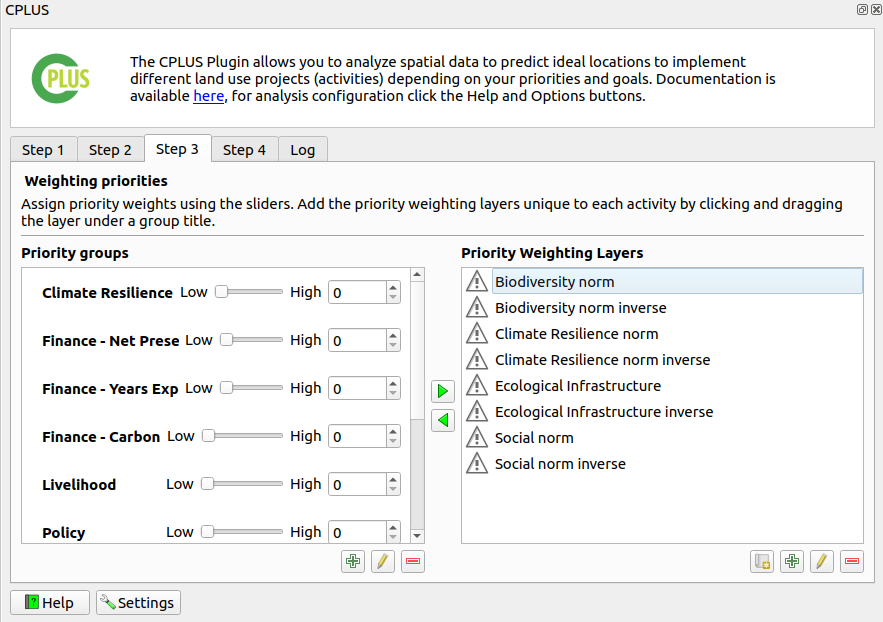
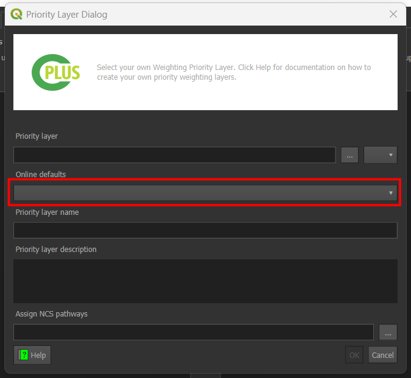
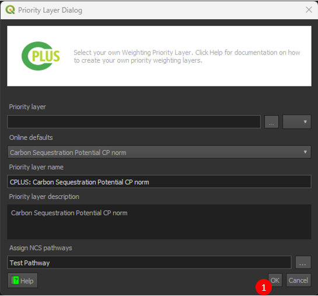
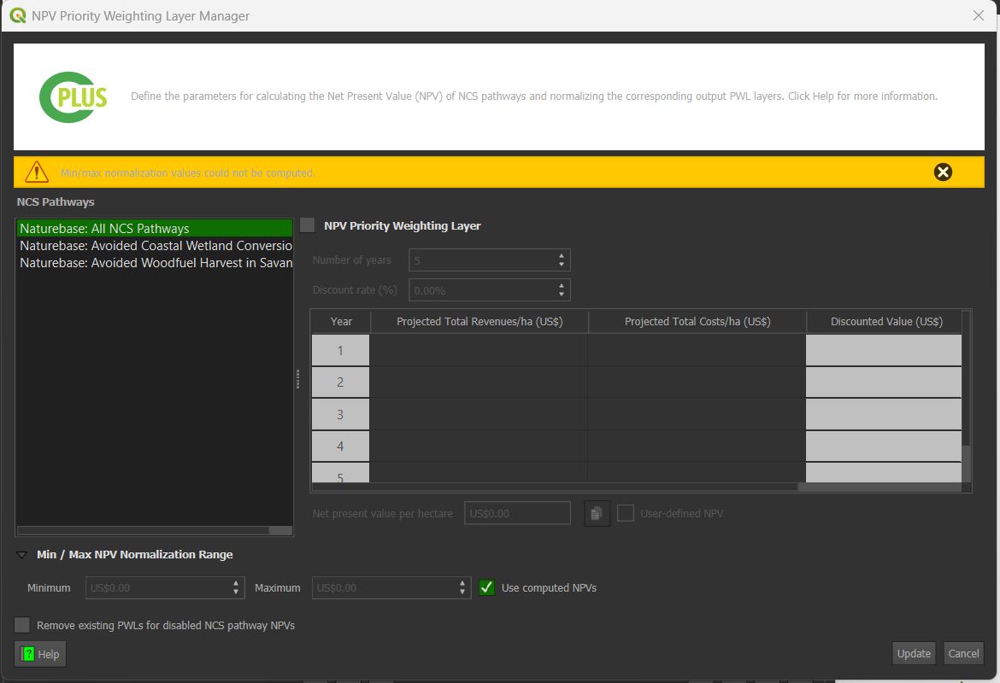

# Step 3: Priority weighting

The final step deals with the **Weighting priorities** and **Priority groups**. These weights will be applied when the user starts running the scenario. An example is shown in **Figure 1**.

- Weight values range from 0 to 5, and affect how important a Priority Weighting Layer (PWL) is compared to other layers.
- A value of 0 indicates that the PWL has a lower importance.

- A value of 5 means that the PWL has a higher importance.

 

*Figure 1: Step 3 allows the user to set the weights of each Priority Group*

 

## Priority Groups

 The `Priority groups` are used to assign weights to specific PWLs based on their importance. These PWLs 
are subsequently applied during the weighting of NCS pathways when creating a scenario analysis.

 

### Add priority groups

To add a new priority group, the user must click on the  button, as shown in **Figure 1**.

This will open a `Priority Group Dialog` box, where user required to fill the following information.

* **Group name:** Name of the group.
* **Group description:** Description of the group.
* **Group value:** Numeric value that reflect the importance of the priority layer.
* **Assign priority layers:** This allows users to allocate importance values to different PWLs.

    * To assign a priority layer, click on the `Assign priority layers` and select from the available PWLs in the list.(see **Figure 3**)

 

*Figure 2: Priority  Group Dialog*

 

After filling in the required information, click on the `OK` button to add it to the `Priority groups`.

 

*Figure 3: Assign priority layers*

 

### Edit group layer

Select the layer and click on the  icon. This will open the `Priority Group Dialog`, allowing you to edit the group name, group description, group value, and assign new priority layers.

 

*Figure 4: Priority Group Dialog Edit*

 

Click `OK` to apply the changes.

 

### Remove group layer

Select the layer and click on the  to remove the layer from the priority group.

 

## Prority Weighting Layers

The priority weighting layers can be selected, added and removed into each priority group by using the arrow buttons.

 

### Add priority layers

Select the target layer from the priority weighting layers list and the destination group from the priority groups and use the left arrow button  to add the layer to the group.

 

### Remove priority layers

Select the target layer from the priority weighting layers list from its priority group and use the right arrow button  to remove the layer to the group.

 

## Create custom priority layers

- Click on  to add a new custom priority layer, or  to edit an existing priority layer.

- This will open the Priority Layer dialog (see **Figure 5**).

 
  
### Methods to create layers

#### Method 1: Create manually

- The following parameters need to be set:
    - **Priority layer**: The layer that represents the priority layer.
    - **Priority layer name**: A unique identifier for the priority layer.
    - **Priority layer description**: A detailed description of the priority layer.
 
- Click the **Assign NCS Pathways** button to select NCS pathways to be associated with the priority layer (see **Figure 5**)

 

*Figure 5: Priority layer dialog*

 

- Select the NCS pathways you want to be associated with the priority layer (see **Figure 6**).

- Click **OK**.

 
  

*Figure 6: NCS pathway selection for priority layers*

 

#### Method 2: Create Online

 

- After clicking on this option a drop down menu will appear with the available online defaults.

 
  

 

- Select the desired online default.

 
  

 

- Select the applicable NCS pathways, then click on the 1️⃣ `OK` button, to create the PWL.
       
- Click the Remove PWL button  to remove one or more of the selected PWLs from the list.

 

## Matrix of Relative Impact Values

The Matrix of Relative Impact Values is used to assign impact coefficients to describe how each pathway influences each Priority Weighting Layer (PWL). These coefficients range from –3 to +3 and are evaluated separately from the PWL weightings.

The system also clearly distinguishes between impact-based and fragmentation-based PWLs, ensuring that the correct type of coefficient is applied during evaluation.

 

### Opening the Matrix Manager

To open the Matrix of Relative Impact Values Manager, first ensure that a Priority Weighting Layer is selected.

1. Use the  button to add a new custom priority layer.

2. Select a layer from the Priority Weighted Layers panel.

3. Click the `Create Matrix of Relative Impact Values` button to open the manager.

 

 

### Assigning Impact Coefficients

In the Matrix Manager, each pathway and PWL pair is represented in a table. Enter an impact coefficient between –3 and +3 to indicate the relative influence of that pathway on the selected PWL.

These coefficients are stored and used during model evaluation alongside, but independently from, the weighting values applied to PWLs.

 

 

## Create a new financial priority layer Net Present Value (NPV)

- Click on the  icon to add a new financial priority layer.

- This will open the Financial priority layer dialog. By default, on first-time load, the NPV configurations for all NCS pathways are disabled.

     

    

     

- To enable the NPV for an NCS pathway, check the NPV Priority Weighting Layer group box.

     

    

     

- Enter the number of years and discount rate. Then, input the revenue and cost values for the respective years. The greyed out cells (i.e., Year and Discount Value) indicate that these values are automatically populated.

- On updating the discount rate, revenue, and cost values, the total NPV is automatically updated.

- For an enabled NPV PWL, all revenue and cost values must be specified. Otherwise, an error message will appear in the message bar indicating which NCS pathway(s) and corresponding years have missing values. This occurs when the user tries to create or update the PWLs:

     

    

     

- It is recommended to leave the `Use computed NPVs` checkbox enabled (the default option). This ensures that the minimum and maximum normalisation values can be synced and automatically updated when user input changes. The min/max values will be based on enabled NPV parameters for NCS pathways. Disabled NPV parameters (in the group box) will be excluded when computing the min/max normalisation values.

     

    

     

- When the `Remove existing PWLs for disabled NCS pathway NPVs` checkbox is enabled, any previously created NPV PWLs will be deleted when updating the NPVs.

     

    

     

- Click on Update button to create the new financial priority layer. A dialog showing the progress of creating/updating the NPVs will be displayed.

     

    

     

- Upon creating NPV PWL rasters, the corresponding PWLs will be created or updated in the list of PWLs. The naming convention for these layers will be `[NCS pathway name] NPV Norm`:

     

    

     

- An NPV layer, which is a constant raster containing the normalised value, will be created under the `{BASE_DIR}/priority_layers/npv` directory. The extents are based on the user-defined extents from Step 1.

## Setting groups values

Move the slider to adjust the weight of each group, values can also be set manually, by using the left input spin box.

 

Click [here](step-4.md) to explore the step 4 section.

Click [here](logs.md) to explore the log section.

 
