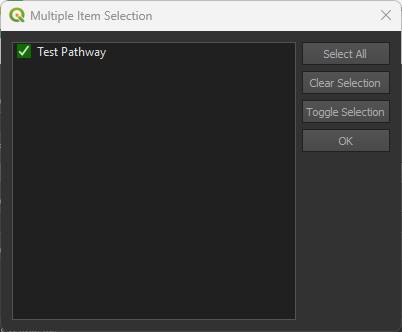

# Step 3: Priority weighting

The final step deals with the **Weighting priorities** and **Priority groups**. These weights will be applied when the user starts running the scenario. An example is shown in **Figure 1**.

- Weight values range from 0 to 5, and affect how important a Priority Weighting Layer (PWL) is compared to other layers.
- A value of 0 indicates that the PWL has a lower importance.

- A value of 5 means that the PWL has a higher importance.

 

*Figure 1: Step 3 allows the user to set the weights of each Priority Group*

 

## Priority Groups

 The `Priority groups` are used to assign weights to specific PWLs based on their importance. These PWLs 
are subsequently applied during the weighting of NCS pathways when creating a scenario analysis.

 

### Add priority groups

To add a new priority group, the user must click on the  button, as shown in **Figure 1**.

This will open a `Priority Group Dialog` box, where user required to fill the following information.

* **Group name:** Name of the group.
* **Group description:** Description of the group.
* **Group value:** Numeric value that reflect the importance of the priority layer.
* **Assign priority layers:** This allows users to allocate importance values to different PWLs.

    * To assign a priority layer, click on the `Assign priority layers` and select from the available PWLs in the list.(see **Figure 3**)

 

*Figure 2: Priority  Group Dialog*

 

After filling in the required information, click on the `OK` button to add it to the `Priority groups`.

 

*Figure 3: Assign priority layers*

 

### Edit group layer

Select the layer and click on the  icon. This will open the `Priority Group Dialog`, allowing you to edit the group name, group description, group value, and assign new priority layers.

 

*Figure 4: Priority Group Dialog Edit*

 

Click `OK` to apply the changes.

 

### Remove group layer

Select the layer and click on the  to remove the layer from the priority group.

 

## Prority Weighting Layers

The priority weighting layers can be selected, added and removed into each priority group by using the arrow buttons.

 

### Add priority layers

Select the target layer from the priority weighting layers list and the destination group from the priority groups and use the left arrow button  to add the layer to the group.

 

### Remove priority layers

Select the target layer from the priority weighting layers list from its priority group and use the right arrow button  to remove the layer to the group.

 

## Create custom priority layers

- Click on  to add a new custom priority layer, or  to edit an existing priority layer.

- This will open the Priority Layer dialog (see **Figure 5**).

 
  
### Methods to create layers

#### Method 1: Create manually

- The following parameters need to be set:
    - **Priority layer**: The layer that represents the priority layer.
    - **Priority layer name**: A unique identifier for the priority layer.
    - **Priority layer description**: A detailed description of the priority layer.
 
- Click the **Assign NCS Pathways** button to select NCS pathways to be associated with the priority layer (see **Figure 5**)

 

*Figure 5: Priority layer dialog*

 

- Select the NCS pathways you want to be associated with the priority layer (see **Figure 6**).

- Click **OK**.

 
  

*Figure 6: NCS pathway selection for priority layers*

 

#### Method 2: Create Online

 

- After clicking on this option a drop down menu will appear with the available online defaults.

 
  

 

- Select the desired online default.

 
  

 

- Select the applicable NCS pathways, then click on the 1️⃣ `OK` button, to create the PWL.
       
- Click the Remove PWL button  to remove one or more of the selected PWLs from the list.

 

## NCS Pathways/PWLs Matrix of Relative Impact Values

The NCS Pathways/PWLs Matrix of Relative Impact Values is used to assign impact coefficients to describe how each pathway influences each Priority Weighting Layer (PWL). These coefficients range from –3 to +3 and are evaluated separately from the PWL weightings.

The system also clearly distinguishes between impact-based and fragmentation-based PWLs, ensuring that the correct type of coefficient is applied during evaluation.

 

### Opening the Matrix Manager

To open the Matrix of Relative Impact Values Manager, first ensure that a Priority Weighting Layer is selected.

1. Use the  button to add a new custom priority layer.

2. Select a layer from the Priority Weighted Layers panel.

3. Click the `Create Matrix of Relative Impact Values for Priority Weighted Layer` button to open the manager.

 

 

### Assigning Impact Coefficients

In the Matrix Manager, each pathway and PWL pair is represented in a table. Enter an impact coefficient between –3 and +3 to indicate the relative influence of that pathway on the selected PWL.

These coefficients are stored and used during model evaluation alongside, but independently from, the weighting values applied to PWLs.

 

 

## NCS Pathways Matrix of Relative Impact Values

### Identifying Carbon Layers

Because layer names alone are not reliable indicators of carbon content, the interface includes a dedicated checkbox (1️⃣ `Enable if layer has carbon storage values`) that allows users to mark a layer as containing carbon storage or carbon impact values. 

 

 

Once selected, the layer is treated as a carbon layer during prioritisation and is automatically added to the carbon-specific tab within the interface. Layers not marked as carbon layers are listed instead in the general impact matrix.

 

### Opening the Matrix Manager

To open the NCS Pathways Matrix of Relative Impact Values Manager, click the 1️⃣ `Create Matrix of Relative Impact Values` button to open the manager.

 

 

For each eligible pathway, the plugin converts the carbon calculation results into a carbon impact potential raster. This raster is normalised to a consistent scale so that it can be compared with other pathway-variable relationships.

At the top of the manager 2 tabs are available:

1. **Carbon Impact**
2. **Priority Weighting Layers**

 

 

### Assigning Impact Values

Carbon layers use an impact weight range from –1 to +1, while non-carbon layers continue to use the –3 to +3 range. This separation ensures that carbon values remain proportionate without overwhelming other prioritisation factors.

1. Navigate to the `Carbon Impact` tab.

2. Enter a Carbon Impact Rating (–1 to +1) for each NCS Pathway.

 

 

1. Navigate to the `Priority Weighting Layers` tab.

2. Enter an impact coefficient (–3 to +3) for each NCS Pathway and PWL combination.

 

 

## Create a Net Present Value (NPV)

The plugin supports adding additional investability factors, such as years of project experience, by allowing users to incorporate constant raster layers into their analysis.

Users can create or load constant raster layers representing custom variables. The plugin automatically normalizes these values, typically scaling them between 0 and 1 so they contribute consistently alongside other metrics.

 

### Opening the Manager

Click on the  icon to open the Investability Variable Manager.

 

 

### Adding a Net Present Value (NPV)

1. From the *Investibility Type* dropdown select `Net Present Value`.

2. Select an *Activity* to open its coresponding configuration.

 

 

1. Enter the `Number of Years` and `Discount Rate`.

2. Input the `Revenue` and `Cost` values for the respective years.

 

 

### Adding Custom Investability Variables

Users have the ability to add a new investability variable besides NPV and years experience.

1. Click the `Add New Investability Type` button.

2. Provide a *Name* for your investabilty type.

3. Define the *Normalization Range* values.

 

 

## Setting groups values

Move the slider to adjust the weight of each group, values can also be set manually, by using the left input spin box.

 

Click [here](step-4.md) to explore the step 4 section.

Click [here](logs.md) to explore the log section.

 
