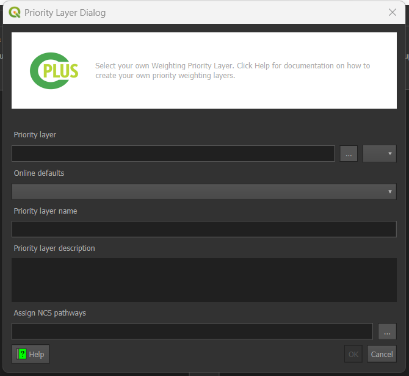
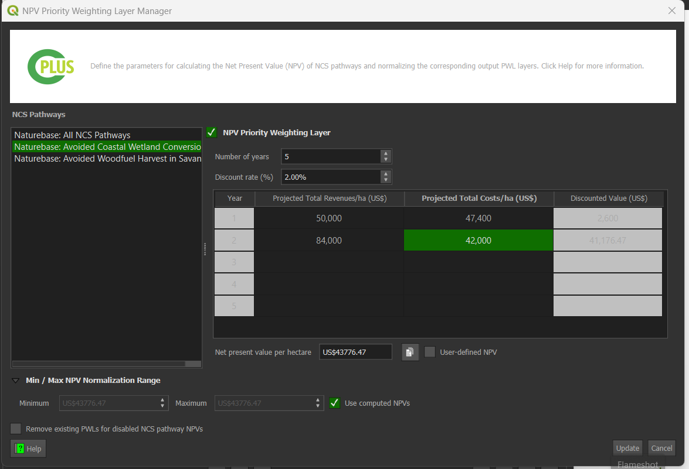
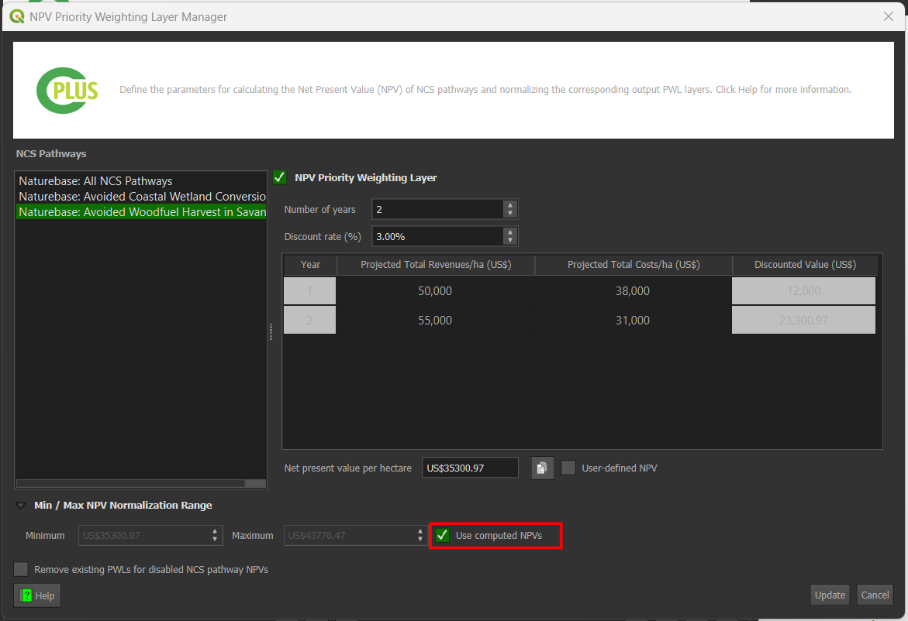
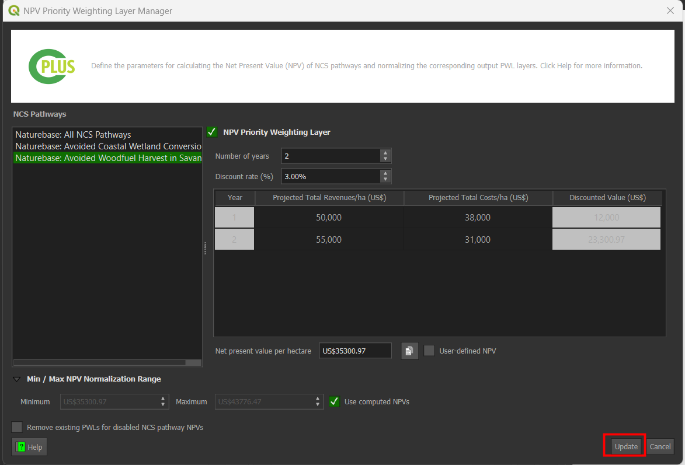

# Step 3: Priority weighting

The final step deals with the **Weighting priorities** and **Priority groups**. These weights will be applied when the user starts running the scenario. An example is shown in **Figure 1**.

- Weight values range from 0 to 5, and affect how important a PWL is compared to other layers.
- A value of 0 indicates that the PWL has a lower importance.

- A value of 5 means that the PWL has a higher importance

*Figure 1: Step 3 allows the user to set the Weights of each Priority Group*

The priority weighting layers can be selected, added and removed into each priority group by using the 
arrow buttons. 

## Add priority layers

Select the target layer from the priority weighting layers list and the destination group from the priority groups and use the left arrow button  to add the layer to the group.

## Remove priority layers

Select the target layer from the priority weighting layers list from its priority group and use the right arrow button  to remove the layer to the group.

## Create custom priority layers

- Click on  to add a new custom priority layer, or  to edit an existing priority layer.

- This will open the Priority Layer dialog (see **Figure 2**).
  
## Methods to create layers

### Method 1: Create manually

- The following parameters need to be set:
    - **Priority layer**: The layer that represents the priority layer.
    - **Priority layer name**: A unique identifier for the priority layer.
    - **Priority layer description**: A detailed description of the priority layer.
 
- Click the **Assign activities** button to select activities to be associated with the priority layer (see **Figure 3**)

*Figure 2: Priority layer dialog*

- Select the activities you want to be associated with the priority layer.

- Click **OK**.
  

*Figure 3: Activity selection for priority layers*

### Method 2: Create Online

- After clicking on this option a drop down menu will appear with the available online defaults. 
  

- Select the desired online default.
  

- Then click **OK** to add the priority layer to PWL.
       
- : Remove the selected PWL.

## Create a new financial priority layer Net Present Value (NPV)

- Click on the  icon to add a new financial priority layer.

- This will open the Financial priority layer dialog. By default, on first-time load, the NPV configurations for all activities are disabled.

    

- To enable the NPV for an activity, check the NPV Priority Weighting Layer group box.

    

- Enter the number of years and discount rate. Then, input the revenue and cost values for the respective years. The greyed out cells (i.e., Year and Discount Value) indicate that these values are automatically populated.

- On updating the discount rate, revenue, and cost values, the total NPV is automatically updated.

- For an enabled NPV PWL, all revenue and cost values must be specified. Otherwise, an error message will appear in the message bar indicating which activity(ies) and corresponding years have missing values. This occurs when the user tries to create or update the PWLs:

    

- It is recommended to leave the Use computed NPVs checkbox enabled (the default option). This ensures that the minimum and maximum normalisation values can be synced and automatically updated when user input changes. The min/max values will be based on enabled NPV parameters for activities. Disabled NPV parameters (in the group box) will be excluded when computing the min/max normalisation values.

    

- When the Remove existing PWLs for disabled activity NPVs checkbox is enabled, any previously created NPV PWLs will be deleted when updating the NPVs.

    

- Click on Update button to create the new financial priority layer. A dialog showing the progress of creating/updating the NPVs will be displayed.

    

- Upon creating NPV PWL rasters, the corresponding PWLs will be created or updated in the list of PWLs. The naming convention for these layers will be [activity name] NPV Norm:

    

- An NPV layer, which is a constant raster containing the normalised value, will be created under the {BASE_DIR}/priority_layers/npv directory. The extents are based on the user-defined extents from Step 1.

## Setting groups values

Move the slider to adjust the weight of each group, values can also be set manually, by using the left input spin box.

Click [here](step-4.md) to explore the step 4 section.

Click [here](logs.md) to explore the log section.
