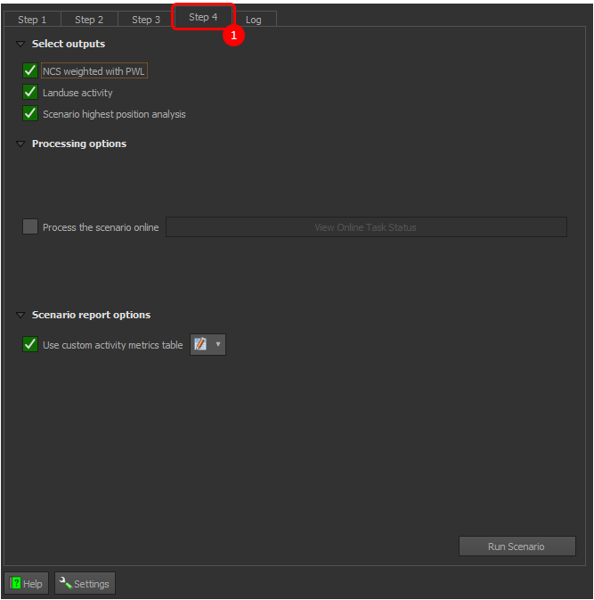
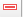

# Step 4: Select outputs and Processing options

Click on the 1️⃣ `Step 4` option, to go to Step 4.

 

 

>NOTE: User need to register and login with a Trends.Earth account to use the online API for processing with CPLUS.

 

## Saving outputs

**Saving Outputs:** In `Step 4`, choose which results you want to save. Each option represents a group of output layers that will be loaded in the map canvas as well as those layers that will be used in the output report. Select an option to save it to your computer for later use. Not selecting an option means it is only available for your current session. This helps optimise memory usage. Choose wisely to make your computer run more efficiently!

 

 

>NOTE: For the output report to be generated, the `Landuse activity` and `Scenario highest position analysis` checkboxes need to be selected as the map layers are required

 

## Processing options

**Process the scenario online:** By default, this option is off. When selected, the scenario is sent to a remote server via the Internet for processing. This enables real-time analysis using the server's resources. It is useful for quick results or complex data that may strain local devices. However, it needs a stable internet connection.

 

 

If `Online defaults` is chosen previously then this option will be automatically selected.

 

## Scenario report options

Benefits of custom activity metrics table:

* The Metrics Generator enables plugin users to incorporate additional metrics or calculations for each activity. It includes automated expressions that assist in calculating measures such as irrecoverable carbon, financial metrics like the net present value (NPV) of each activity, and other weighting measures such as jobs per hectare.

* The tool leverages the full functionality of the expression builder, allowing users to create fully customised expressions based on the available project variables.

* The Expression Builder within the Metrics Generator has been enhanced with a CPLUS library, which offers automated calculations for irrecoverable carbon, PWL measures, and NPV. These features come with helpful guidance for their use. It is also important to reference the variables list when creating custom options.

 

>Note: Please note that expressions can be applied on a column-by-column basis or can be cell-specific, providing full granularity for the measures and metrics associated with each activity.

 

## How to use custom activity metrics table?

To use the `custom activity metrics table`, you need to check the 1️⃣ `checkbox`, after which you can access the 2️⃣ `edit` option which allows you to create custom metrics table.

 

 

After clicking on the edit option user will receive the following window.

 

 

* You can follow these steps to create the custom metrics table:

 

### Step 1:

The first step in creating the custom metrics table provides an 1️⃣ `example` demonstrating that you can use different expressions for each cell. It also includes a 2️⃣ `Next` button, which allows you to proceed to the next step, and a 3️⃣ `Cancel` button, which enables you to exit the process.

 

 

### Step 2:

* This step allows you to define a metric profile by selecting a 1️⃣ `Profile`, then adding 2️⃣ `Columns` and specifying their corresponding 3️⃣ `Properties`. 
* A metric profile represents a collection of columns grouped according to user-defined criteria - for example, by climate, finance, or forestation themes. The grouping options are entirely flexible, depending on how the user wishes to organize the columns and their associated properties. 
* The primary benefit of profiles is that they enable users to configure column groupings and easily select which profiles to apply in different scenario analysis reports.
* A `Default` profile is automatically created when the plugin is used for the first time.

 

 

#### Profiles

Click on the drop-down menu to select the current profile.

 

**Add Profile:**

- Click on the  icon to add a new profile. This will open a `Add New Profile` dialog box where you can enter the name of the profile.

- Enter the profile name and click on the `OK` button to add it to the list of profiles and set it as the current profile.

     

    

     

- If the profile name already exists you will receive the following error.

     

    

     

**Rename Profile:**

- Click on the  icon to rename the current profile. This will open a `Rename Profile` dialog box where you can enter the name of the profile.

- Enter the profile name and click on the `OK` button to update the name.

     

    

     

- If the profile name already exists you will receive the following error.

     
    
    

     
      
**Copy Profile:**

- Click on the  icon to copy the current profile. This will open a `Copy Profile` dialog which allows one to specify a new name for the copied profile.

- Enter the name of the copied profile and click on the `OK` button to add it to the list of profiles and set it as the current profile. A `Copy` suffix will, by default, be appended to the name of the source profile.

     

    

     

- If the profile name already exists you will receive the following error.

     

    

     
    
**Delete Profile**

- Click on the  icon to remove the current profile.

 

#### Columns

**Add Column**

- Click on the  icon to add a new column. This will open a `Set Column Name` dialog box where you can enter the name of the column.

- Enter the column name and click on the `OK` button to add it to the `Columns` table.

     

    

     

- If the column name already exists you will receive the following error.

     

    

     

**Remove Column**

- Click on the  icon to remove the selected column.

 

**Change Column Order**

- Click on the  icon to move the selected column up in the list and click on the  icon to move the selected column down in the list.

 

#### Properties

* **Header label:** The default header name is based on the selected column. You can change it to any name you prefer, but the field must be filled in. If the Header label is empty, you will encounter the error `header label is empty`.

     

    

     

* **Metric:** Metric is the expression that will be used to calculate the value of the column. You can also define a custom metric by clicking on the  button.

    * Click on the 1️⃣ `Expression` tab to access this window.

    * Choose your desired expression from 3️⃣ `list` or you can search it by entering the expression name in the 2️⃣ `Search` field.

    * You are required to follow the syntax of the expression as shown in the 4️⃣ `Detail Section`.

    * Define your expression in the 5️⃣ `Input field`. You can use the 6️⃣ `operators and symbols` provided to structure your expression.

         

        

         

    * If any case you have entered wrong expression you will receive the following error.

         
        
        

         

    * After defining your expression, click on the `OK` button to save it otherwise click on the `Cancel` button to cancel the process. This will open a confirmation dialog box.

    * Check the 1️⃣ ✅ `checkbox` to save your preference and prevent this message from appearing again in the future. Click 2️⃣ `No` to cancel the current process or 3️⃣ `Discard changes` to finalise the cancellation process. Clicking on the 3️⃣ `Discard changes` will remove all the changes you made in the current process.

         

        

         

* **Formatting:**

    * Click on the 1️⃣ `Dropdown `to choose the alignment for the column data. To format the data as a number, check the 2️⃣ `Format as number` checkbox. Once selected, you will be able to 3️⃣ `Customise` the data. After clicking on the 3️⃣ `Customise` new tab will open.

         

        

         

        * Click on the 1️⃣ `Icon` to go back. Select the number category from the 2️⃣ `Category` dropdown menu, then enter the desired number of decimal places in the 3️⃣ `Decimal places` input field. Check the information 4️⃣ `Checkboxes` based on your preferences, and choose the scaling value from the 5️⃣ `Dropdown` menu. After selecting your options, the sample output will be displayed at 6️⃣ `Sample`.
        

 

### Step 3:

* Click on the 1️⃣ `Customise activity metric` to define the different metric for particular cell. Double-click on the 2️⃣ `Cell` this will convert it into the dropdown menu.

     

    

     

* To define the metric for a specific column, select `<Cell metric>` from the cell dropdown menu. This allows you to add a metric for that cell.

     

    

     

    After choosing the `<Cell metric>` the `Activity Column Expression Builder` window will open. Please look at the [Step 2](#step-2) documentation to know how to use `Activity Column Expression Builder`.

* If you select `<Cell metric>` and do not define a metric for the cell, you will encounter the following 1️⃣ `error`.

     

    

     

### Step 4:

This step allows you to review and save the metrics configuration to be used in the scenario analysis report. After verifying the 1️⃣ `metrics configuration`, click on the 2️⃣ `Finish` button to save the configuration.

 

 

The profile specified in `Step 2` is set as the default for the scenario analysis report when the activity metrics table option is selected.

 

## Metric Profile for the Scenario Analysis Report

You can select the desired profile for the activity table in the scenario analysis report by using the dropdown menu as shown below:

 

 

Hovering over the metric builder button displays the currently active profile selected by the user.

 

 

## Run Scenario

**Run Scenario:** Click on the `Run Scenario` button to execute the scenario and generate the report.A progress bar will appear, showing the status of the processing.

 

 

**Scenario Progress Dialog:** This dialog box shows the progress of the scenario execution. 

 

 

- **Hide** - Hide the dialog box.

After hiding the dialog box, the `View Online Task Status` button will be enabled to check the status of the task.

 

 

Click on the `View Online Task Status` button to check the status of the task.

 

 

## View Report

Once the scenario is processed, you can view the report by clicking on the `View Report` button.

 

 

Click on the `View Report` button, it will display a dropdown menu to view the report.

 

 

1. **Layout designer**: Opens the report in the QGIS layout designer.

     

    

     

2. **Open PDF**: Opens the created PDF.

 

### Report without the custom activity metrics table

 

### Report with the custom activity metrics table

 

### Report with pie chart

Reports also include pie charts that summarise relevant categorical data for each scenario. These charts are automatically generated from the scenario inputs and are clearly labelled and styled to ensure the visual information is easy to interpret.

 

 

Click [here](logs.md) to explore the log section.

 
