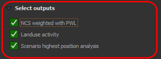
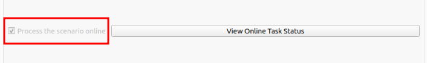

# Step4: Select outputs and Processing options

Click on the 1️⃣ `Step 4` option, to go to Step 4.

>NOTE: User need to register and login with a Trends.Earth account to use the online API for processing with CPLUS.

## Saving Outputs

**Saving Outputs:** In `Step 4`, choose which results you want to save. Each option represents data for your report. Select an option to save it to your computer for later use. Not selecting an option means it is only available for your current session. This helps optimise memory usage. Choose wisely to make your computer run more efficiently!

## Processing Options

**Process the scenario online:** By default, this option is off. When selected, the scenario is sent to a remote server via the Internet for processing. This enables real-time analysis using the server's resources. It is useful for quick results or complex data that may strain local devices. However, it needs a stable internet connection.

If `Online defaults` is choosen previously then this option will be automatically selected.

## Run Scenario

**Run Scenario:** Click on the `Run Scenario` button to execute the scenario and generate the report.A  progress bar will appear, showing the status of the processing.

**Scenario Progress Dialog:** This dialog box shows the progress of the scenario execution. 

- **Hide** - Hide the dialog box.

After hiding the  dialog box, the `View Online Task Status` button will be enabled to check the status of the task.

Click on the  `View Online Task Status` button to check the status of the task.

## View Report 
Once the scenario is processed, you can view the report by clicking on the `View Report` button.

Click on the `View Report` button, it will display a dropdown menu to view the report.

1. **Layout designer**: Opens the report in the QGIS layout designer.
   

2. **Open PDF**: Opens the created PDF.

Click [here](logs.md) to explore the log section.
