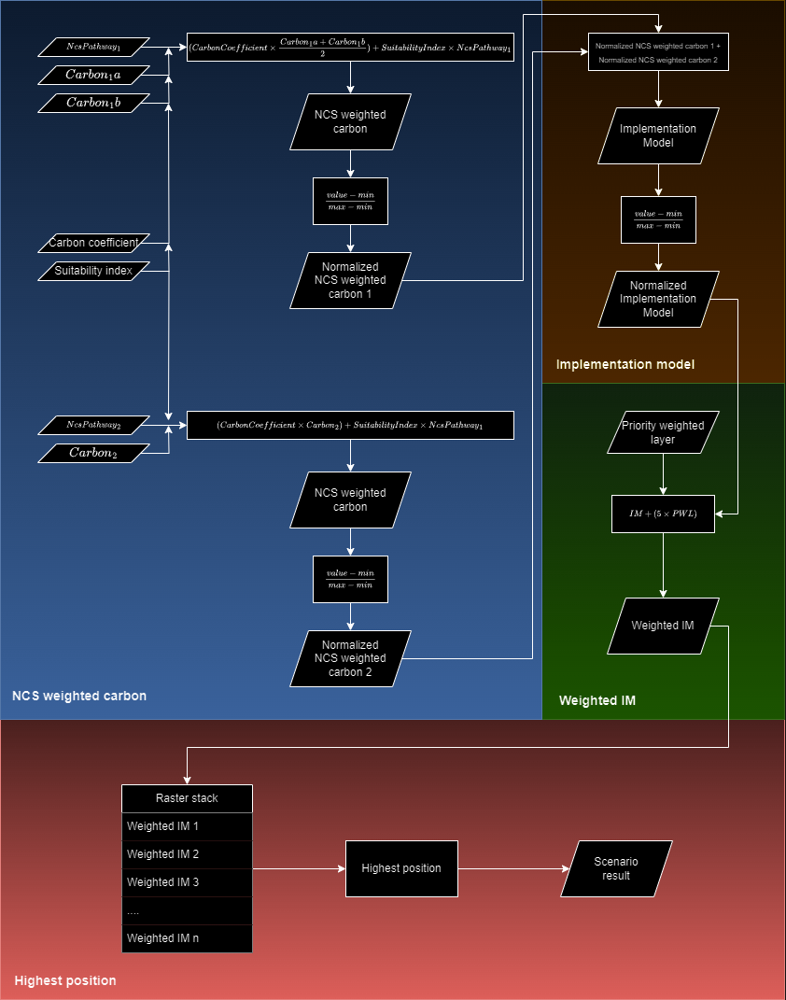
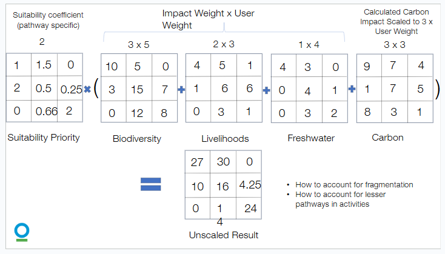
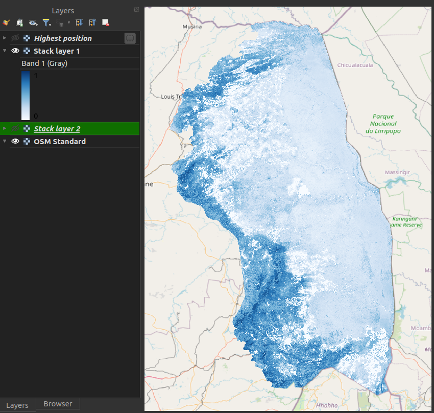
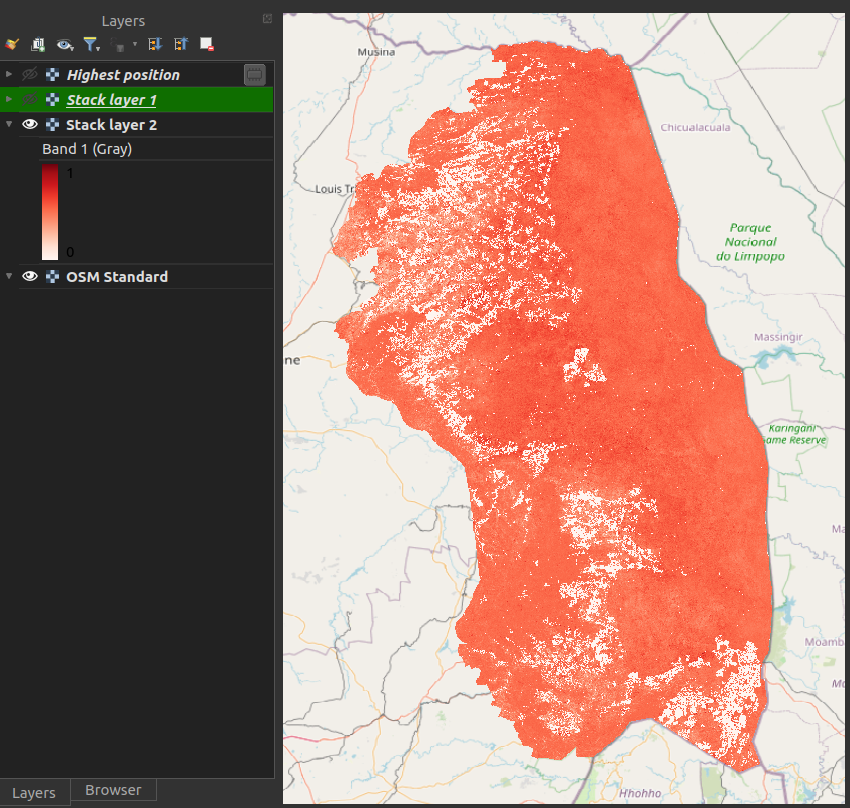
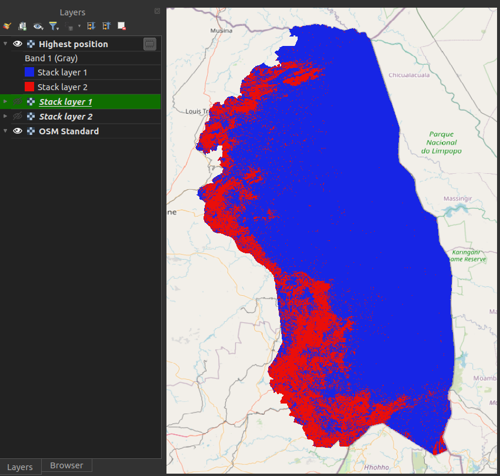
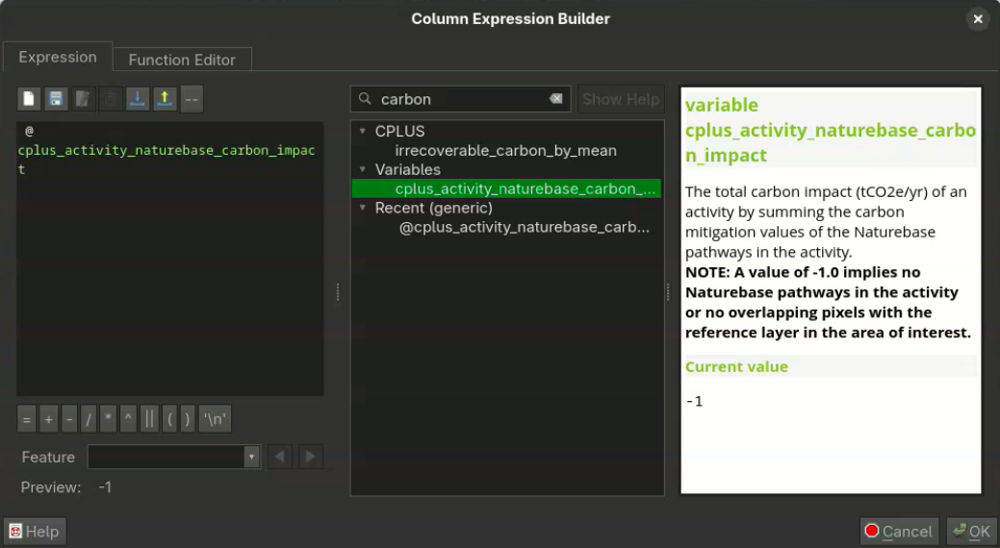

# Manual

The manual is divided into two main sections. The first section explains the complete workflow, including the calculations and formulas used throughout the CPLUS processing process. This section helps users understand how pathways and carbon layers are processed, how activities are generated, and which algorithms are applied to create the priority-weighted (weighted activity) layer. It also covers how the highest-position values are calculated.

The second section offers a succinct overview of each step, providing references to detailed explanations for further clarification. A description of the generated report is also provided.

## CPLUS calculations and formulas

**Figure 1** shows the workflow of the CPLUS model. The workflow can be split into four parts:

- Natural climate solution (NCS) weighted carbon pathway(s)
- Activity
- Priority weighted layer (Weighted activity)
- Highest position (Scenario result)

*Figure 1: CPLUS workflow*

### Evaluation Normalization Across Pathways

Conservation planning analyses often use pathways that differ in structure, scale, or number of input variables. Without correction, pathways containing more variables may contribute disproportionately to the results. To ensure fairness and comparability, the plugin performs an Evaluation Normalization step before any pathway is processed into activities.

**Figure 2** shows the Evaluation normalization workflow. 

*Figure 2: Evaluation Normalization workflow*

**Purpose of Evaluation Normalization**

The goal of this step is to:

- Equalize the influence of pathways with different matrix sizes

- Rescale all evaluation variables so they contribute proportionally

- Integrate user-defined priorities into the weighting

- Ensure the final activities reflect both user intent and balanced mathematical treatment

This ensures that no pathway or variable dominates merely because it has more inputs, higher numeric ranges, or larger matrices.

### Normalization Workflow

The Evaluation Normalization step consists of four operations:

**1. Suitability Coefficient × Impact Weight × User Weight**

Each suitability matrix (representing system-defined suitability) is multiplied by a matrix of:

- Impact weights (assigned per variable)

- User weights (representing pathway importance)

This produces a weighted evaluation matrix for each pathway.

**Concept:**

Suitability defines how appropriate a location is, while impact and user weights define how important each variable is.

**2. Scaling Pathways with Different Numbers of Variables**

Pathways may have very different structures.
For example:

- Biodiversity → 3 × 5 matrix

- Livelihoods → 2 × 3

- Freshwater → 1 × 4

- Carbon → 3 × 3

If left uncorrected, larger matrices contribute larger numbers simply because they contain more values.

To prevent over-representation, all weighted matrices are **rescaled to a common magnitude.**

This ensures that each pathway contributes proportionally to its assigned user weight—not according to its raw matrix size.

**3. Normalizing Variable Influence**

Within each pathway, variables may have naturally different ranges (e.g., from 0–3 vs 0–10).
The plugin applies a normalization step so that each variable contributes equally within its pathway before combining them.

This prevents numeric ranges from skewing the evaluation results.

**4. Producing Balanced Weighted Pathway Layers**

The result of the operations above is a balanced, normalized, and user-weighted evaluation layer for each pathway:

-Biodiversity

-Livelihoods

-Freshwater

-Carbon

These evaluation layers are the inputs to the next stage of the CPLUS workflow, where they are used to generate:

- NCS weighted carbon

- Activities

- Priority weighted layers

- Highest position results

Evaluation normalization ensures that the downstream results accurately reflect user priorities and scientifically balanced structures.

### NCS weighted carbon

The following steps/rules are considered to create the NCS weighted carbon layer(s):

- Carbon layers:
    - When multiple Carbon layers are provided, the average is calculated from the layers to create a single Carbon layer
    - The produced Carbon layer is multiplied by the Carbon coefficient provided by the user in the settings
    - If the Carbon coefficient is zero, the value is ignored
- NCS pathways:
    - Multiply the pathway raster with the Suitability index
    - If the index is zero, the pathway raster is used as-is
- **Equation 1** shows how the NCS weighted carbon layer is calculated

$$
\operatorname{NCS weighted carbon} ={CarbonCoefficient}\times{\frac{(Carbon_1 + Carbon_2 + .... + Carbon_n)}{n}} + ({SuitabilityIndex}\times{NcsPathway})
$$

*Equation 1: NCS weighted carbon* 

where *CarbonCoefficient* is the carbon coefficient value multiplied with the averaged carbon raster;

&emsp;&emsp;&nbsp;&nbsp;&nbsp; *Carbon* is a carbon raster;

&emsp;&emsp;&nbsp;&nbsp;&nbsp; *SuitabilityIndex* is the NCS pathway index value;

&emsp;&emsp;&nbsp;&nbsp;&nbsp; *NcsPathway* is the NCS pathway raster; and

&emsp;&emsp;&nbsp;&nbsp;&nbsp; *n* is the number of carbon rasters.

- The results from the above calculation are normalised to create the normalised NCS Weighted Carbon layer
- A normalised raster's pixel values range from 0 to 1
- Normalisation is done as shown in **Equation 2**

$$
\operatorname{Normalised NCS weighted carbon} =\frac{value - min}{max - min}
$$

*Equation 2: Normalised NCS weighted carbon*

where *value* is the pixel value;

&emsp;&emsp;&nbsp;&nbsp;&nbsp; *min* is the minimum value of the raster; and

&emsp;&emsp;&nbsp;&nbsp;&nbsp; *max* is the maximum value of the raster.

### Activity

- Because an activity can consist of multiple pathways, the normalised results will be summed
- All NCS weighted carbon layers, as created from **Equation 2**, are summed as shown in **Equation 3** to
create the activity from the pathways

$$
\operatorname{Summed pathways} = NcsWeightedCarbon_1 + NcsWeightedCarbon_2 + ... + NcsWeightedCarbon_n
$$

*Equation 3: Summed pathways for the activity*

where *NcsWeightedCarbon* is a pathway set up by the user; and

&emsp;&emsp;&nbsp;&nbsp;&nbsp; *n* is the number of pathways.

- Now that the pathways have been summed for the activity, the result needs to be normalised
- The Suitability index and the Carbon coefficient then needs to be taken into account after the normalised raster has been created
- This calculation is shown in **Equation 4**

$$
\operatorname{Final activity} ={(SuitabilityIndex + CarbonCoefficient)}\times{\frac{value - min}{max - min}}
$$

*Equation 4: Final activity created from pathways*

where *value* is the pixel value;

&emsp;&emsp;&nbsp;&nbsp;&nbsp; *min* is the minimum value of the raster;

&emsp;&emsp;&nbsp;&nbsp;&nbsp; *max* is the maximum value of the raster;

&emsp;&emsp;&nbsp;&nbsp;&nbsp; *SuitabilityIndex* is the NCS pathway index value; and

&emsp;&emsp;&nbsp;&nbsp;&nbsp; *CarbonCoefficient* is the carbon coefficient value multiplied with the averaged carbon raster.

- The resulting output is the final activity

### Priority weighted layer (Weighted activity)

- This step is performed after the activities have been created
- The PWL is more important, and will therefore be multiplied by five to take this into account
- The PWL weighted is calculated as shown in **Equation 5**

$$
\operatorname{Priority weighted layer} ={FinalActivity} + ({5}\times{Priority weighted layer})
$$

*Equation 5: Priority weighted layer (Weighted activity) calculation*

- The resulting PWL will then be used as input to the Highest position calculation

### Highest Position

The <a href="https://docs.qgis.org/3.28/en/docs/user_manual/processing_algs/qgis/rasteranalysis.html#qgishighestpositioninrasterstack">Highest position</a>
tool determines the raster in a stack with the highest value at a given pixel. Essentially the result
is a classification, where each class represents a specific activity. If multiple rasters have the highest
pixel value at a given pixel, the first raster with that pixel value in the stack will be used.
Figure 2 shows an example from the QGIS description of the Highest position tool.

*Figure 3: Highest position example*

In the plugin, the `nodata` values are ignored. This means that if at least one raster has a pixel value
at that cell there will be a raster stack value. If none of the rasters in the stack has a pixel value
at that cell (e.g. each raster pixel is `nodata`) the output will be `nodata` at that pixel.

Here is an explanation of how to use the **Highest position** tool:

- Figure 3 shows the layer for the Highest position at stack position 1

*Figure 4: Layer 1 used as the highest position input*

- Figure 4 shows the layer for the Highest position at stack position 2

*Figure 5: Layer 2 used as the highest position input*

- Figure 6 shows the result from the Highest position calculation (Scenario result)
    - *Stack layer 1* (blue): Figure 2 raster had the highest pixel value
    - *Stack layer 2* (red): Figure 3 raster had the highest pixel value

*Figure 6: Highest position result*

### Naturebase Carbon Impact Calculation

The plugin automatically calculates the carbon impact of each scenario using the mitigation potential values provided by Naturebase. Because Naturebase pathways already include carbon mitigation expressed in consistent units, the plugin can directly sum these values across all pathways selected in a scenario. The resulting total carbon impact is added to the final output report and reflected in any scenario summaries.

To enable this calculation for a scenario, users should add the `cplus_activity_naturebase_carbon_impact` variable in *Step 2* of the **Activity Metrics Wizard**. This ensures that the carbon metric is correctly applied and that the scenario’s total mitigation value is recorded using Naturebase’s native units of analysis.

 

 

This concludes the section on how the calculations are done.

### References

- https://www.pnas.org/doi/10.1073/pnas.1710465114
- https://royalsocietypublishing.org/doi/10.1098/rstb.2019.0126

## Plugin

Detailed descriptions for each UI element of the plugin. This covers steps 1 to 3, dialogs,
and the settings UI.

### Dock widget

This is the main UI of the plugin. The dock widget opens on the right side of QGIS.
The dock widget consists of three tabs, each focussing on a particular phase of the analysis.
Here is a short description of those steps:

- **Step 1**: Scenario information. Click [here](step-1.md) for a detailed explanation.

- **Step 2**: NCS pathways and activities. Click [here](step-2.md) for a detailed explanation.

- **Step 3**: Weighting priorities (weighted activities). Click [here](step-3.md) for a detailed explanation.

For a detailed explanation of the plugin settings, the user can to refer the setting [documentation](settings.md)
