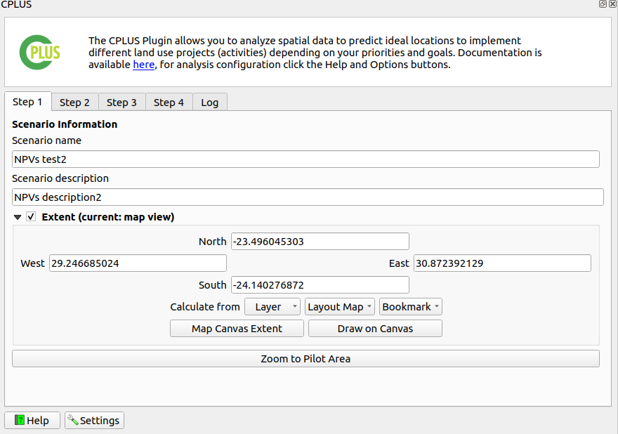

# Manual

The manual covers two sections. Firstly the workflow will be covered. This includes a discussion on the calculations
and formulas. This is so that a user can understand how the CPLUS processing workflow and calculations for each step is
done when processing the pathways and carbon layers, how the implementations models (IM) are created, algorithms applied to
create the priority weighted layer (weighted IM), and the last step, which is the highest position calculation.

The second section deals with the plugin itself. It covers each step, explains each element of each step and why its
needed. A description of the generated report are also provided.

## CPLUS calculations and formulas

**Figure 1** shows the workflow of the CPLUS model. The workflow can be split into four parts:

- Natural climate solution (NCS) weighted carbon pathway(s)
- Implementation model (IM)
- Priority weighted layer (Weighted IM)
- Highest position (Scenario result)

*Figure 1: CPLUS workflow*

### NCS weighted carbon

The following steps/rules are considered to create the NCS weighted carbon layer(s):

- Carbon layers:
    - When multiple Carbon layers are provided, the average is calculated from the layers to create a single Carbon layer
    - The produced Carbon layer is multiplied by the Carbon coefficient provided by the user in the settings
    - If the Carbon coefficient is zero, the value is ignored
- NCS pathways:
    - Multiply the pathway raster with the Suitability index
    - If the index is zero, the pathway raster is used as-is
- **Equation 1** shows how the NCS weighted carbon layer is calculated

$$
\operatorname{NCS weighted carbon} ={CarbonCoefficient}\times{\frac{(Carbon_1 + Carbon_2 + .... + Carbon_n)}{n}} + ({SuitabilityIndex}\times{NcsPathway})
$$

*Equation 1: NCS weighted carbon*

where *CarbonCoefficient* is the carbon coefficient value multiplied with the averaged carbon raster;

&emsp;&emsp;&nbsp;&nbsp;&nbsp; *Carbon* is a carbon raster;

&emsp;&emsp;&nbsp;&nbsp;&nbsp; *SuitabilityIndex* is the NCS pathway index value;

&emsp;&emsp;&nbsp;&nbsp;&nbsp; *NcsPathway* is the NCS pathway raster; and

&emsp;&emsp;&nbsp;&nbsp;&nbsp; *n* is the number of carbon rasters.

- The results from the above calculation are normalized to create the normalized NCS Weighted Carbon layer
- A normalized raster's pixel values range from 0 to 1
- Normalization is done as shown in **Equation 2**

$$
\operatorname{Normalized NCS weighted carbon} =\frac{value - min}{max - min}
$$

*Equation 2: Normalized NCS weighted carbon*

where *value* is the pixel value;

&emsp;&emsp;&nbsp;&nbsp;&nbsp; *min* is the minimum value of the raster; and

&emsp;&emsp;&nbsp;&nbsp;&nbsp; *max* is the maximum value of the raster.

### Implementation model

- Because an IM can consist of multiple pathways, the normalized results will be summed
- All NCS weighted carbon layers, as created from **Equation 2**, is summed as shown in **Equation 3** to
create the IM from the pathways

$$
\operatorname{Summed pathways} = NcsWeightedCarbon_1 + NcsWeightedCarbon_2 + ... + NcsWeightedCarbon_n
$$

*Equation 3: Summed pathways for the IM*

where *NcsWeightedCarbon* is a pathway set up by the user; and

&emsp;&emsp;&nbsp;&nbsp;&nbsp; *n* is the number of pathways.

- Now that the pathways has been summed for the IM, the result needs to be normalized
- The Suitability index and the Carbon coefficient then needs to be taken into account after the normalized raster
has been created
- This calculation is shown in **Equation 4**

$$
\operatorname{Final IM} ={(SuitabilityIndex + CarbonCoefficient)}\times{\frac{value - min}{max - min}}
$$

*Equation 4: Final IM created from pathways*

where *value* is the pixel value;

&emsp;&emsp;&nbsp;&nbsp;&nbsp; *min* is the minimum value of the raster;

&emsp;&emsp;&nbsp;&nbsp;&nbsp; *max* is the maximum value of the raster;

&emsp;&emsp;&nbsp;&nbsp;&nbsp; *SuitabilityIndex* is the NCS pathway index value; and

&emsp;&emsp;&nbsp;&nbsp;&nbsp; *CarbonCoefficient* is the carbon coefficient value multiplied with the averaged carbon raster.

- The resulting output is the final IM

### Priority weighted layer (Weighted IM)

- This step is performed after the IMs has been created
- The PWL is more important, and will therefore be multiplied by five to take this into account
- The PWL weighted is calculated as shown in **Equation 5**

$$
\operatorname{Priority weighted layer} ={FinalImplementationModel} + ({5}\times{Priority weighted layer})
$$

*Equation 5: Priority weighted layer (Weighted IM) calculation*

- The resulting PWL will then be used as input to the Highest position calculation

### Highest Position

The <a href="https://docs.qgis.org/3.28/en/docs/user_manual/processing_algs/qgis/rasteranalysis.html#qgishighestpositioninrasterstack">Highest position</a>
tool determines the raster in a stack with the highest value at a given pixel. Essentially the result
is a classification, where each class represents a specific IM. If multiple rasters has the highest
pixel value at a given pixel, the first raster with that pixel value in the stack will be used.
Figure 2 shows an example from the QGIS description of the Highest position tool.

*Figure 2: Highest position example*

In the plugin the nodata values are ignored. This means that if atleast one raster has a pixel value
at that cell there will be a raster stack value. If none of the rasters in the stack has a pixel value
at that cell (e.g. each raster pixel is nodata) the output will be nodata at that pixel.

Here is an explanation on how-to use the **Highest position** tool:

- Figure 3 shows the layer for the Highest position at stack position 1

*Figure 3: Layer 1 used as highest position input*

- Figure 4 shows the layer for the Highest position at stack position 2

*Figure 4: Layer 2 used as highest position input*

- Figure 5 shows the result from the Highest position calculation (Scenario result)
    - *Stack layer 1* (blue): Figure 2 raster had the highest pixel value
    - *Stack layer 2* (red): Figure 3 raster had the highest pixel value

*Figure 5: Highest position result*

This concludes the section on how the calculations is done 

### References

- https://www.pnas.org/doi/10.1073/pnas.1710465114
- https://royalsocietypublishing.org/doi/10.1098/rstb.2019.0126

## Plugin

Detailed descriptions for each UI element of the plugin. This covers steps 1 to 3, dialogs,
and the settings UI.

### Dock widget

This is the main UI of the plugin. The dock widget opens on the right side of QGIS.
The dock widget consist of three tabs, each focussing on a particular phase of the analyis.
Here is a short description of those steps:

- **Step 1**: Scenario information
- **Step 2**: NCS pathways and IMs
- **Step 3**: Weighting priorities (weighted IMs)

#### Step 1: Scenario information

*Figure 6: Step 1 of the dock widget*

Step 1 allows a user to set up the scenario details and parameters.

- **Scenario name**: This title will be used throughout the processing, will be used for the groups added to the QGIS canvas, and in the generated report
- **Scenario description**: A detailed description of the scenario the user will be running. This information will be added to the final report
- **Extent**: The area of interest (AOI) for analysis. Any spatial data outside this region will be ignored
- **Map Canvas Extent**: The AOI will be the current extent the user has in QGIS
- **Draw on Canvas**: Allows the user to manually draw the AOI
- **Zoom to Pilot Area**: Zooms to the Bushbuckridge pilot study area

Figure 7: Bushbuckridge study area

#### Step 2: NCS pathways and Implementation models

Step 2 focuses on the implementation models (IMs) and pathways.

*Figure 8: Step 2 of the dock widget*

- **NCS pathways**: Pathways which can be added to IMs. Multiple pathways can be added to each IM
- **Implementation models**: Each selected model will be created in used to perform the analysis
- **Description**: A description of the IM or pathway selected
- : Add the selected pathway to the selected IM
- : Adds all pathways to the selected IM
- : Add a new IM
- : Remove the selected IM or pathway
- : Edit the selected IM

##### Implementation Model Editor dialog

*Figure 9: Implementation model editing/adding dialog*

- **Name**: The name of the new IM or IM being edited. IM title will be used in the report
- **Description**: A detailed description of the IM. This will be used in the report
- **Map layer**: If enabled, a user can provide an existing IM. This has to be a raster

#### Step 3: Weighting priorities

*Figure 10: Step 3 of the dock widget*

- **Priority groups**: Groups to which PWLs can be assigned
- **Priority weighted layers (PWL)**:
- : Remove the selected PWL from the priority group
- : Add the selected PWL to the selected priority group
- : Add a new PWL
- : Remove the selected PWL
- : Edit the selected PWL
- **Run Scenario**: Starts running the analysis. The progress dialog will open when the user clicks this button

##### Priority Weighted Layers Editor dialog

*Figure 11: Priority layer dialog*

- **Priority layer**: Select the priority layer
- **Priority layer name**: A unique name for the priority layer
- **Priority layer description**: A detailed description for the priority layer
- **Assign implementation models**: Selected IMs associated with the priority layer

*Figure 12: Selection of IMs for a custom priority layer*

- List of IMs a user can select. Multiple IMs can be selected
- **OK**: Save the selected models
- **Select All**: Selects each of the available IMs
- **Clear Selection**: Deselects each of the selected IMs
- **Toggle Selection**: Switches each option from deselected to selected, or selected to deselected

### Progress dialog

*Figure 13: Processing dialog which will show the status of the analysis*

- **Analysis Progress**: Progress of the current step
- **Status**: A status message on the current analysis being performed
- **View Report**: This button will remain disabled until the processing is done
- **Cancel**: Clicking this button will stop the processing
- **Close**: Only visible once the processing stops. Will close the progress dialog

#### Report options

These options will be available once the analysis has finished. The options will stay disabled if the analysis failed

*Figure 14: Options available to the user related to the generated report*

- **Layout designer**: Opens the report in the QGIS layout designer
- **Open PDF**: Opens the created PDF
- **Help**: Takes the user to the Users documentation site

### Settings

*Figure 15: Settings available to the user*

- **Reports**: Information to be added to the report
    - *Organization*: (optional) Organization or institute name
    - *Contact email*: (optional) Contact email of the user
    - *Website*: (optional) Link to website of your company or institute
    - *Custom logo*: (optional) If enabled, the user needs to provide a custom logo. Most formats should suffice (png, jpeg, etc.)
    - *Logo preview*: Visual previre of the default CI logo, or the custom logo a user selected
    - *Footer*: (optional) Will be added to the report
    - *Disclaimer*: Change as desired, otherwise use the default disclaimer
    - *License*: Change as desired, otherwise use the default license description
- **Advanced**:
    - *Base data directory*: Directory to read data from, and to which results will be written
    - *Coefficient for carbon layers*: Applied to carbon layers during processing
    - **Coefficient importance**: Level of importance for used coefficients when weighting the implementation models
    - **Pathway suitability index**: Index multiplied to the pathways. Lower values means the pathway is less important, higher means its more important
