# Logs User Manual

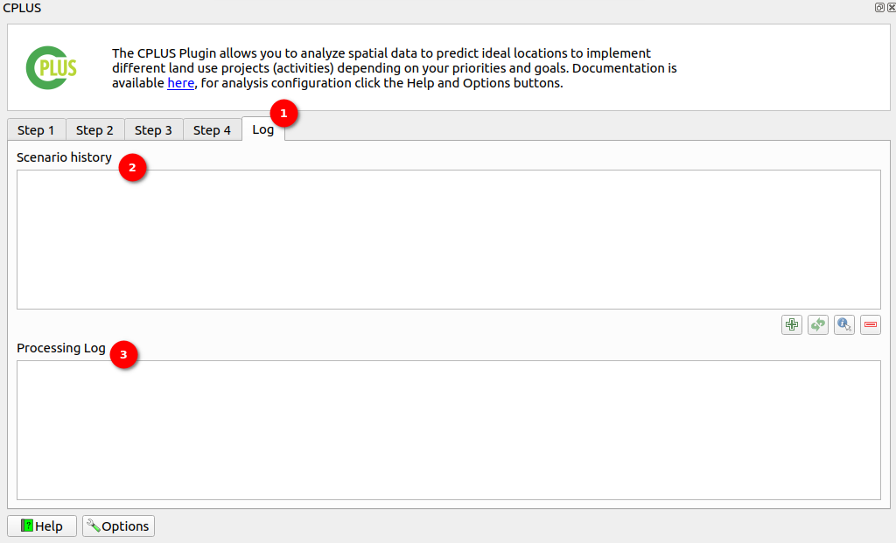

1. **Log:** Click on the `Log` option available to view the logs of the processing scenario and the scenario history.

2. **Scenario History:** In this section, users can explore the history of previously executed scenarios. It serves as an archive of past processing scenarios, allowing users to review, analyse, and reference historical data. Users can retrieve valuable information about past activities, outcomes, and trends, facilitating informed decision-making and performance evaluation. The scenario history provides a comprehensive overview of past system activities, offering insights into long-term patterns and performance metrics.

    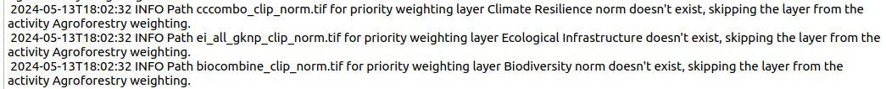

    Once the scenario is completed that scenario history will be shown in the scenario history section.

    In the bottom right corner of the scenario history, you will find four buttons with the following functions:

    - **Plus Icon:** This button allows you to save the scenario to the scenario history section. Clicking on it enables you to include additional scenarios for review and analysis within the scenario history.

    - **Refresh Button:** This button serves the function of loading the selected scenario details into Step 1 of the interface. Upon selecting a scenario from the list within the Scenario History section, users can click the Round Arrow button to load the details of that scenario into Step 1. This action facilitates a seamless transition from reviewing scenario history to initiating further analysis or action within the system.

    - **Information Icon:** By clicking on the information icon, users can access useful information related to the scenarios. This feature provides additional insights, explanations, or tips to enhance the understanding and interpretation of the scenario history data.

    - **Scenario Comparison Report:** This feature allows users to run scenario comparisons, and generate comparison reports. These reports are saved in the base data directory specified in the CPLUS plugin settings.

        **Run the Scenario:** Ensure the scenario runs successfully.
        **Save Scenario History:** Click on the plus icon (+) to save the scenario history into the logs. The user can save the scenario after the scenario runs successfully.

        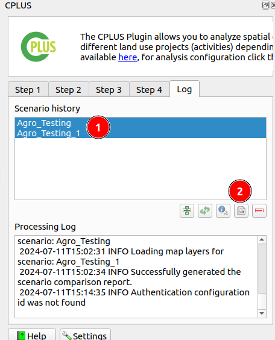

        1. **Select Scenarios for Comparison:** The user needs to select the scenarios they want to compare from the list of available logs.

            **Scenario 1 (Agro_Testing):** This scenario report has two activities `Agroforestry` and `Alien Plant Removal`. The report was generated based on these two activities.

            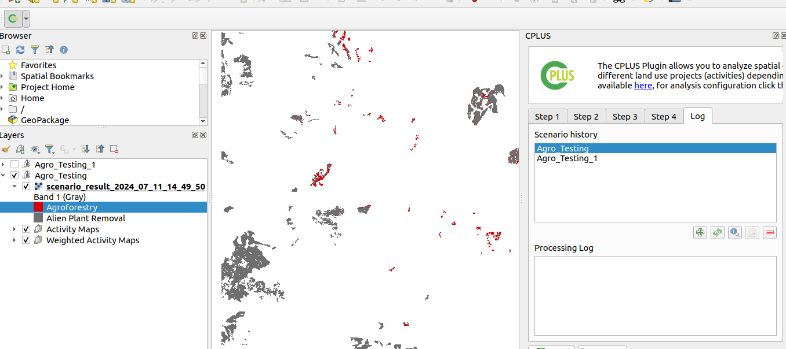

            **Scenario 2 (Agro_Testing_1):** This scenario report has three activities `Agroforestry`, `Alien Plant Removal` and `Avoided Deforestation and Degradation`. The report was generated based on these three activities.

            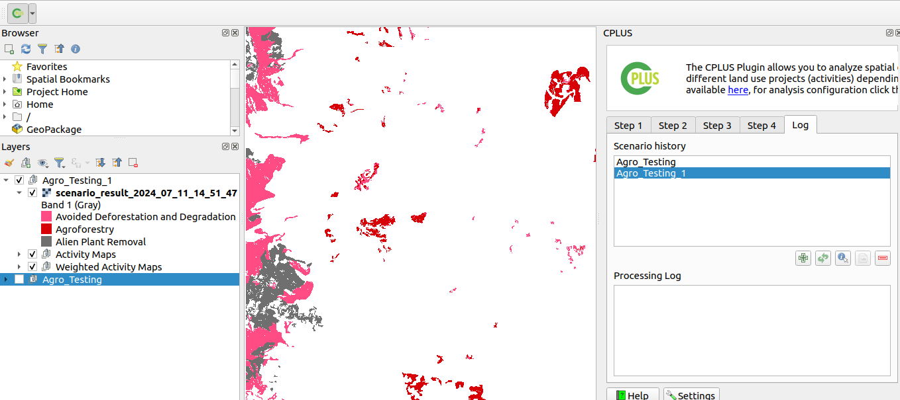

        2. **Comparison Icon:** Click on the file comparison icon to initiate the comparison. Upon clicking the icon, the comparison report generation will start. A popup will appear that shows the progress bar indicating the status of the report generation process.

            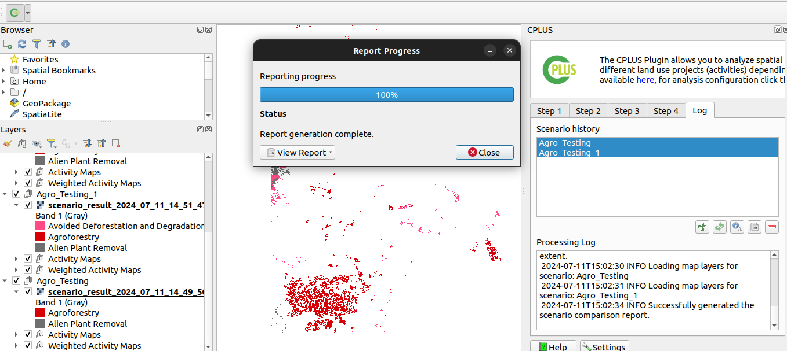

            - The user can close the popup by clicking on the `Close` button or can view the generated report by clicking on the `View Report` button.

        **Accessing the Comparison Report:** Once the comparison report is generated, it will be saved in the base data directory specified in the CPLUS plugin settings.

        **Comparison Report:**

        Navigate to the base data directory to access the comparison report.

        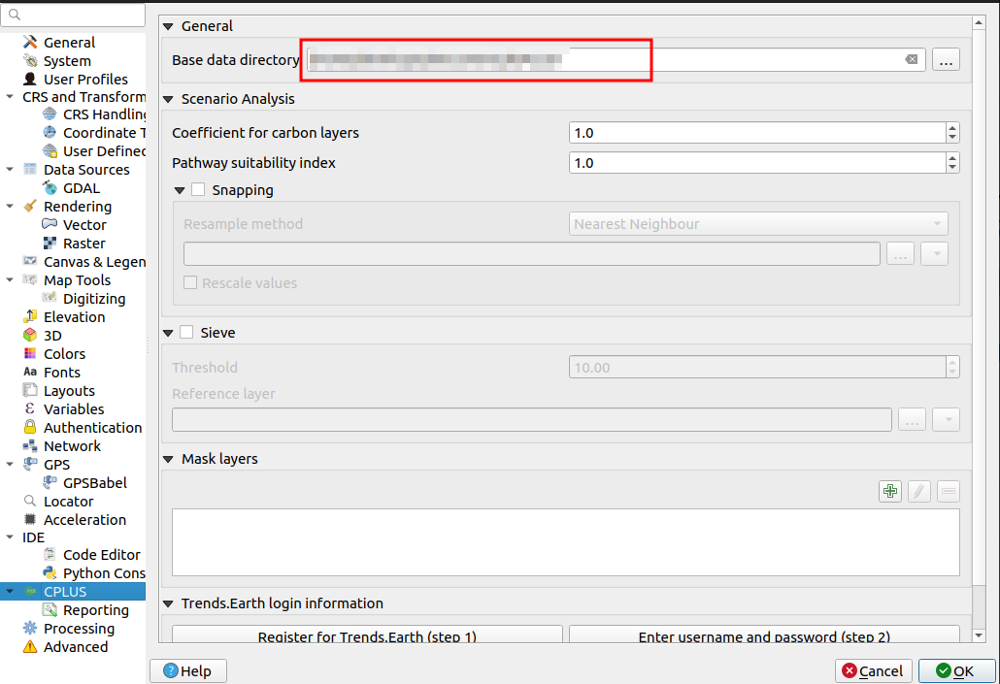

        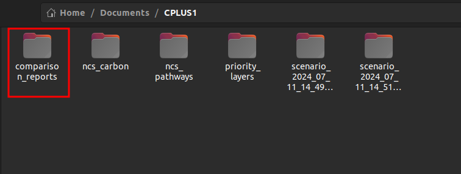

        **The comparison report includes the following key components:**

        - **Scenario Activity Area Comparison Table:** This table shows a detailed comparison of activity areas across the selected scenarios. It provides insights into how different activities perform in various areas, highlighting similarities and differences between scenarios.

            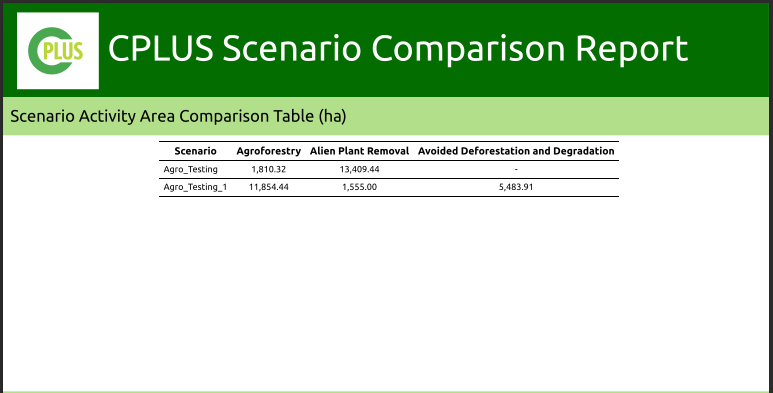

        - **Scenario Maps:** The following set of maps offers a side-by-side comparison of the different scenarios selected for this report. These scenario maps are the final output of the highest position analysis done for each scenario. The maps indicate which activities are best suited to each area in the stated area of interest, providing a visual representation of the comparative analysis.

            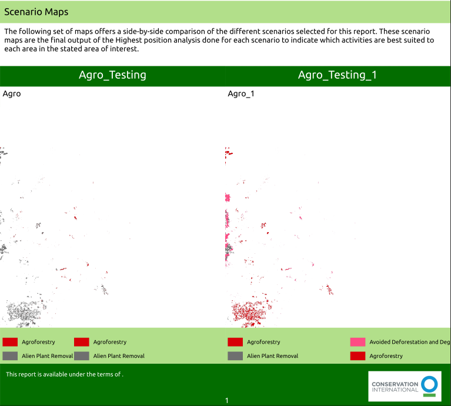

    - **Minus Icon:** The minus icon serves the purpose of removing the scenario from the scenario history section. Clicking on this icon allows users to delete specific scenarios from the history, streamlining the displayed records to focus on relevant information.

3. **Processing Scenario Logs:** This section provides a detailed record of logs about the ongoing processing scenario. It offers real-time insights into the actions, events, and outcomes within the current scenario. Users can monitor the progress, identify any errors or issues, and troubleshoot accordingly. These logs are essential for tracking the execution flow and diagnosing any anomalies during the processing workflow.

    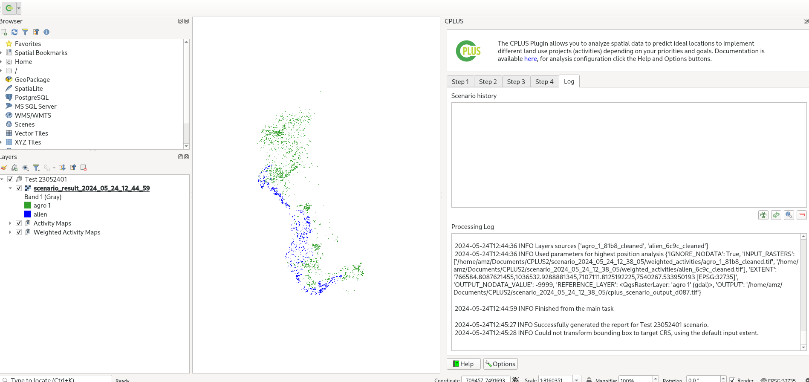

    - **Info:** The success info will be seen in the processing log section once the scenario runs successfully.

        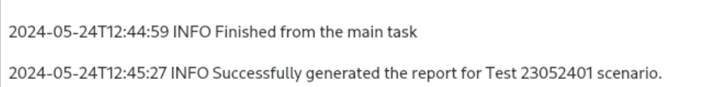
