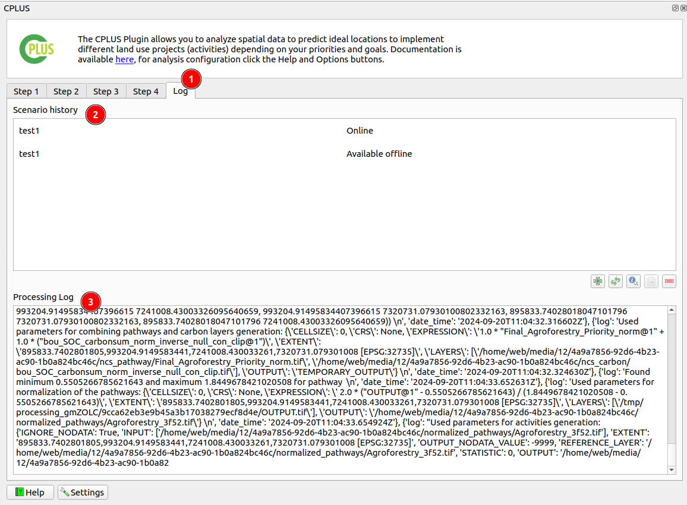
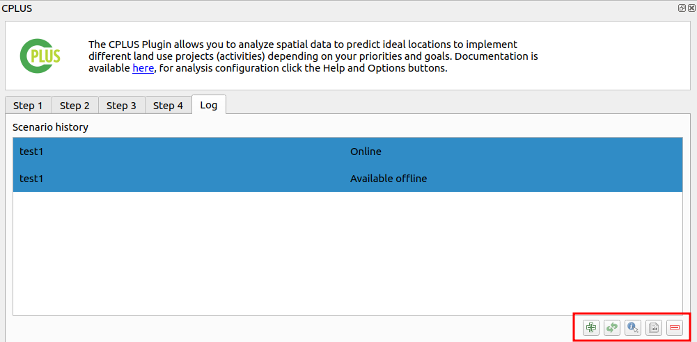
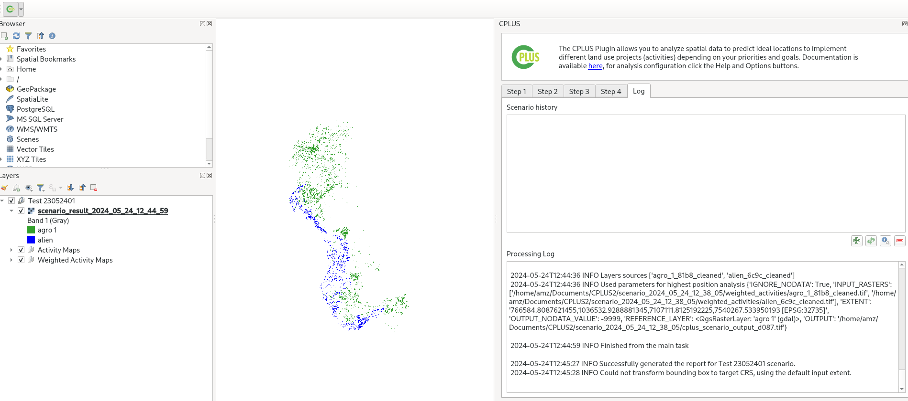

# Logs User Manual

1. **Log:** Click on the `Log` option available to view the logs of what is happening during each step of the processing.

- The log module shows all the functions and processes that are done by the plugin throughout the analysis and this information is saved to the scenario file.

- Each log entry provides clear and concise information to facilitate tracking and debugging of the validation process within the system.

**INFO**

**WARNING**

