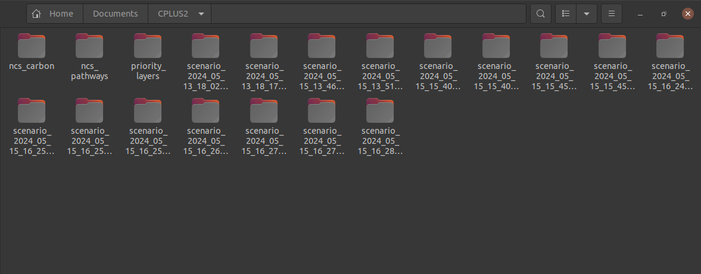
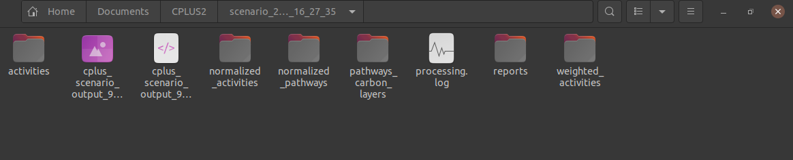

# Scenario files

The scenario files are stored in the base directory of the system. The base directory can be configured from the settings. You can refer to the [Settings Documentation](./settings.md) for detailed instructions on how to set the base directory.

In the base directory, you will find the scenario files necessary for analysis. Users can navigate to the specific scenario folder they wish to view or analyse.

Within each scenario folder, all details related to that particular scenario are available. Users can access processing logs, generated reports, activity details, and pathway information associated with the selected scenario.

This organised structure enables users to efficiently manage and analyse scenario data, facilitating informed decision-making and performance evaluation.