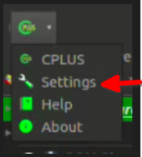
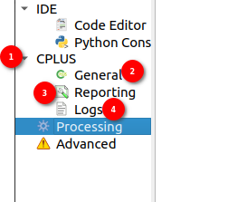
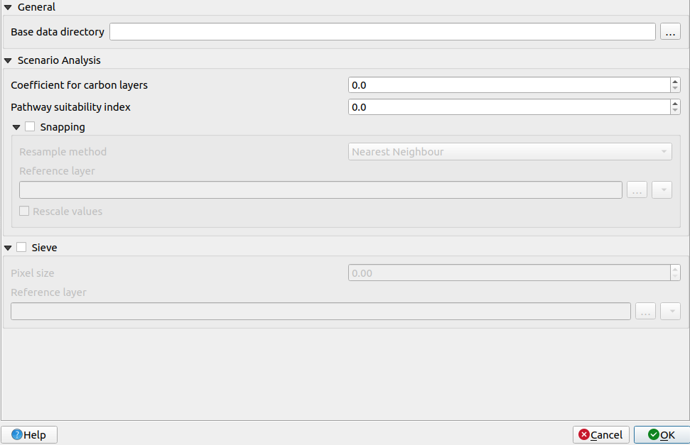
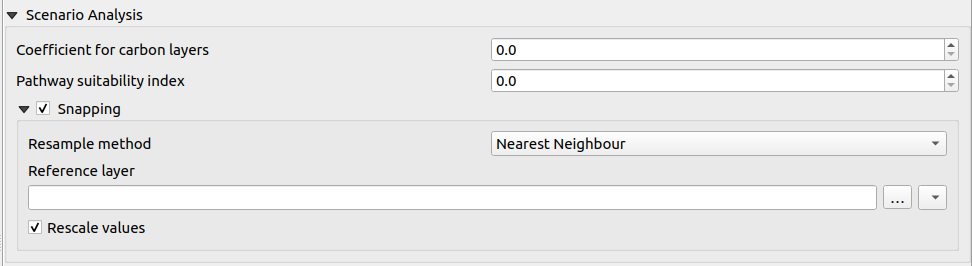
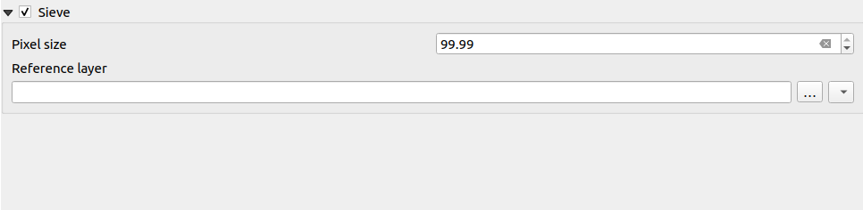
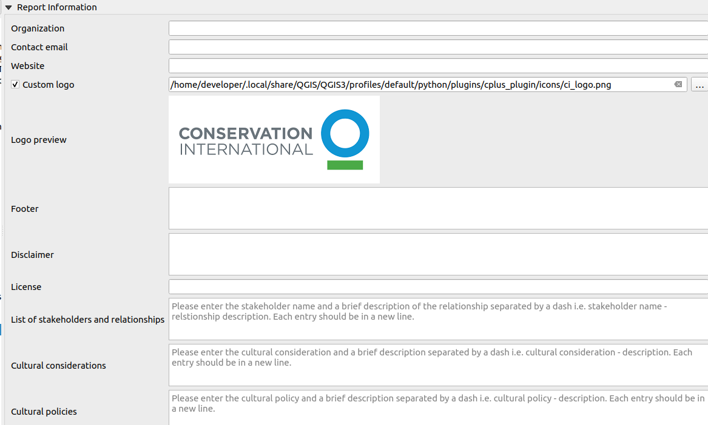

# Settings

To go to the settings the user can click on the plugin toolbar icon to reveal the option.

**Setting:** click on the `settings` option to go to the plugin settings. Upon clicking the settings page will open.

1. **CPLUS Dropdown:** Click on the dropdown icon to reveal the Cplus setting options.

2. **General:** Click on the `General` option for basic settings such as General, Scenario Analysis, and Sieve settings.

    

    ## General Setting 

    **Base data directory:** Directory to read data from, and to which results will be written.

    ## Scenario Analysis Setting

    **Coefficient for carbon layers:** Applied to carbon layers during processing.

    **Pathway suitability index:** Index multiplied to the pathways. Lower values means the pathway is less important, and higher means it's more important.

    ### Snaping

    Snapping will set rasters to match the cell alignment of a reference layer.

    

    **Resample method:** Resampling performed on pixel values. The user can choose the method of their choice from the dropdown. The available methods are as follows:

    - *Nearest neighbour*: Closest pixel value. This will be best to use if a user wants to preserve the original pixel values.

    - *Bilinear*: Computes the pixel values from the two closest pixels (2 x 2 kernel).

    - *Cubic*: Computes the pixel values from the four closest pixels (4 x 4 kernel).

    - *Cubic B-Spline*: Cubic resampling based on B-Spline (4 x 4 kernel).

    - *Lanczos*: Lanczos windowed sinc interpolation (6x6 kernel).

    - *Average*: Computes the average of all non-nodata contributing pixels.

    - *Mode*: Select the value which appears most often of all the sampled pixels.

    - *Maximum*: Selects the maximum value which appears of all the sampled pixels.

    - *Minimum*: Selects the minimum value which appears of all the sampled pixels.

    - *Median*: Selects the median value which appears in all the sampled pixels.

    - *First quartile (Q1)*: Select the first quartile value which appears in all the sampled pixels.

    - *Third quartile (Q3)*: Select the third quartile value which appears in all the sampled pixels.

    **Reference layer:** The reference layer to which the cell alignment will be applied. The user can choose a file from the system.

    **Rescale values:** Rescale values according to cell size. The user can check or uncheck.

    ## Sieve Settings

    

    The `Sieve function` is a tool designed to filter raster data based on a specified pixel size. It enables users to define a minimum area threshold, such that any contiguous area in the raster dataset smaller than the specified size will be removed or filtered out.

    This functionality is particularly useful for projects or activities that require a minimum spatial extent to be meaningful or practical. For instance, it might not be feasible to undertake an activity on a parcel of land that is smaller than a certain size, such as a hectare.

    By setting the desired pixel size, users can ensure that only areas meeting the specified minimum extent are retained in the dataset, while smaller features are eliminated. This process helps streamline data analysis and ensures that only relevant spatial entities are considered for further processing or analysis.

    The user can use this by checking the checkbox available in front of the `Sieve`.

    **Pixel Size:** The user can specify the pixel size to filter out areas smaller than the specified value.

    **Reference Layer:** The reference layer to which the sieve function will be applied. The user can choose the layer from the system.

    To apply the settings user needs to click on the `OK` button.
    
    Click on `Cancel` will close the dialog without applying any changes.

3. **Reporting:** Click on the `Reporting` option for reports-related settings. Under the Reporting settings, users can configure the information to be included in the generated reports. These settings include:

- *Organization*: (optional) Organization or institute name.

- *Contact email*: (optional) Contact email of the user.

- *Website*: (optional) Link to the website of your company or institute.

- *Custom logo*: (optional) If enabled, the user needs to provide a custom logo. Most formats should suffice (png, jpeg, etc.).

- *Logo preview*: Visual preview of the default CI logo, or the custom logo a user selected.

- *Footer*: (optional) Will be added to the report.

- *Disclaimer*: Change as desired, otherwise use the default disclaimer.

- *License*: Change as desired, otherwise use the default license description.

- *List of stakeholders and relationships*: Enter the stakeholder's name and a brief description of the relationship separated by a dash i.e. 

    `Stakeholder's name - Relationship description`

    Each entry should be in a new line.

- *Cultural considerations*: Enter the cultural considerations and a brief description separated by a dash i.e.

    `Cultural considerations - description`

    Each entry should be in a new line.

- *Cultural Policies*: Enter the cultural policies and a brief description separated by a dash i.e.

    `Cultural policies - description`

    Each entry should be in a new line.

- To apply the settings user needs to click on the `OK` button.
    
- Click on `Cancel` will close the dialog without applying any changes.

4. **Logs:** The logs tab displays all messages that have been generated.
