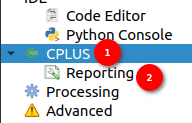
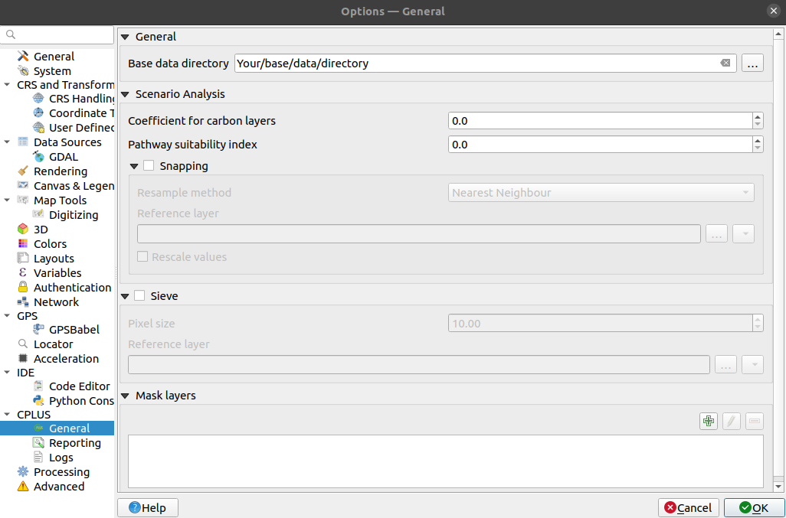
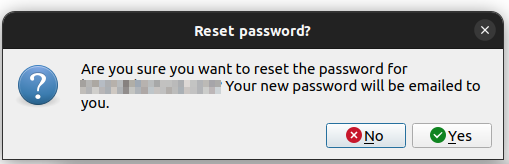

# Settings

To go to the settings the user can click on the plugin toolbar icon to reveal the option.

**Setting:** click on the `settings` option to go to the plugin settings. Upon clicking the settings page will open.

1. **CPLUS Dropdown:** Click on the dropdown icon to reveal the Cplus setting options. Click on the `CPLUS` to view the options like general, snapping, sieve, mask layer and trends earth login.

    

    1 **General:** Click on the `General` option for basic settings such as General, Scenario Analysis, and Sieve settings.

    

    ## General Settings 

    **Base data directory:** Directory to read data from, and to which results will be written.

    2 **Scenario Analysis Setting:**

    **Coefficient for carbon layers:** Applied to carbon layers during processing.

    **Pathway suitability index:** Index multiplied to the pathways. Lower values means the pathway is less important, and higher means it's more important.

    ## Snapping

    Snapping will set rasters to match the cell alignment of a reference layer.

    

    **Resample method:** Resampling performed on pixel values. The user can choose the method of their choice from the dropdown. The available methods are as follows:

    - *Nearest neighbour*: Closest pixel value. This will be best to use if a user wants to preserve the original pixel values.

    - *Bilinear*: Computes the pixel values from the two closest pixels (2 x 2 kernel).

    - *Cubic*: Computes the pixel values from the four closest pixels (4 x 4 kernel).

    - *Cubic B-Spline*: Cubic resampling based on B-Spline (4 x 4 kernel).

    - *Lanczos*: Lanczos windowed sinc interpolation (6x6 kernel).

    - *Average*: Computes the average of all non-nodata contributing pixels.

    - *Mode*: Select the value that appears most often of all the sampled pixels.

    - *Maximum*: Selects the maximum value which appears of all the sampled pixels.

    - *Minimum*: Selects the minimum value which appears of all the sampled pixels.

    - *Median*: Selects the median value that appears in all the sampled pixels.

    - *First quartile (Q1)*: Select the first quartile value that appears in all the sampled pixels.

    - *Third quartile (Q3)*: Select the third quartile value that appears in all the sampled pixels.

    **Reference layer:** The reference layer to which the cell alignment will be applied. The user can choose a file from the system.

    **Rescale values:** Rescale values according to cell size. The user can check or uncheck.

    ## Sieve Settings

    

    The `Sieve Function` is a tool designed to filter raster data based on a specified threshold. It enables users to define a minimum area threshold, such that any contiguous area in the raster dataset smaller than the specified size will be removed or filtered out.

    This functionality is particularly useful for projects or activities that require a minimum spatial extent to be meaningful or practical. For instance, it might not be feasible to undertake an activity on a parcel of land that is smaller than a certain size, such as a hectare.

    By setting the desired threshold, users can ensure that only areas meeting the specified minimum extent are retained in the dataset, while smaller features are eliminated. This process helps streamline data analysis and ensures that only relevant spatial entities are considered for further processing or analysis.

    The user can use this by checking the checkbox available in front of the `Sieve`.

    **Threshold Size:** Enter the desired threshold value in the Threshold field. This value represents the minimum number of connected pixels that should be preserved when sieving. Any contiguous area smaller than this threshold will be filtered out.

    **Reference Layer:** The reference layer to which the sieve function will be applied. The user can choose the layer from the system.

    To apply the settings user needs to click on the `OK` button.
        
    Click on `Cancel` will close the dialog without applying any changes.

    3 **Mask Layers:**

    **Masking Layers:** Masking layers are used to specify areas that should be excluded from further analysis.

    **Adding a Layer to the Mask:** When the user adds a layer to the mask, they specify that the areas covered by that layer should be excluded from the analysis or processing steps.

    **Exclusion of Layer Area:** By adding a layer to the mask, the user is essentially creating a filter that excludes the areas represented by that layer.

    **Impact on Analysis:** Any analysis or operations performed on the masked data will skip the areas covered by the added layer. This ensures that the analysis focuses only on the relevant geographic features while disregarding the specified layer.

    **Relevance to GIS:** Masking layers play a crucial role in GIS analysis, allowing users to focus on specific areas of interest and filter out irrelevant or undesired features from consideration.

    In summary, adding a layer to the mask in a context allows for the selective exclusion of specific geographic areas from analysis or visualisation, improving the accuracy and relevance of outputs.

    1. **Arrow:** Click on the available `Arrow` button in front of the `Mask Layer` to see the options for adding or deleting the layers from the mask feature.

        

        Upon clicking the user will see the options.

        

        2. **Plus Icon:** Click on the `Plus` icon, to add the layer to the mask layer from the system. Upon clicking the icon the system will show the available layer, and choose the desired layer to add to the mask layer.

            

        3. **Minus Icon:** Select the added layer and click on the `Minus` icon, to remove that layer.

        4. **Ok:**  After adding the layer/layers to the mask layer, click on the `OK` button to save the layers in the mask layer and skip them from further analysis.

    4 **Irrecoverable Carbon Reference Layer:**

    The `Irrecoverable Carbon` layer is used in a calculation with the protect pathways to calculate the total irrecoverable carbon per activity.

    

    1 **local path:** Users are required to click on this radio button if they want to use the local path for the `Irrecoverable Carbon` layer.

    2 **Input Field:** Users can click on this input field to enter the path manually or they can click on the three dots `...` on the right side of the input field to open the file explorer from where they select the irrecoverable carbon layer.

    

    * If the `Irrecoverable Carbon` layer is not found in the system, the system will show an error message.

        
    
    

    1 **Online source:** Users are required to click on this radio button if they want to use the online source for the `Irrecoverable Carbon` layer.

    2 **URL:**  this field contains the url to down the `Irrecoverable Carbon` layer from the online source.

    3 **Save as:** Specify the location and name for saving the downloaded `Irrecoverable Carbon` layer in the system.

    4 **Start download:** Click on this button to download the resource.

    5 **Download not started:** Current status of the downloading process. There are three types of statuses : `Download Not started`, `Download ongoing`, and `Download successful`.

    * If any how the download fails, the system will show an error message.

        
    
    5 **Trends.Earth Login Information:**

    >NOTE: User need to register and login with a Trends.Earth account to use the online API for processing with CPLUS.

    

    1. **Register for Trends.Earth (step 1):** Click on the `Register for Trends.Earth (Step 1)` button to initiate the registration process for Trends.Earth. Upon clicking, a registration form will open. The user needs to enter the following information:

        - **Email:** Enter your email address.
        - **Name:** Enter your full name.
        - **Organisation:** Enter the name of your organisation.
        - **Country/Region:** Select your country or region from the dropdown list.
    
    * After entering the details, click on the `OK` button to submit the form.

    * After clicking the `OK` button, a success message will pop up:
            
    * Message: User registered: your password has been emailed to the user's email address. Enter that password in CPLUS settings to finish setting up the plugin.

        

    * The user will receive an email at the address entered in the form. This email will contain the user and password needed to complete the setup.

        
            
        After successful registration, a pop-up will prompt the user to set a new master authentication password.

        **Setting the Master Password:**

        - Always enable the Store/Update master password in your Wallet/KeyRing option to save the password securely in the Wallet/Keyring of your computer.

        - Once set, the master password can be reset; however, the current master password will be needed prior to resetting.

        - During the reset process, there is an option to generate a complete backup of the current database.

        - **Important:** If the user forgets the master password, there is no way to retrieve or override it. There is also no means of retrieving encrypted information without knowing the master password.

        - If a user inputs their existing password incorrectly three times, the dialog will offer to erase the database.

        - **Reminder:** Do not forget your master password and store it securely for later use, as it is not retrievable.

            

            1. **Required Field:** Enter the new master password in the required password field.

            2. **Verify Password Field:** Re-enter the new master password in the verify password field to confirm it.

            3. **Store/Update Master Password in your Wallet/KeyRing Checkbox:** Enable the Store/Update master password in your Wallet/KeyRing checkbox to save the password securely in your computer's Wallet/KeyRing.

            4. **OK Button:** Click the `OK` button to submit and set the new master password.

            5. **Cancel Button:** Click the `Cancel` button to cancel the operation and exit the form without setting a new master password.
        
        2. **Enter username and password (step 2):** Click on the `Enter username and password (step 2)` button to log in to Trends.Earth account. Upon clicking on this button the Trends.Earth login form will open. To log in enter the email and password in the respective fields. Click on the `OK` button to log in to the Trends.Earth account.

            

            After successful submission, the success message will pop up.

            
        
        3. **Update profile:** Click on the `Update profile` button to update the profile. Upon clicking the update profile form will open.

            

            *The user can update the fields they want to update.*
                - Email: Enter the email address to update the email.
                - Name: Enter the name to update the name.
                - Organisation: Enter the name of organisation to update the Organisation.
                - Country: Select the country from the dropdown list to update the country.
            
            Click on the `Save` button to save the changes. After successful updation, a success message will pop up.

            

        4. **Reset password:** Click on the `Reset Password` button to reset the password. Upon clicking the reset password form will open.

            

            *Enter your email address below. If you have an account, an email will be sent to you (from api@trends.earth) with a new password.*

            - **Email:** Enter the email address in the provided field.
            - **OK Button:** Click the `OK` button to submit the email address and request a password reset.
            - **Cancel Button:** Click the `Cancel` button to cancel the password reset request and exit the form.

            

            *Upon clicking the OK button, a confirmation popup will open with the following message:*

            - **Confirmation Message:** Are you sure you want to reset your password for xyz@gmail.com? Your new password will be mailed to you.
            - **No Button:** Click the `No` button to cancel the password reset and close the confirmation popup.
            - **Yes Button:** Click the `Yes` button to confirm the password reset. An email with your new password will be sent to you.

            *On successful submission, the success message popup will be shown to the user.*

            

            *The user will receive an email with the new password.*

            

        5. **Delete user:** Click on the `Delete user` button to delete the user. Upon clicking the delete user form will open.

            

            - **Message:** Are you sure you want to delete the user xyz@gmail.com? All your tasks will be lost and you will no longer be able to process data online using Trends.Earth.
            - **No Button:** Click the `No` button to cancel the deletion and close the form.
            - **Yes Button:** Click the `Yes` button to confirm the deletion of the user. This will permanently delete your account and all associated tasks.

2. **Reporting:** Click on the `Reporting` option for reports-related settings. Under the Reporting settings, users can configure the information to be included in the generated reports. These settings include:

- *Organisation*: (optional) Organisation or institute name.

- *Contact email*: (optional) Contact email of the user.

- *Website*: (optional) Link to the website of your company or institute.

- *Custom logo*: (optional) If enabled, the user needs to provide a custom logo. Most formats should suffice (png, jpeg, etc.).

- *Logo preview*: Visual preview of the default CI logo, or the custom logo a user selected.

- *Footer*: (optional) Will be added to the report.

- *Disclaimer*: Change as desired, otherwise use the default disclaimer.

- *License*: Change as desired, otherwise use the default license description.

- *List of stakeholders and relationships*: Enter the stakeholder's name and a brief description of the relationship separated by a dash i.e. 

    `Stakeholder's name - Relationship description`

    Each entry should be in a new line.

- *Cultural considerations*: Enter the cultural considerations and a brief description separated by a dash i.e.

    `Cultural considerations - description`

    Each entry should be in a new line.

- *Cultural Policies*: Enter the cultural policies and a brief description separated by a dash i.e.

    `Cultural policies - description`

    Each entry should be in a new line.

- To apply the settings user needs to click on the `OK` button.
    
- Click on `Cancel` will close the dialog without applying any changes.
