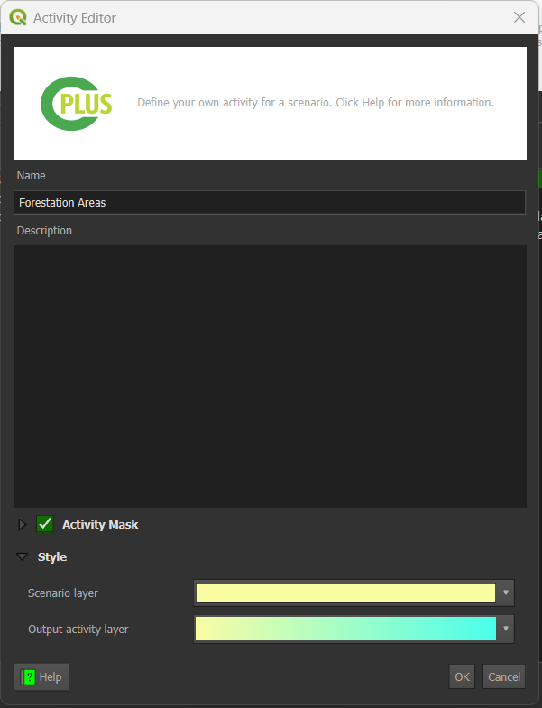
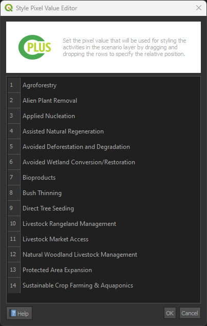

# Step 2: NCS Pathways and Activities

`Step 2` focuses on the activities and pathways. Step 2 of the process revolves around configuring NCS (Natural Climate Solutions) pathways and activities. This step is crucial for defining the activities to be performed and pathways to be followed during the analysis.

- **NCS pathways**: Natural climate solution (NCS) Pathways which can be added to activities. Multiple pathways can be added to each activity.

- **Activities**: Each selected activity will be created in used to perform the analysis.

- **Description**: A description of the activity or pathway selected.

- : Add the selected pathway to the selected activity.

- : Adds all pathways to the selected activity.

- : Add a new activity.

- : Remove the selected activity or pathway.

- : Edit the selected activity.

- : Order the pixel values (activities) will be in the scenario output

### Activity Editor dialog

- **Name**: The name of the new activity or activity being edited. Activity title will be used in the report

- **Description**: A detailed description of the activity. This will be used in the report

- **Style**: Styles used for the activity:

    - *Scenario layer*: Colouring which will be used in the Scenario output for this activity

    - *Output activity layer*: Colour ramp which will be applied to the activity raster output

- **Map layer**: If enabled, a user can provide an existing activity. This has to be a raster

## Ordering of the pixel values for the scenario output

A user can order the stack using the **Style pixel value editor**.

Overall, Step 2 provides users with comprehensive tools for defining and configuring NCS pathways and activities, enabling efficient and accurate analysis and visualisation of natural climate solutions.
