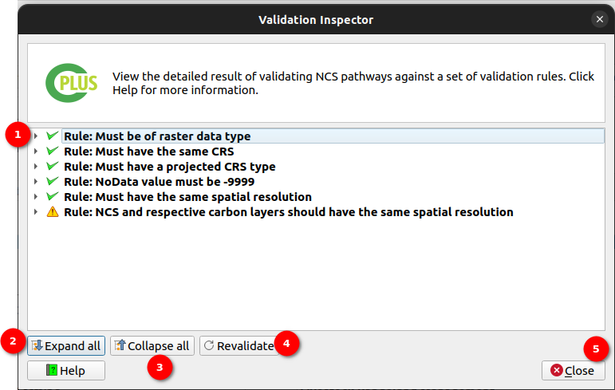
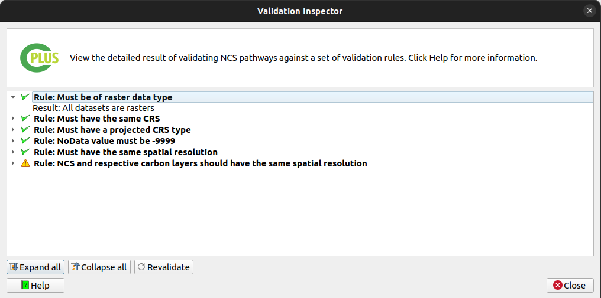
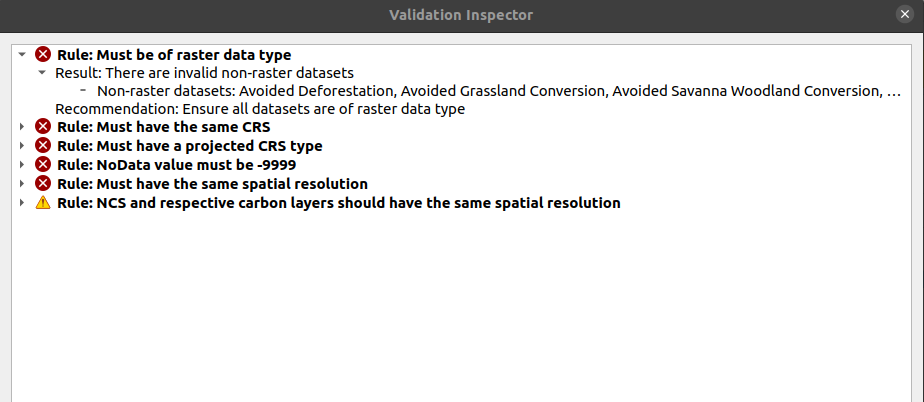

# Step 2: NCS Pathways and Activities

`Step 2` focuses on the activities and pathways. Step 2 of the process revolves around configuring NCS (Natural Climate Solutions) pathways and activities. This step is crucial for defining the activities to be performed and pathways to be followed during the analysis.

- **NCS pathways**: Natural climate solution (NCS) Pathways which can be added to activities. Multiple pathways can be added to each activity.

- Add NCS Pathways: The user can add the NCS pathways according to their preferences to add the NCS pathways, click on the plus icon to open the NCS pathways add window.

    There are two ways to add the NCS Pathways:

    1. **Add Manually** 

    

    - Name: Enter the name of the NCS pathway.
    - Description: Enter the description of the NCS pathway.
    - Map Layer: Choose the map layer from the downloaded data available in the system.
    
    For example add map layer for Agroforestry

    

    - Carbon Layer: Click on the plus icon and choose the carbon layer from the downloaded data available in the system.

    For example add carbon layer for Agroforestry 
    
    

    After entering all details, click on the OK button to add the NCS pathway.

    2. **Add Online**

    >Note: To use the Online Defaults option, the user needs to have an account on Trends.Earth platform.

    

    The user can add the NCS pathways online by clicking on the `Online Defaults` dropdown and choosing. Name and the description will be filled automatically after choosing the NCS pathway Next, add the carbon layer from the system by selecting it from the available options. Click on the OK button to add the NCS pathway.

    **After choosing from online default**

    

- **Activities**: Each selected activity will be created in used to perform the analysis.

- **Description**: A description of the activity or pathway selected.

- : Add the selected pathway to the selected activity.

- : Adds all pathways to the selected activity.

- : Add a new activity.

- : Remove the selected activity or pathway.

- : Edit the selected activity.

- : Order the pixel values (activities) will be in the scenario output

### Activity Editor dialog

- **Name**: The name of the new activity or activity being edited. Activity title will be used in the report

- **Description**: A detailed description of the activity. This will be used in the report

- **Style**: Styles used for the activity:

    - *Scenario layer*: Colouring which will be used in the Scenario output for this activity

    - *Output activity layer*: Colour ramp which will be applied to the activity raster output

- **Map layer**: If enabled, a user can provide an existing activity. This has to be a raster

## Ordering of the pixel values for the scenario output

A user can order the stack using the **Style pixel value editor**.

Overall, Step 2 provides users with comprehensive tools for defining and configuring NCS pathways and activities, enabling efficient and accurate analysis and visualisation of natural climate solutions.

## Validations

1. **Error Model:** Whenever an error occurs the user will see the `Error Model` at the top. In this model, the user gets a basic idea about where to check for the detailed error logs. 

    **Message:** NCS pathways are not valid or there is an ongoing validation process. Use the validation inspector to see more details.

2. **Validation Inspector:** Click on the `Validation Inspect/Magnifying Glass` icon, to view the detailed error logs. Upon clicking the validation error window will pop up, where all the detailed logs are available.

    

    1. **Arrows:** Click on the available `Arrow` button in front of the error to expand that error log.

        

    2. **Expand All:** Click on the `Expand All` button, to expand all the error messages.

        

    3. **Collapse All:** Click on the `Collapse All` button, to collapse all the messages.

    4. **Revalidate:** Click on the `Revalidate` button, to revalidate. Upon clicking it will rerun the validations.

        

    4. **Close:** Click on the `Close` button, to close the validation inspector window.

The user can also check the validation inspector window to view the failed validations.

*Error Types*

- **Rule: Must be of raster data type**

- **Rule: Must have the same CRS**

- **Rule: Must have a projected CRS type**

- **Rule: NoData value must be -9999**

- **Rule: Must have the same spatial resolution**

- **Rule: NCS and respective carbon layers should have the same spatial resolution**

Click [here](step-3.md) to explore the step 3 section.

Click [here](step-4.md) to explore the step 4 section.

Click [here](logs.md) to explore the log section.
