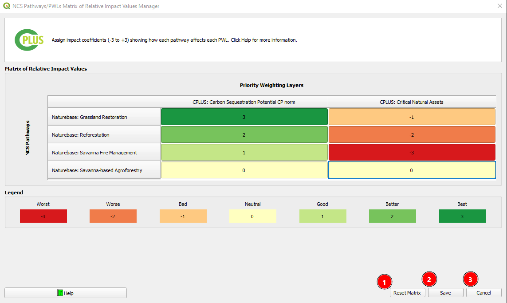
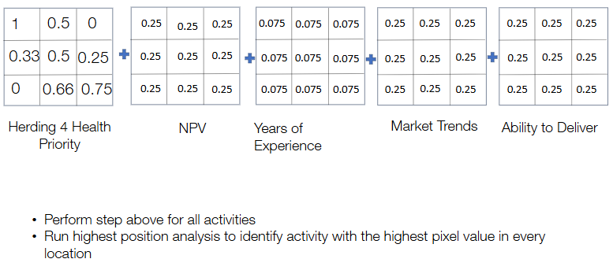
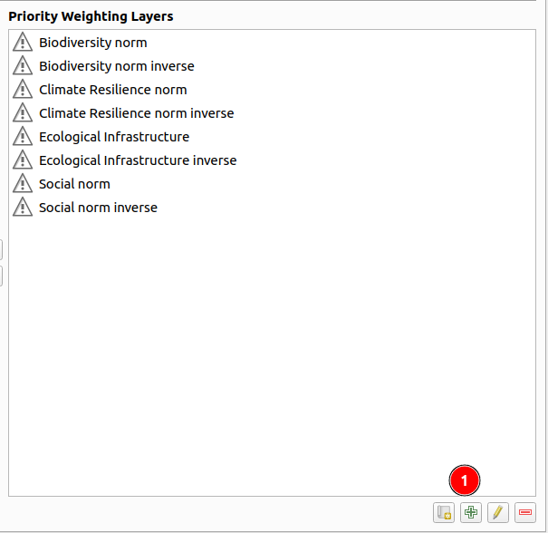
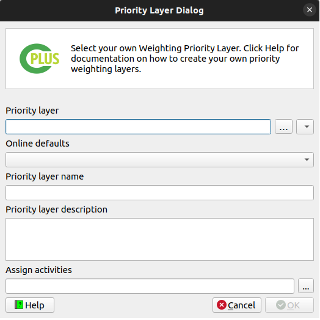
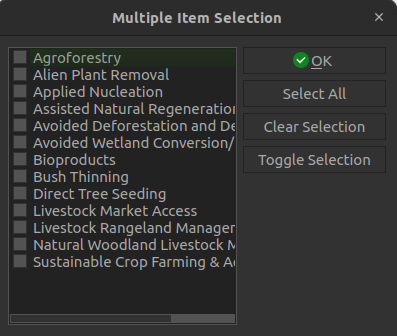
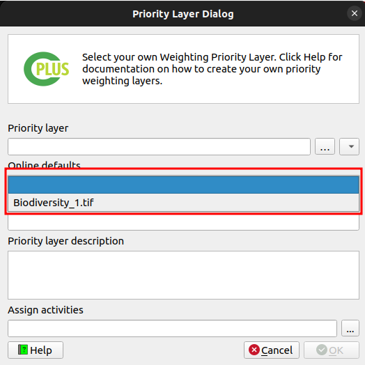

# Step 3: Weighting priorities

`Step 3` focuses on weighting priorities, which involves assigning importance to different priority groups and weighted layers. This step is critical for determining the relative significance of various factors in the analysis.

- **Priority groups**: Users can define different priority groups to which priority weighting layers (PWLs) can be assigned. These groups represent different categories or themes that contribute to the overall analysis.

- : Add a new priority group.

- : Edit the selected priority group.

- : Remove the selected priority group.

- **Priority Weighting Layers (PWL)**: Users can assign importance values to each priority group by associating them with priority weighted layers. These layers represent the spatial data layers or attributes that contribute to the analysis.

- : Remove the selected PWL from the priority group.

- : Add the selected PWL to the selected priority group.

- : Create matrix of relative impact values for priority weighting layers. 

- : Create a financial priority weighted layer.

- : Manage constant rasters.

- : Add a new PWL.

- : Edit the selected PWL.

- : Remove the selected PWL.

##  Matrix of Relative Impact values Editor dialog

The NCS Pathways and PWLs Matrix tool provides a structured way to define how each Natural Climate Solutions (NCS) pathway influences specific Priority/Weighting Layers (PWLs). Using a scale from –3 to +3, users can describe whether a pathway has a negative, neutral, or positive effect on key variables.

**Understanding the Matrix of Relative Impact values tool**

In Step 3 of the workflow, the plugin displays a matrix where:

- **Rows → NCS pathways**

- **Columns → PWL variables**

Users assign a coefficient (–3 to +3) to each pathway–PWL combination.

The matrix focuses only on impact-based PWLs, where the pathway directly influences the variable (e.g., carbon, biodiversity, water, livelihoods).
Fragmentation-based PWLs, those related to spatial configuration or landscape compatibility, are handled separately and do not require coefficients.

Carbon-related variables (biomass, sequestration potential, soil carbon) fit naturally within this scheme and can be assigned positive or negative impact scores.

**Below is an example of the relative impact of pathways on different variables:**

**Purpose of Matrix of Relative Impact values tool**

Earlier steps in the workflow evaluate implementability, producing maps that show how suitable or feasible it is to apply each pathway in each location. These implementability variables are pathway-specific and relate to costs, logistics, governance, access, degradation type, and other factors.

However, implementability does not reflect the broader system-level outcomes of restoration.
Impact variables such as:

- carbon benefits

- biodiversity gains

- livelihood contributions

- freshwater regulation

remain essential for holistic planning.

The impact coefficient system captures these direct effects, allowing users to integrate impact modelling into the evaluation. In many analyses, implementability results are later combined with impact-based outcomes in a second multicriteria assessment, which the CPLUS plugin fully supports.

1. **File Icon:** Click on the file icon to open the matrix of relative impact values tool. Upon clicking, a new window will open for adding coefficient values to each pathway–PWL combination.

Below is an example of a completed matrix table with coefficient values between -3 and 3. Any other values is not allowed by the system.

1. **Reset Matrix:** Values may be modified individually, or the entire table can be reset and repopulated as needed.

2. **Save:** Save the matrix table after adding or editing coefficient values.

3. **Cancel:** Cancel to discard any changes made to the matrix table. 

## Financial Priority Weighted Layer Editor dialog

The Net Present Value (NPV) Tool is designed to assist users in making informed financial decisions by evaluating and prioritising activities based on their projected cash flows and the time value of money. This manual provides comprehensive instructions on how to utilise the NPV tool effectively.

**Understanding Net Present Value (NPV):**
Net Present Value (NPV) is a financial metric that calculates the value of a series of future cash flows in today's terms. By discounting future cash flows to their present value, NPV allows users to assess the profitability of an investment or project.

**Purpose of the NPV Tool**
The primary purpose of the NPV Tool is to help users prioritise activities by providing a clear picture of the financial implications. This aids in holistic decision-making during the planning process, ensuring that the activities with the highest potential value are prioritised and executed.

1. **File Icon:** Click on the file icon to create a new financial priority weighted layer. Upon clicking, a new window will open specifically for creating the NPV Net Present Value layer.

### Net Present Value (NPV)

1. **NPV checkbox:** By default, on the first-time load, the NPV configurations for all activities are disabled. To enable the `Net Present Value (NPV)` for an activity, check the NPV group box.

    

1. **Number of years:** Enter the number of years. The number of rows in the table will adjust according to the entered number.

2. **Discount Rate %:** Enter the discount rate.

3. **Years Table:** Input the `Project total revenues per hectare` and `Project total cost per hectare` values for the respective years. Note that the `Year` and `Discount Value` cells are greyed out as they are automatically populated.

    >NOTE: For an enabled NPV PWL, all revenue and cost values must be specified. If any values are missing, an error message will display the activities and corresponding years with missing values when attempting to create or update the PWLs.

    

4. **Net Present Value per Hectare:** When the discount rate, revenue, and cost values are updated, the total NPV is automatically recalculated and shown in the net present value per hectare box.

5. **Copy icon:** The user can copy the NPV by clicking on the copy icon available next to the net present value per hectare box.

6. **User-defined NPV Checkbox:** By enabling this checkbox we can manually set the `Net present value per hectare` value.

7. **Min/Max Normalisation Range:** It is recommended to keep the `Use computed NPVs` check box enabled (default option). This ensures that the minimum and maximum normalisation values are synced and automatically updated based on user input. The min/max values will be based on enabled NPV parameters for activities. Disabled NPV parameters will be excluded from the computation.

8. **Remove Existing WPL Checkbox:** When the `Remove existing PWLs for disabled activity NPVs check box` is enabled, any previously created NPV PWLs will be deleted upon updating the NPVs.

9. **Cancel Button:** Click on the cancel button to cancel the adding NPV.

10. **Update Button:** Click the `Update` button to show a dialog displaying the progress of creating/updating the NPVs.

    - When creating NPV PWL rasters, the corresponding PWLs will be created or updated in the list of PWLs.
    - The naming convention for these layers is `[activity name] NPV Norm`.

    

    * An NPV layer, which is a constant raster containing the normalised value, will be created under the `{BASE_DIR}/priority_layers/npv` directory.

    * The extents are based on the user-defined extents specified in Step 1.

## Manage Constant Rasters Editor dialog

Some evaluation criteria, such as years of project experience or other investability factors, are not spatially variable and must be introduced as constant raster layers. These layers ensure that non-spatial attributes are treated consistently alongside spatial data such as PW or NPV rasters. By converting these variables into normalized and weighted raster layers, they can be incorporated into the broader project evaluation workflow.

**Understanding Constant Rasters**

A constant raster is a layer in which every cell holds the same value. These values typically represent project-level attributes that do not change across space. Examples include:

- Years of project experience

- Market Trends

- Confidence in Ability to Deliver

Since these variables can influence investment prioritization, they must be normalized and included in the analysis in a controlled and comparable way.

Normalization ensures that each variable contributes proportionally to the overall evaluation. This typically involves scaling values to a 0–1 range, where the highest-performing project receives a value of 1, and others are scaled accordingly.

This process aligns these variables with other normalized layers like PW and NPV.

**Purpose of Constant Rasters**

The purpose of incorporating constant rasters is to:

- Integrate non-spatial project attributes into spatial evaluation workflows

- Standardize the influence of investability variables through normalization

- Ensure consistency in multi-criteria decision analysis and scoring

- Allow users to input, modify, or replace investability values without altering the underlying geospatial structure

This enables more balanced, transparent, and defensible project prioritization results.

## Add new Priority Weighting Layer (PWL)

1. : Allows users to add a new Priority Weighting Layer.

### Methods to create layers

#### Method 1: Create manually 

- The following parameters need to be set:
    - **Priority layer**: The layer that represents the priority layer.
    - **Priority layer name**: A unique identifier for the priority layer.
    - **Priority layer description**: A detailed description of the priority layer.

- Click the `Assign activities` button to select activities to be associated with the priority layer.
  

- Select the activities you want to be associated with the priority layer.

- Click **OK**.

- List of activities a user can select. Multiple activities can be selected.

- **OK**: Save the selected activities.

- **Select All**: Select each of the available activities.

- **Clear Selection**: Deselects each of the selected activities.

- **Toggle Selection**: Switches each option from deselected to selected, or selected to de-selected.

#### Method 2: Create Online

Click on the `Online defaults` to select the default priority layer from the available options.

- Then click **OK** to add the priority layer to PWL.

<!-- 
## Progress dialog

- **Analysis Progress**: Progress of the current step.

- **Status**: A status message on the current analysis being performed.

- **View Report**: This button will remain disabled until the processing is done.

- **Hide**: This button will hide the  progress dialog.

- **Cancel**: Clicking this button will stop the processing.

- **Close**: Only visible once the processing stops. Will close the progress dialog.

### Report options

These options will be available once the analysis has finished. The options will stay disabled if the analysis failed

- **Layout designer**: Opens the report in the QGIS layout designer.

- **Open PDF**: Opens the created PDF.

- **Help**: Takes the user to the User's documentation site.

Overall, Step 3 provides users with tools to assign priorities and weights to different factors, guiding the analysis process and helping to identify key areas of focus in the scenario.

Click [here](step-4.md) to explore the step 4 section.

Click [here](logs.md) to explore the log section. -->
