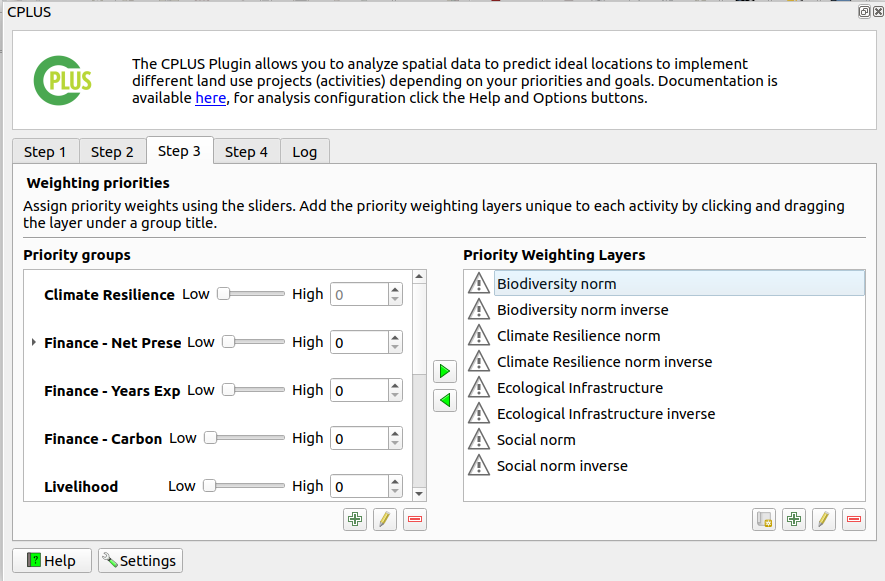

# Step 3: Weighting priorities

`Step 3` focuses on weighting priorities, which involves assigning importance to different priority groups and weighted layers. This step is critical for determining the relative significance of various factors in the analysis.

- **Priority groups**: Users can define different priority groups to which Priority Weighted Layers (PWLs) can be assigned. These groups represent different categories or themes that contribute to the overall analysis.

- **Priority weighted layers (PWL)**: Users can assign importance values to each priority group by associating them with Priority Weighted Layers. These layers represent the spatial data layers or attributes that contribute to the analysis.

- : Remove the selected PWL from the priority group.

- : Add the selected PWL to the selected priority group.

- : Create a financial priority weighted layer.

- : Add a new PWL.

- : Remove the selected PWL.

- : Edit the selected PWL.

## Financial Priority Weighted Layer Editor dialog

The Net Present Value (NPV) Tool is designed to assist users in making informed financial decisions by evaluating and prioritising activities based on their projected cash flows and the time value of money. This manual provides comprehensive instructions on how to utilise the NPV tool effectively.

**Understanding Net Present Value (NPV):**
Net Present Value (NPV) is a financial metric that calculates the value of a series of future cash flows in today's terms. By discounting future cash flows to their present value, NPV allows users to assess the profitability of an investment or project.

**Purpose of the NPV Tool**
The primary purpose of the NPV Tool is to help users prioritise activities by providing a clear picture of the financial implications. This aids in holistic decision-making during the planning process, ensuring that the activities with the highest potential value are prioritised and executed.

1. **File Icon:** Click on the file icon to create a new financial priority weighted layer. Upon clicking, a new window will open specifically for creating the NPV Net Present Value layer.

### Net Present Value (NPV)

1. **NPV checkbox:** By default, on the first-time load, the NPV configurations for all activities are disabled. To enable the `Net Present Value (NPV)` for an activity, check the NPV group box.

    

1. **Number of years:** Enter the number of years. The number of rows in the table will adjust according to the entered number.

2. **Discount Rate %:** Enter the discount rate.

3. **Years Table:** Input the `Project total revenues per hectare` and `Project total cost per hectare` values for the respective years. Note that the `Year` and `Discount Value` cells are greyed out as they are automatically populated.

    >NOTE: For an enabled NPV PWL, all revenue and cost values must be specified. If any values are missing, an error message will display the activities and corresponding years with missing values when attempting to create or update the PWLs.

    

4. **Net Present Value per Hectare:** When the discount rate, revenue, and cost values are updated, the total NPV is automatically recalculated and shown in the net present value per hectare box.

5. **Copy icon:** The user can copy the NPV by clicking on the copy icon available next to the net present value per hectare box.

6. **Min/Max Normalization Range:** It is recommended to keep the `Use computed NPVs` check box enabled (default option). This ensures that the minimum and maximum normalisation values are synced and automatically updated based on user input. The min/max values will be based on enabled NPV parameters for activities. Disabled NPV parameters will be excluded from the computation.

7. **Remove Existing WPL Checkbox:** When the `Remove existing PWLs for disabled activity NPVs check box` is enabled, any previously created NPV PWLs will be deleted upon updating the NPVs.

8. **Update Button:** Click the `Update` button to show a dialog displaying the progress of creating/updating the NPVs.

    - When creating NPV PWL rasters, the corresponding PWLs will be created or updated in the list of PWLs.
    - The naming convention for these layers is `[activity name] NPV Norm`.

    

- An NPV layer, which is a constant raster containing the normalised value, will be created under the `{BASE_DIR}/priority_layers/npv` directory.

- The extents are based on the user-defined extents specified in Step 1.

9. **Cancel Button:** Click on the cancel button to cancel the adding NPV.

## Priority Weighted Layers Editor dialog

- **Priority layer**: Select the priority layer.

- **Priority layer name**: A unique name for the priority layer.

- **Priority layer description**: A detailed description for the priority layer.

- **Assign activities**: Selected activities associated with the priority layer.

- List of activities a user can select. Multiple activities can be selected.

- **OK**: Save the selected activities.

- **Select All**: Select each of the available activities.

- **Clear Selection**: Deselects each of the selected activities.

- **Toggle Selection**: Switches each option from deselected to selected, or selected to deselected.

## Progress dialog

- **Analysis Progress**: Progress of the current step.

- **Status**: A status message on the current analysis being performed.

- **View Report**: This button will remain disabled until the processing is done.

- **Cancel**: Clicking this button will stop the processing.

- **Close**: Only visible once the processing stops. Will close the progress dialog.

### Report options

These options will be available once the analysis has finished. The options will stay disabled if the analysis failed

- **Layout designer**: Opens the report in the QGIS layout designer.

- **Open PDF**: Opens the created PDF.

- **Help**: Takes the user to the User's documentation site.

Overall, Step 3 provides users with tools to assign priorities and weights to different factors, guiding the analysis process and helping to identify key areas of focus in the scenario.

Click [here](step-4.md) to explore the step 4 section.

Click [here](logs.md) to explore the log section.
