# Step4: Select outputs and processing options

1. **Step 4:** `Step 4` guides the user to select the outputs to be saved into the file system for report generation. By clicking on the `Step 4` option, the user will navigate to the section dedicated to producing outputs. Here, the user finds a list of available outputs, each representing data that can be included in the report.

    When the user selects an output, it signifies that the user wants it to be saved onto their file system, making it accessible beyond the current session. Conversely, leaving an option unselected means that the data will be stored as a memory layer, useful for temporary use within the current session.

    This step is crucial for tailoring the outputs to include only the necessary information, thereby optimising memory usage. By choosing specific outputs to be saved, the user can generate fewer output layers which utilises system resources more efficiently.

    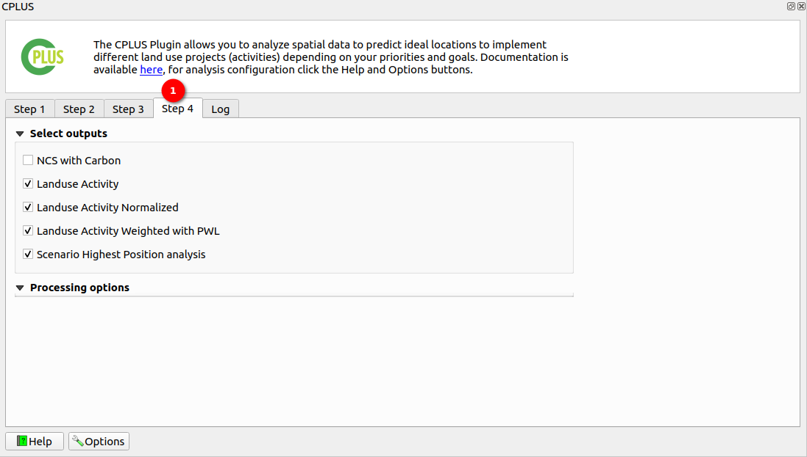

2. **Select Outputs**

    There are 5 options available in the select outputs. 

    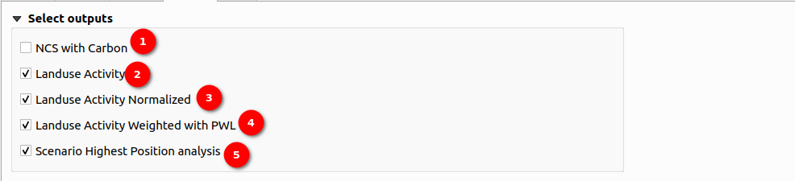

    **1. NCS With Carbon:** This output is initially unchecked by default. When selected, it triggers the generation of the NCS pathways output, providing insights into the pathways associated with NCS (Natural climate solution) and carbon sequestration.

    **2. Landuse Activity:** Initially, this output is checked by default. It generates landuse activity layer outputs, providing valuable insights into various landuse activities. Users have the option to uncheck it if they do not wish to include landuse data in the report.

    **3. Landuse Activity Normalised:** By default, this output is checked. It generates landuse project normalised outputs, providing a normalised view of landuse activities for enhanced analysis. Users have the option to uncheck it if they do not wish to include landuse normalised data in the report.

    **4. Landuse Activity Weighted with PWL (Priority weighted layers):** By default, this output is checked. It generates landuse projects weighted outputs. Unselecting this option will disable report generation this is because the weighted output is the required output for report generation.

    **5. Scenario Highest Position analysis:** By default, this output is checked. It generates the final highest position analysis outputs. Unselecting this option will disable report generation this is because the highest position analysis output is the required output for report generation.

3. **Processing Options**

    >NOTE: Users need to register and login with a Trends.Earth account to use the online API for processing with CPLUS.

    The user can also choose the processing option, deciding whether they want to process online or offline.

    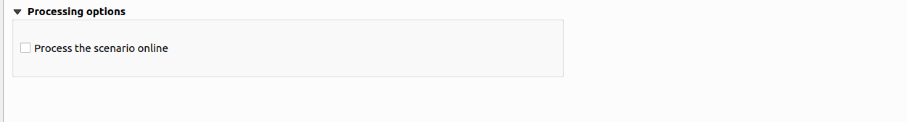

    * **Process the scenario online:** By default, this option is unchecked. When the user selects this option, the scenario is processed online using the API. This means that the system sends the scenario data to a remote server or service via the Internet. The remote server performs the necessary computations or analysis based on the provided scenario data. Processing online allows for real-time analysis and can leverage the computing power and resources available on the remote server. This option might be preferred when the user requires quicker results or when the scenario data is too large or complex to be processed efficiently on the user's local device. However, processing online may require a stable internet connection.
   
    *If the user has previously selected `Online defaults`, this option will be selected automatically.*

4. **Scenario report options:** Below are the benefits of the scenario report options.

    * The Metrics Generator enables plugin users to incorporate additional metrics or calculations for each activity. It includes automated expressions that assist in calculating measures such as irrecoverable carbon, financial metrics like the net present value (NPV) of each activity, and other weighting measures such as jobs per hectare.

    * The tool leverages the full functionality of the expression builder, allowing users to create fully customised expressions based on the available project variables.

    * The Expression Builder within the Metrics Generator has been enhanced with a CPLUS library, which offers automated calculations for irrecoverable carbon, PWL measures, and NPV. These features come with helpful guidance for their use. It is also important to reference the variables list when creating custom options.

    >Note: Please note that expressions can be applied on a column-by-column basis or can be cell-specific, providing full granularity for the measures and metrics associated with each activity.

    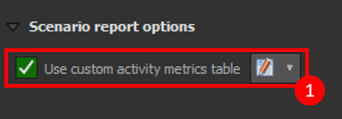

    1 **Use custom activity metrics table:** Users must check the checkbox to enable this option. After doing so, they need to click on the  icon to access the metrics table. 

    Users are required to follow these steps to create a custom activity metrics table.

     **Step 1:**

    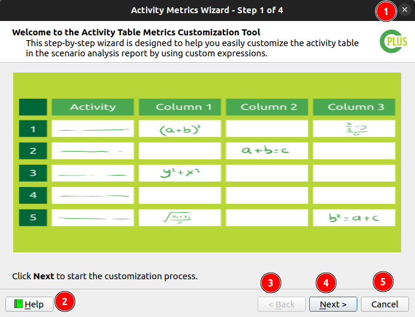

    1 **x:** Close the wizard.

    2 **Help:** Provides the qgis help documentation.

    3 **Back:** Go back to the previous step (Disabled in the first step).

    4 **Next:** Proceed to the next step.

    5 **Cancel:** Cancel the current operation.

    **Step 2:**

    

    1 **Columns:** Users can add or remove columns from the table.

    * **:** Allows users to add column to the table.

        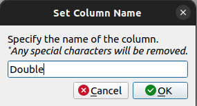

        * **x:** Close the dialog box.
        * **Input Field:** Users are required to enter the column name in this input field.
        * **Cancel:** Cancel the process.
        * **OK:** Users can complete the add column process by clicking on this button. If users click on this button without filling the column name then the process will be complete without any column being added.

            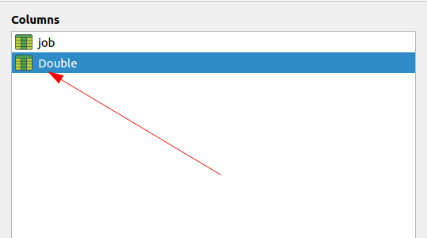
        
        * If users fill in a column name which is already available in the table then the users will encounter the error `There is already existing column name`.

            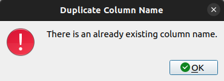

    * **:** Allows users to remove a column from the table. Users are required to select the column which they want to remove from the table and then click on this button to remove it from the table.

        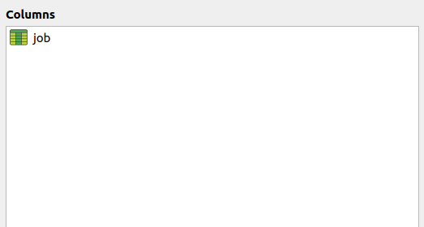

    * **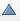 and 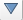:** Allows users to reorder the columns in the table. Select the column from the table and then click on the either any option to reorder the column.

    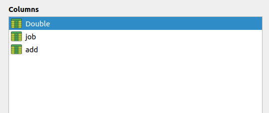

    2 **Properties:** This contains the properties of the column.
    
    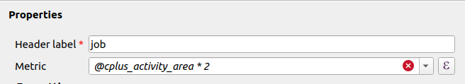 

    * **Header label:** The default header name is based on the selected column. Users can change it to any name they prefer, but the field must be filled in. If the `Header label` is empty then the users will encounter with the error `header label is empty`.

        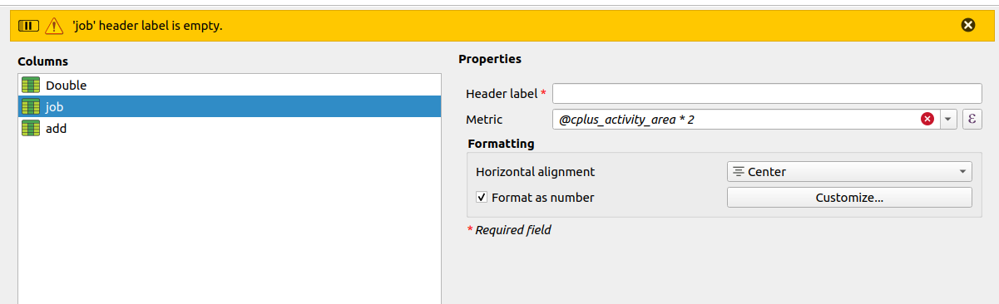 
    
    * **Metric:** Users can select the metric from the dropdown list. User can clear the metric filed by clicking on the `x` mark available inside the input field and can add their own custom metric.

        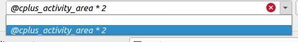 

    * **Create Custom Metric:** Users can create their own custom metric by clicking on the `ε epsilon` button located on the right side of the `Metric` input field.

        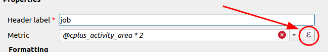 

        * This will open the `Column Expression Builder` dialog box.

        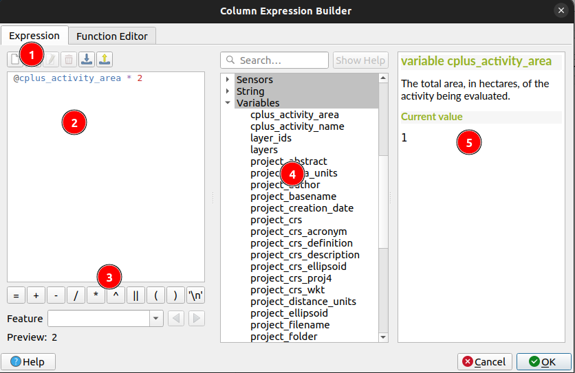

        1 **Expression:** Users can access the expression tab by clicking here.

        2 **Input Area:** User can enter the expression in this input area.

        3 **Operators and symbols:** Users can access the operators and symbols from here.

        4 **Functions:** Users can choose the function that their expression is related to.

        5 **Details Section:** This section shows the details of the expression like how users can fill the expression, what are the available arguments and operators etc.

        * For Example:

            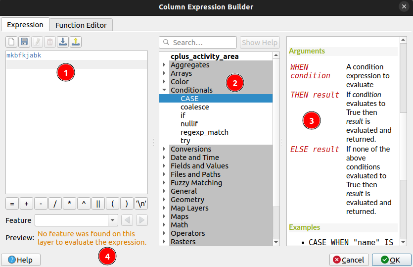

            1 **Input Area:** Contains the expression we have entered.

            2 **Functions:** For example, we have selected the `CASE` from `Conditionals`.

            3 **Details Section:** This section shows the details of the expression like how users can fill the expression, what are the available arguments and operators etc.

            4 **Preview:** This section displays the feature details. In our case, we have entered the incorrect input without following the proper syntax, resulting in an error in the preview.

        * After filling all the details users are required to click on the `OK` button to complete the process or they can click on the `Cancel` button to cancel the process.

        * When users click on the `Cancel` button a popup dialog box will appear asking for confirmation to cancel the process.

            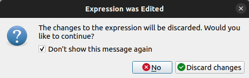

            * **✅:** Users can check this checkbox to remember their choice and avoid showing this message again in the future.

            * **No:** Users can click on the `No` button to go back to the editing the process.

            * **Discard changes:** Users can click on this button to complete the cancel process. This will discard the changes and close the window.

    3 **Formatting:** This contains the formatting options for the column.

    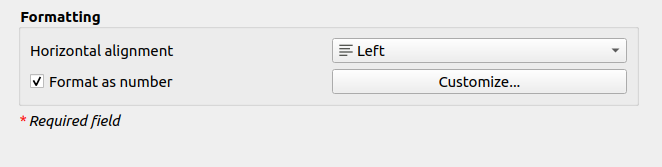

    * **Horizontal alignment:** Users can select the horizontal alignment of the column from the dropdown list, choosing between left, center, right, or justify alignment.

    * **Format as number:** Users are required to check the checkbox to use this option, then users will be use the `Customise...` button to customise the number format.

        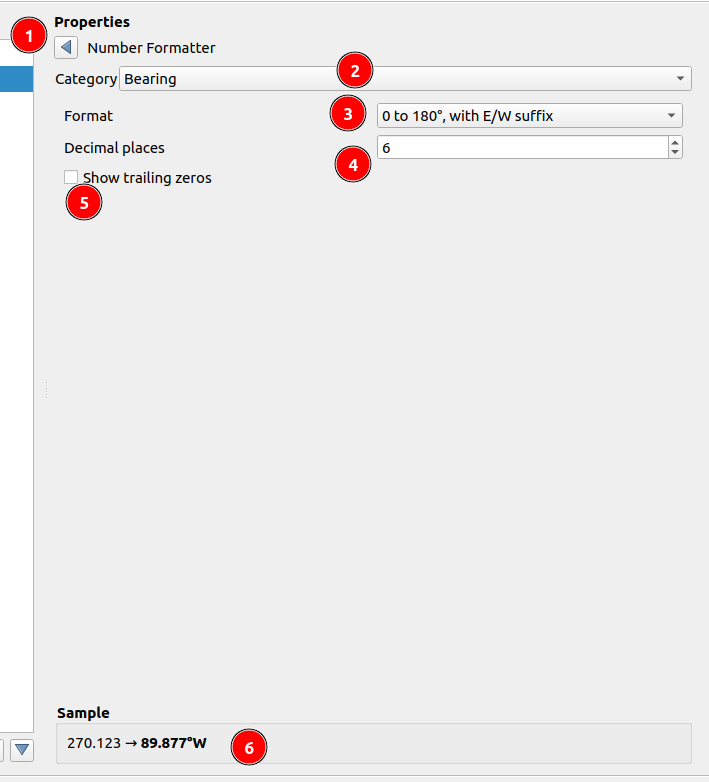

        1 **Number Format:** Users can use this button to go back to the previous window.

        2 **Category:** Users can select the category of the number format from the dropdown list.

        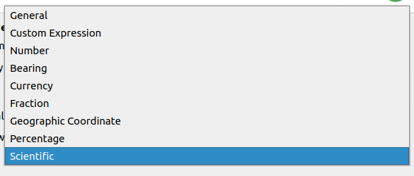

        3 **Format:** Users can select the format of the number from the dropdown list. (This field varies depending on the selected category.)

        4 **Decimal places:** Users can enter the number of decimal places to be displayed. (This field varies depending on the selected category.)

        5 Show trailing zeros: Users can select this checkbox to display trailing zeros. (This field varies depending on the selected category.)

        6 **Sample:** Users can see the sample of the number format selected.

    **Step 3:**
    
    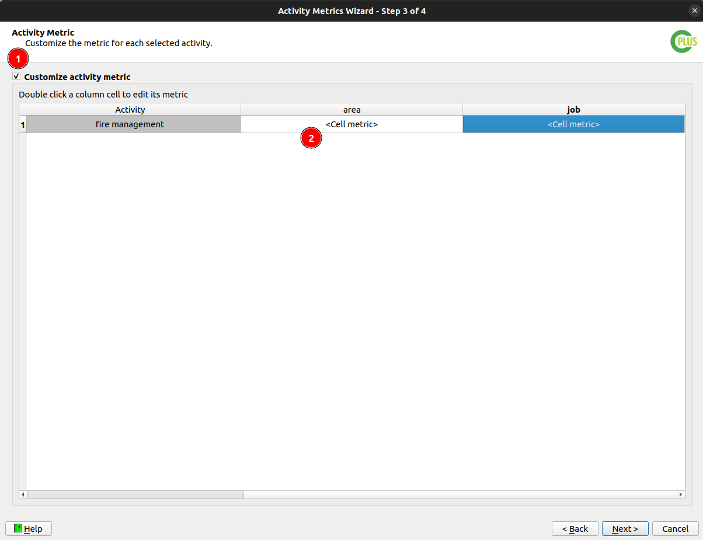

    1 **Customise activity metric:** Checking this checkbox allows users to customise the metric of a specific cell.

    2 **Customise cell metric:** Double-clicking on a cell converts it into a dropdown menu. Users can then select the `<Cell metrics>` option from the menu, enabling them to customise the cell metric.

    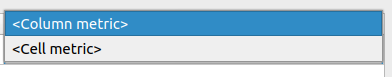

    * This will open the `Activity Expression Builder` window.

        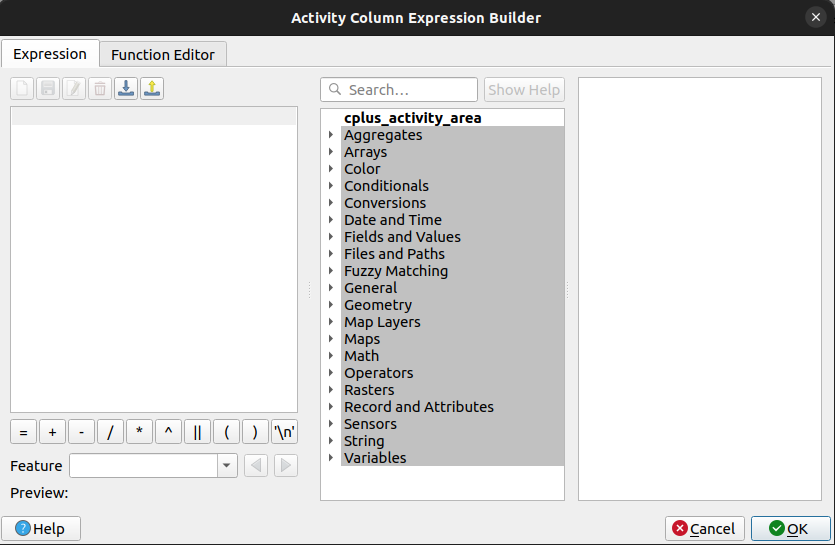

    Please check the `Step 2` to know more about how to customise the metric.

    * If users try to proceed without defining the `<Cell-metric>` then users will encounter an error message.

        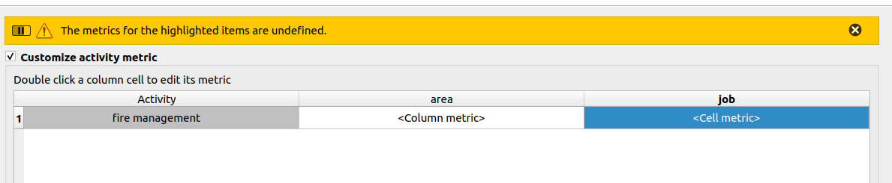

    **Step 4:**

    This is the last step where user review all the columns and metrics they have defined. After clicking on the `Finish` button will complete the process and redirected to the `Qgis plugin Step 4` from where users can generate the report with the `custom activity metrics table`.

    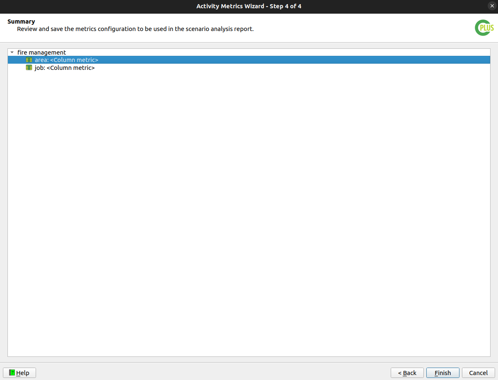

5. **Run Scenario:** 

    After checking or unchecking the checkbox, click on the `Run Scenario` button to execute the scenario and generate the report. 

    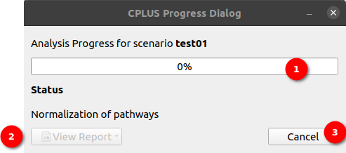

    **1. Progress Bar:** Upon clicking this button, a pop-up window will appear, displaying a progress bar indicating the report generation status. 

    **2. View Report Dropdown:** Once the report is generated, the user can click on the `View Report` dropdown, to view the options.

    The following options are available there.

    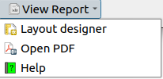

    - **Layout designer:** Opens the report in the QGIS layout designer.

    - **Open PDF:** Opens the created PDF.

    - **Help:** Takes the user to the User's documentation site.
  
    **3. Hide:** This  option hides the Progress Dialog Box.

    **4. Cancel:** Click on the `Cancel` button to terminate the report generation process. Upon clicking this button, it will transform into the `Close` button. Click on the `Close` button to dismiss the pop-up window.

    ### View Task Status Online
    After clicking on the `Hide` button this button will be enabled to view the task status.

    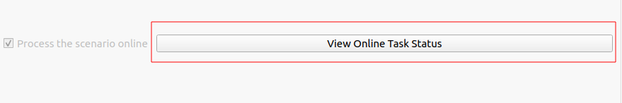

    Click on the `View Task Online button` to view the task status.

    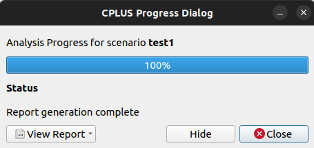 

## Report without custom metrics table

* Users can see in the report there is no custom metrics table.

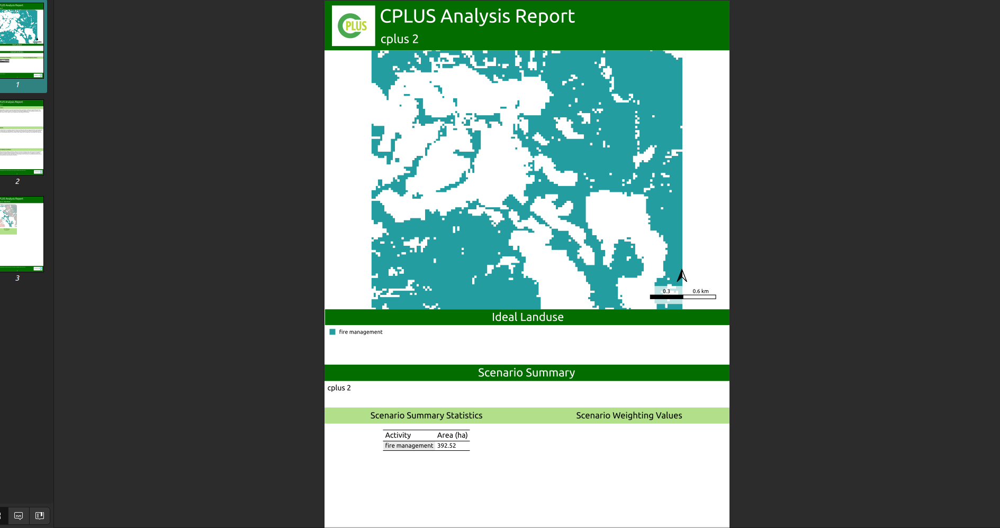

## Report with custom metrics table

* Users can see in the report that the custom metrics table is included.

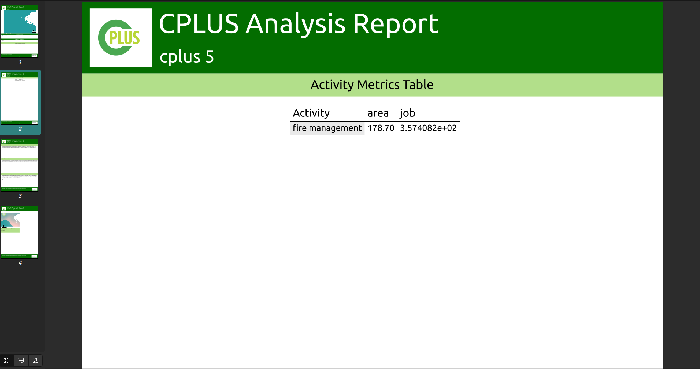

Click [here](logs.md) to explore the log section.
