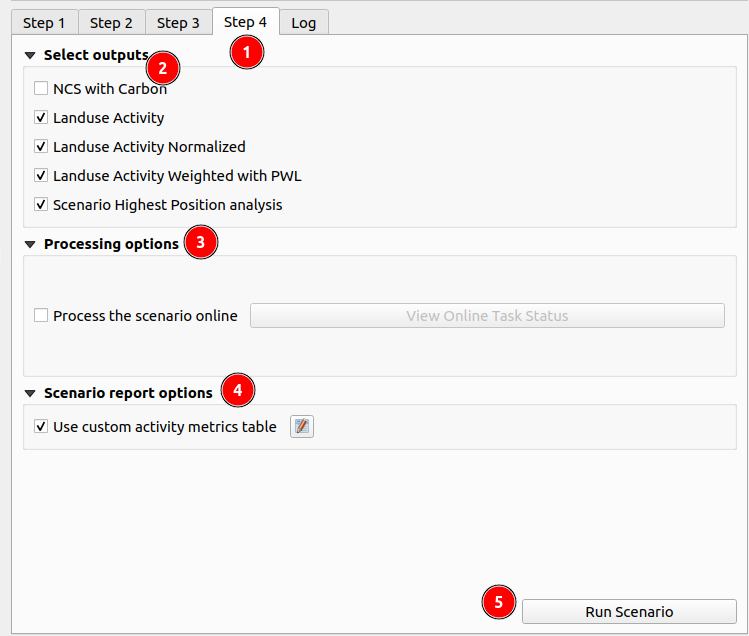
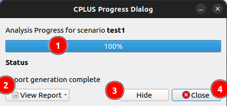

# Step4: Select outputs and precessing options

1. **Step 4:** `Step 4` guides the user to select the outputs to be saved into the file system for report generation. By clicking on the `Step 4` option, the user will navigate to the section dedicated to producing outputs. Here, the user finds a list of available outputs, each representing data that can be included in the report.

When the user selects an output, it signifies that the user wants it to be saved onto their file system, making it accessible beyond the current session. Conversely, leaving an option unselected means that the data will be stored as a memory layer, useful for temporary use within the current session.

This step is crucial for tailoring the outputs to include only the necessary information, thereby optimising memory usage. By choosing specific outputs to be saved, the user can generate fewer output layers which utilises system resources more efficiently.

2. **Select Outputs**

    There are 5 options available in the select outputs. 

    

    1. **NCS With Carbon:** This output is initially unchecked by default. When selected, it triggers the generation of the NCS pathways output, providing insights into the pathways associated with NCS (Natural climate solution) and carbon sequestration.

    2. **Landuse Activity:** Initially, this output is checked by default. It generates landuse activity layer outputs, providing valuable insights into various landuse activities. Users have the option to uncheck it if they do not wish to include landuse data in the report.

    3. **Landuse Activity Normalised:** By default, this output is checked. It generates landuse project normalised outputs, providing a normalised view of landuse activities for enhanced analysis. Users have the option to uncheck it if they do not wish to include landuse normalised data in the report.

    4. **Landuse Activity Weighted with PWL (Priority weighted layers):** By default, this output is checked. It generates landuse projects weighted outputs. Unselecting this option will disable report generation this is because the weighted output is the required output for report generation.

    5. **Scenario Highest Position analysis:** By default, this output is checked. It generates the final highest position analysis outputs. Unselecting this option will disable report generation this is because the highest position analysis output is the required output for report generation.

3. **Processing Options**

    The user can also choose the processing option, deciding whether they want to process online or offline.

    

    1. **Process the scenario online:** By default, this option is unchecked. When the user selects this option, the scenario is processed online using the API. This means that the system sends the scenario data to a remote server or service via the Internet. The remote server performs the necessary computations or analysis based on the provided scenario data. Processing online allows for real-time analysis and can leverage the computing power and resources available on the remote server. This option might be preferred when the user requires quicker results or when the scenario data is too large or complex to be processed efficiently on the user's local device. However, processing online may require a stable internet connection.

4. **Run Scenario:** 

    After checking or unchecking the checkbox, click on the `Run Scenario` button to execute the scenario and generate the report. 

    

    1. **Progress Bar:** Upon clicking this button, a pop-up window will appear, displaying a progress bar indicating the report generation status. 

    2. **View Report Dropdown:** Once the report is generated, the user can click on the `View Report` dropdown, to view the options.

        The following options are available there.

        - **Layout designer:** Opens the report in the QGIS layout designer.

        - **Open PDF:** Opens the created PDF.

        - **Help:** Takes the user to the User's documentation site.

    3. **Cancel:** Click on the `Cancel` button to terminate the report generation process. Upon clicking this button, it will transform into the `Close` button. Click on the `Close` button to dismiss the pop-up window.

    
