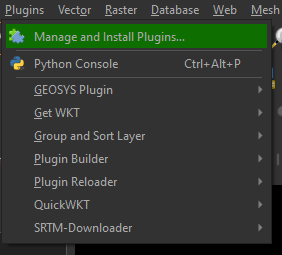
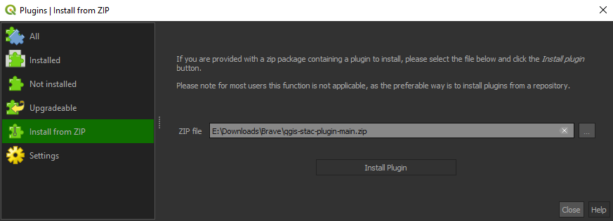
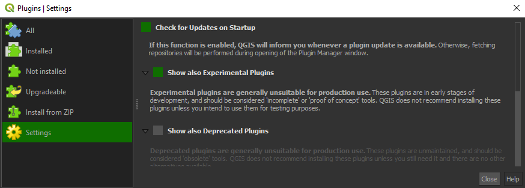

# Quick start

## Installation

### Plugin repository

During the development phase the plugin is available to install via 
a dedicated plugin repository 
[https://raw.githubusercontent.com/kartoza/cplus-plugin/release/docs/repository/plugins.xml](https://raw.githubusercontent.com/kartoza/cplus-plugin/release/docs/repository/plugins.xml)

### Install from QGIS plugin repository

- Open QGIS application and open plugin manager.
- Click on **Plugins** -> **Manage and Install Plugins** (see **Figure 1**)

*Figure 1: QGIS plugin manager*

- Search for `CPLUS` in the **All** page of the plugin manager.
- From the found results, click on the `CPLUS` result item and a page with plugin information will show up.
- Click the `Install Plugin` button at the bottom of the dialog to install the plugin.

### Install from ZIP file

Alternatively the plugin can be installed using **Install from ZIP** option on the 
QGIS plugin manager. 

- Download zip file from the required plugin released version
https://github.com/kartoza/cplus-plugin/releases/download/{tagname}/cplus.{version}.zip

- Open QGIS application and open plugin manager
- Click on **Plugins** -> **Manage and Install Plugins**
- Click on **Install from ZIP** (**Figure 2**)
- Select the zip file which contains the plugin
- Click **Install Plugin**

*Figure 2: Plugin manager install from zip option*

- From the **Install from ZIP** page, select the zip file and click the **Install** button to install plugin

### Install from custom plugin repository

Current repository: [https://raw.githubusercontent.com/kartoza/cplus-plugin/release/docs/repository/plugins.xml](https://raw.githubusercontent.com/kartoza/cplus-plugin/release/docs/repository/plugins.xml)

- Open the QGIS plugin manager, then select the **Settings** page (**Figure 3**)

**NOTE:** The plugin is currently in experimental phase, so enable **Show also Experimental Plugins**

*Figure 3: Custom repository installation*

- Click **Add** button on the **Plugin Repositories** group box and use the above url to create the new plugin repository.
- The plugin should now be available from the list of all plugins that can be installed.

Disable QGIS official plugin repository in order to not fetch plugins from it.

**NOTE:** While the development phase is on going the plugin will be flagged as experimental, make
sure to enable the QGIS plugin manager in the **Settings** page to show the experimental plugins
in order to be able to install it.

When the development work is complete the plugin will be available on the QGIS
official plugin repository.

## Short tutorial

Short example (**Figure 4**) on how to set parameters in step 1, implementation models in step 2, and weighing in step 3.
For a more detailed instructions on how to use the plugin,
see the [guide](../guide/index.md) and the [manual](../manual/index.md).

*Figure 4: Quick guide on how to use the plugin*
