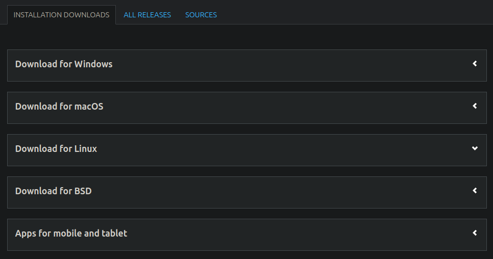
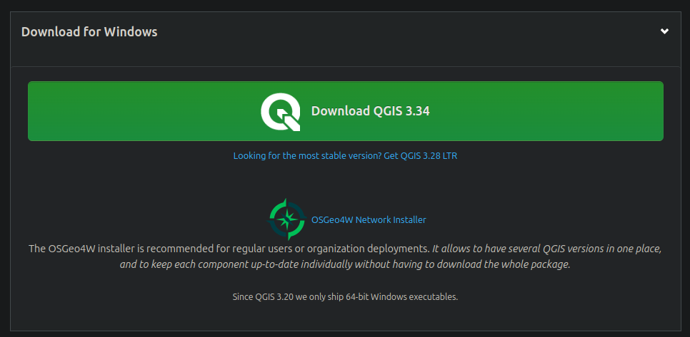
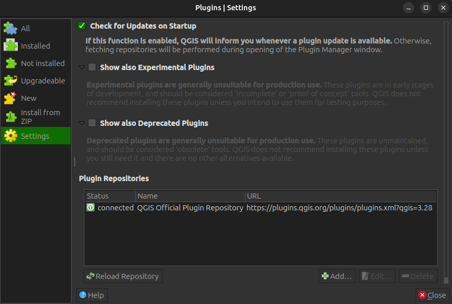
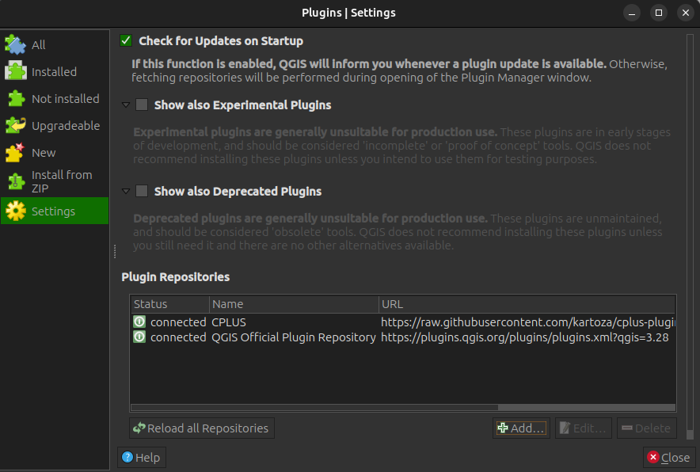

# Quick start

Instructions for a user on how to get the plugin working. First section deals with QGIS, and what versions
are best to work with. This is followed by a section on how to install the CPLUS plugin, ending with a
short tutorial accompanied by a video to show the user how to use the plugin.

## QGIS version

The CPLUS plugin might have issues with older versions of QGIS. QGIS 3.32 or higher has thoroughly
been tested with no major known issues. Here is a list of possible issues which may occur if using an
outdated version of QGIS are being used:

- Processing stalls and does not continue
- Symbologies (e.g. colour ramps) cannot be applied to the output layers
- Reports cannot be generated

Best will be to update QGIS to the latest version, even for other plugins, as bugs and improvements will
be available for those versions. To update QGIS, a user can do the following:

- Go to the [QGIS download webpage](https://www.qgis.org/en/site/forusers/download.html)
- Download or follow the instructions for the OS on which QGIS needs to be installed
- If a specific version (not the latest version) of QGIS needs to be installed, click on the **All releases** tab

### OSGeo4W network installer

This section will only be helpful for Windows users. The OSGeo4W network installer provides much more option
in a user-friendly UI. Advantages of using this installer:

- Easily allows a user to install both the latest and the latest LTR versions of QGIS
- User can select the exact libraries and versions they want to install (e.g. gdal)
- Option to include (or not include) GRASS and SAGA
- Extensions for QGIS
- If a user wants to update an existing QGIS installation, simply run the osgeo.exe in the installation directory
- Simply run the osgeo.exe to update already installed libraries, or install new libraries
- Easy to remove libraries or extensions
- Python modules
- And much more

## Installation

### Plugin repository

During the development phase the plugin is available to install via 
a dedicated plugin repository. This link should be used:
[https://raw.githubusercontent.com/ConservationInternational/cplus-plugin/release/docs/repository/plugins.xml](https://raw.githubusercontent.com/ConservationInternational/cplus-plugin/release/docs/repository/plugins.xml)

- Open QGIS application and open plugin manager.
- Click on **Plugins** -> **Manage and Install Plugins** (see **Figure 1**)

- Open the **Settings** tab

- Click the **Add** button
- Provide the following parameters:
    - **Name**: Provide a name for the repository
    - **URL**: Paste the above repository URL

- Click **OK**
- The result should be similar to the following:

### Install from QGIS plugin repository

- Open QGIS application and open plugin manager.
- Click on **Plugins** -> **Manage and Install Plugins** (see **Figure 1**)

*Figure 1: QGIS plugin manager*

- Search for `CPLUS` in the **All** page of the plugin manager.
- From the found results, click on the `CPLUS` result item and a page with plugin information will show up.
- Click the `Install Plugin` button at the bottom of the dialog to install the plugin.

### Install from ZIP file

Alternatively the plugin can be installed using **Install from ZIP** option on the 
QGIS plugin manager. 

- Download zip file from the required plugin released version
https://github.com/ConservationInternational/cplus-plugin/releases/download/{tagname}/cplus.{version}.zip

- Open QGIS application and open plugin manager
- Click on **Plugins** -> **Manage and Install Plugins**
- Click on **Install from ZIP** (**Figure 2**)
- Select the zip file which contains the plugin
- Click **Install Plugin**

*Figure 2: Plugin manager install from zip option*

- From the **Install from ZIP** page, select the zip file and click the **Install** button to install plugin

### Install from custom plugin repository

Current repository: [https://raw.githubusercontent.com/ConservationInternational/cplus-plugin/release/docs/repository/plugins.xml](https://raw.githubusercontent.com/ConservationInternational/cplus-plugin/release/docs/repository/plugins.xml)

- Open the QGIS plugin manager, then select the **Settings** page (**Figure 3**)

**NOTE:** The plugin is currently in experimental phase, so enable **Show also Experimental Plugins**

*Figure 3: Custom repository installation*

- Click **Add** button on the **Plugin Repositories** group box and use the above url to create the new plugin repository.
- The plugin should now be available from the list of all plugins that can be installed.

Disable QGIS official plugin repository in order to not fetch plugins from it.

**NOTE:** While the development phase is on going the plugin will be flagged as experimental, make
sure to enable the QGIS plugin manager in the **Settings** page to show the experimental plugins
in order to be able to install it.

When the development work is complete the plugin will be available on the QGIS
official plugin repository.

## Short tutorial

Short example (**Figure 4**) on how to set parameters in step 1, implementation models in step 2, and weighing in step 3.
For a more detailed instructions on how to use the plugin,
see the [guide](../guide/index.md) and the [manual](../manual/index.md).

*Figure 4: Quick guide on how to use the plugin*
