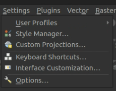
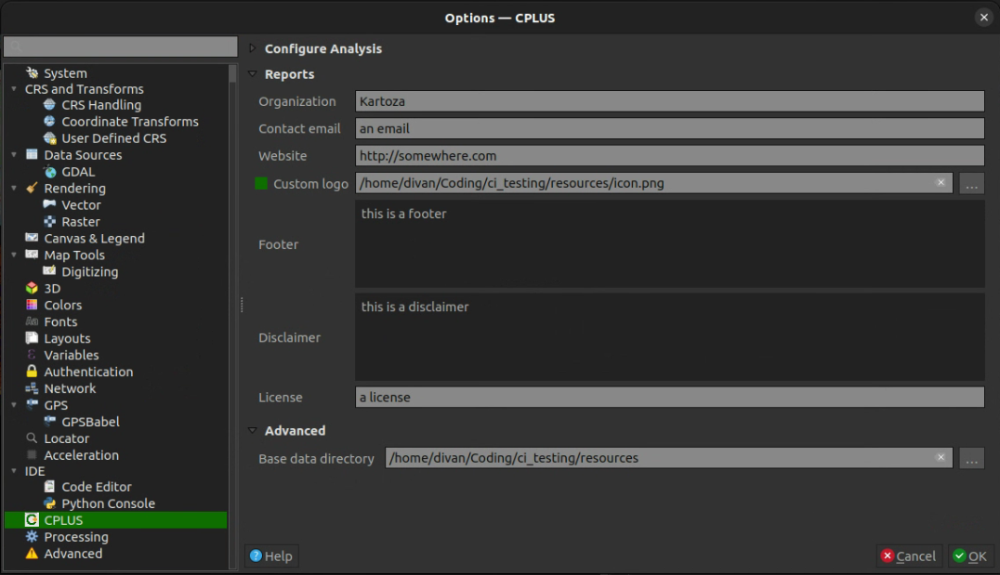
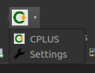

# Settings

## Open CPLUS settings

- **QGIS options**:
  - Click on **Settings** -> **Options**

  - Select the CPLUS tab to the left
  - This will open the CPLUS settings dialog

- **Toolbar**:
  - Click on the CPLUS toolbar drop-down
  - Select **Settings**
  - This will take you directly to the CPLUS settings dialog in the QGIS options

## CPLUS settings

A short description of each available setting a user can change. Most are optional.

**Configure Analysis**:

- Settings will be added as the plugin develops

**Reports**:

- Information which will be included when a report is generated. These settings are optional,
  and will be excluded from the report if not provided
- *Organization*: The organization(s) to be included in the report
- *Contact Email*: Contact email for the author
- *Website*: A website link to the project or company
- *Custom logo*: Enable and provide a custom logo of your choosing
- *Footer*: Footer section for the report
- *Disclaimer*: A disclaimer to be added to the report
- *License*: A license to be added to the report

**Advanced**:

- *Base data directory* (required): Data accessed and download by the plugin will be stored here

